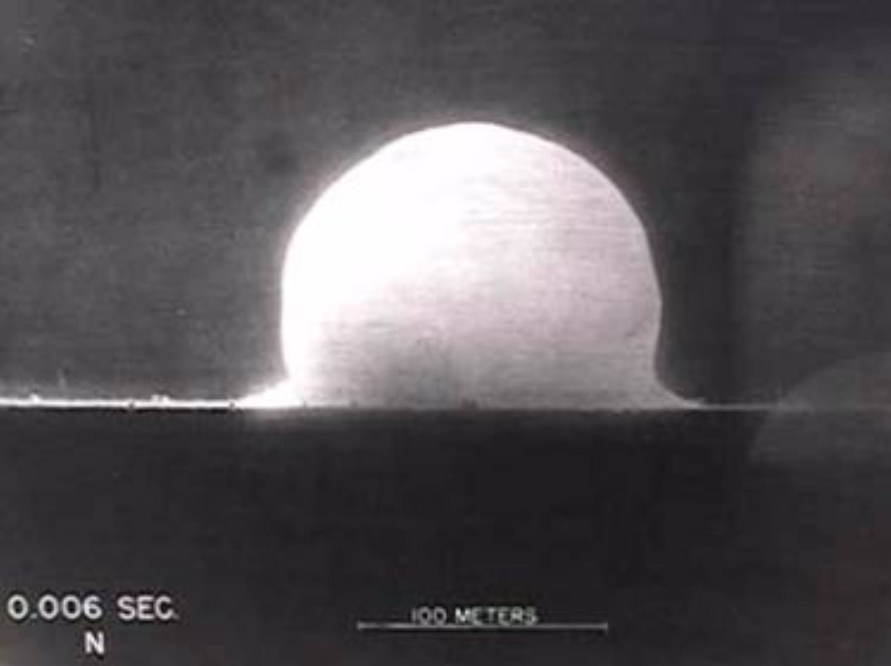
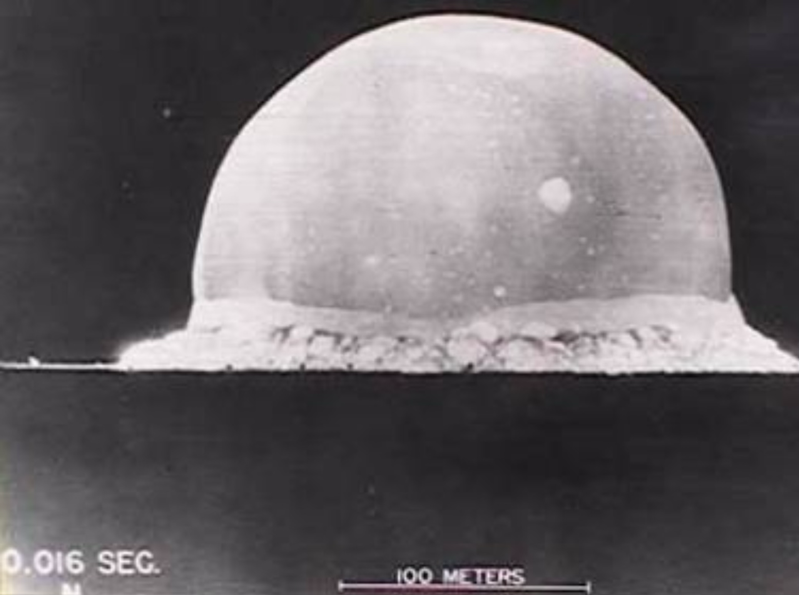
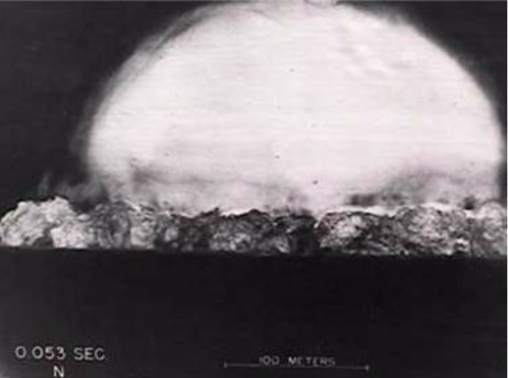
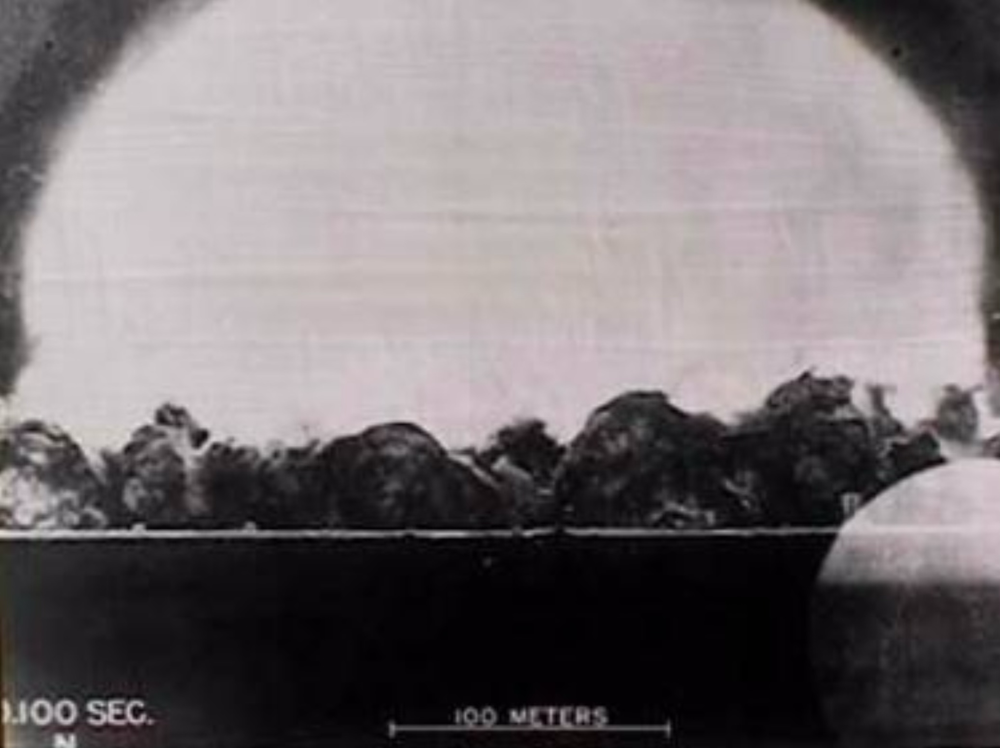

Lab 11: Dimensional Analysis
============================

Dimensional Analysis is a method for analyzing various physical quantities (like energy, force, velocity, distance, etc.) based on their base units (like length, time, or mass). In this lab, you will use dimensional analysis to estimate the energy output of an atomic bomb.

Balancing Units
---------------

Often in writing mathematical equations for physical systems, brackets around a variable refer to the *units* of that variable. For example, velocity is measured in units of length (:math:`L`) and time (:math:`T`).

.. math::

    [v] = \frac{L}{T}

A key idea in dimensional analysis is the balancing of units. In order for the units to balance in an equation, both sides must reduce to the same units. We know that for work:

.. math::

    W=Fd

Where 

* :math:`W` is work
* :math:`F` is force
* :math:`d` is distance

Note the units of these quantities in :math:`M` (mass), :math:`L` (length), and :math:`T` (time)

* :math:`[W] = M \frac{L^2}{T^2}`
* :math:`[F] = M \frac{L}{T^2}`
* :math:`[d] = L`

On the right side of this equation, we can simplify the units

.. math:: 

    L M \frac{L}{T^2} = M \frac{L^2}{T^2}

Which are the units of work. So the units are balanced.

Rayleigh's Method and the Buckingham :math:`\pi` Theorem
--------------------------------------------------------

In dimensional analysis, we frequently have equations where the units are not balanced. `Rayleigh's Method <https://en.wikipedia.org/wiki/Dimensional_analysis#Rayleigh's_method>`_ and the `Buckingham Pi theorem <https://en.wikipedia.org/wiki/Buckingham_%CF%80_theorem>`_ are ways we can reason about the relationship between different physical quantities that must be balanced.

The steps of Rayleigh's method are:

#. Identify all of the variables that will affect the dependent variable
#. Write the equation out with each dependent variable having a power, and add a constant (:math:`r = C \cdot r_1^{x_1} \cdot r_2^{x_2} \cdot r_3^{x_3} ... r_n^{x_n}`)
#. Replace each variable with its base units (:math:`[r] = L`)
#. Solve the system of equations given by the exponents (:math:`x_i`)
#. Substitute the results (:math:`x_i`) back into the equation (:math:`r = C \cdot r_1^{x_1} \cdot r_2^{x_2} \cdot r_3^{x_3} ... r_n^{x_n}`)

A Simple Pendulum
~~~~~~~~~~~~~~~~~
As simple example of Rayleigh's method, lets consider how long a pendulum takes to complete a swing. This is called the period. We assume that the period :math:`t` (in units of time) is based on the quantities :math:`m` (mass), :math:`l` (length), :math:`g` (acceleration due to gravity), and :math:`C` (some dimensionless constant).

.. image:: ./_static/pendulum.png
    :width: 40%
    
So our equation would look something like:

.. math::

    t = C m l g

Because we don't actually know if the units will work out in this equation, we use Rayleigh's method and raise each :math:`m`, :math:`l`, and :math:`g` to an unknown power :math:`x`, :math:`y`, and :math:`z`.

.. math::

    t = C m^x l^y g^z
    
Then we replace our variables with their units.

* :math:`[t] = T`
* :math:`[m] = M`
* :math:`[l] = L`
* :math:`[a] = \frac{L}{T^2}` 
* :math:`[C]` no units

So,

.. math::

    T = M^x L^y \frac{L^z}{T^{2z}}

Now we want to find :math:`x`, :math:`y`, and :math:`z` such that we end up with one unit of time :math:`T` once we solve. Doesn't that sound familiar? It is just a system of equations.

.. math::

    T = M^x L^{y + z} T^{-2z}

We see there are no :math:`M`'s or :math:`L`'s on the left, so we write :math:`x = 0` and :math:`y + z = 0` respectively. We see that there is a :math:`T` on the left side, so we write :math:`-2z = 1`.

.. note::
    Because :math:`x = 0` we know that mass does not play a significant role in the period of a pendulum.

When we represent this system of equations in a matrix form, we get

.. math::

    \begin{bmatrix}
    1 & 0 & 0\\
    0 & 1 & 1\\
    0 & 0 & -2\\
    \end{bmatrix}
    \begin{bmatrix} x \\ y \\ z \end{bmatrix}
    =
    \begin{bmatrix} 0 \\ 0 \\ 1 \end{bmatrix}

.. note::
    The rows represent the physical dimension (:math:`M`, :math:`L`, and :math:`T`) and the columns represent the powers (:math:`x`, :math:`y`, and :math:`z`).

So the main idea with dimensional analysis is that you can create an equation relating several independent variables and one dependent variable. We can then use Rayleigh's method to ensure that the base units work out. If the units do balance, it provides us a vaild framework for understanding the relationship between the variables.

Task 1: Solve the System
------------------------
Using ``numpy.linalg.solve(A, b)``, find the solution to the matrix above.

.. note::

    ``numpy.linalg.solve`` has parameters ``A`` which is the unaugmented matrix, and ``b`` which is the augmented part of the matrix. It solves for :math:`\vec{x}` in the equation :math:`A\vec{x} = \vec{b}` using an iterative method (like in `Lab 9 <https://emc2.byu.edu/fall-labs/lab09.html>`_), not Gaussian elimination. 

With your solution, plug your values for :math:`x`, :math:`y`, and :math:`z` into our original equation. :math:`C` is normally found through experimentation so let's just say it is :math:`4\pi`.... What do you get?

.. math::

    t = 4 \pi m^x l^y g^z

Now look up the equation for the period of a pendulum and see how you did!

G. I. Taylor and the Atomic Bomb
---------------------------------
During the early US atomic bomb tests, British physicist named G. I. Taylor saw pictures of the explosion in Time magazine.

|first| |second|

|third| |fourth|

He used dimensional analysis to figure out the energy yield of the atomic bomb.

He made the following assumptions:

#. The energy was released in a small space
#. The energy expanded in a sphere

He assumed the radius :math:`R` of the explosion would depend on:

* :math:`E`: the energy contained in the explosion
* :math:`\rho`: the density of the air
* :math:`t`: the time since the explosion
* :math:`C`: some dimensionless constant

Note the physical dimensions of these variables:

* :math:`[R] = L`
* :math:`[E] = \frac{ML^2}{T^2}`
* :math:`[\rho] = \frac{M}{L^3}`
* :math:`[t] = T`
* :math:`[C]` no units

Task 2: Find the Exponents
--------------------------

Using this information and Rayleigh's method, estimate the values of :math:`x`, :math:`y`, and :math:`z` for

.. math::

    R = C E^x \rho^y t^z

Use ``numpy.round(a, decimals)`` to round your answers to 2 decimal places. ``a`` is the number you want to round and ``decimals`` is the number of decimal places you want to round to.

.. Hint::
    A good first step is to write out this equation with the units of the variables rather than the variables themselves.

Task 3: Estimate the Energy Yield
---------------------------------
With the correct values for :math:`x`, :math:`y`, and :math:`z`, write a function ``energy_yield(R, t)`` that will estimate the energy yield of the bomb for any given radius ``R`` and time ``t``. Use it to estimate the energy yield of the bomb for all of the pictures shown above. Assume :math:`C=1`.

.. note::

    A reasonable value for the density of air is :math:`1.2\frac{kg}{m^3}`

Your function will take in ``R``, the radius of the explosion in meters, and ``t``, the time since the explosion in seconds. It will return the energy yield in Joules (:math:`\frac{kg \cdot m^2}{s^2}`).

.. Hint::
    You need to solve for :math:`E` in the equation :math:`R = C E^x \rho^y t^z`, not :math:`R`.

It is interesting to note that the modern estimated value for the energy yield is around 18 to 20 kilotons of TNT (1 Joule = 2.3901e-13 kilotons of TNT). How close were your estimates?