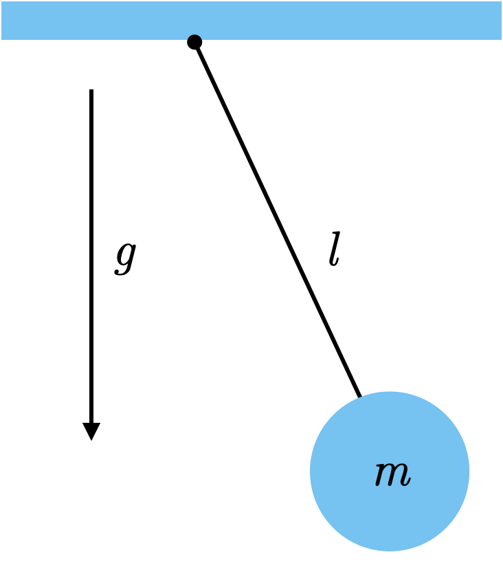

Lab 11: Dimensional Analysis
============================

Dimensional Analysis is a method for analyzing various physical quantities (like energy, force, velocity, distance, etc.) based on their base units (like length, time, or mass). In this lab, you will use dimensional analysis to estimate the energy output of an atomic bomb.

Rayleigh's Method and the Buckingham :math:`\pi` Theorem
--------------------------------------------------------
The background for dimensional analysis comes from `Rayleigh's method <"https://en.wikipedia.org/wiki/Dimensional_analysis#Rayleigh's_method">`_ and the formalization of Rayleigh's method, the `Buckingham Pi theorem <https://en.wikipedia.org/wiki/Buckingham_%CF%80_theorem>`_.

The main idea is that you can create an equation relating a bunch of independent variables and one dependent variable. We can then use Rayleigh's method to ensure that the base units work out. If they do, we have a valid way of looking at our independent variable.

"ensure that the base units work out"
~~~~~~~~~~~~~~~~~~~~~~~~~~~~~~~~~~~~~
When we put brackets around a variable, it means we are talking about the units of that variable. For example, velocity is measured in units of length (:math:`L`) and time (:math:`T`).

.. math::

    [v] = \frac{L}{T}

In order for the units to balance in an equation, both sides must reduce down to the same units. We know that for work:

.. math::

    W=Fd

Where 

* :math:`W` is work
* :math:`F` is force
* :math:`d` is distance

Note the units of these quantities in :math:`M` (mass), :math:`L` (length), and :math:`T` (time)

* :math:`[W] = M \frac{L^2}{T^2}`
* :math:`[F] = M \frac{L}{T^2}`
* :math:`[d] = L`

On the right side of this equation, we can simplify the units

.. math:: 

    L M \frac{L}{T^2} = M \frac{L^2}{T^2}

Which are the units of work. It wouldn't make sense to have an equation where the units were not balanced. Dimensional analysis and Rayleigh's method allows us to balance the units for an equation.

A Simple Pendulum
-----------------
Here is a simple example. Say we have a pendulum and we want to calculate the period (the time it takes to complete a swing). We assume that the period :math:`t` (in units of time) is based on the quantities :math:`m` (mass), :math:`l` (length), :math:`g` (acceleration due to gravity), and :math:`C` (some dimensionless constant).

    
We our equation would look something like:

.. math::

    t = C m l g

We just assumed that period is based on mass, length, and acceleration, which is reasonable, but we don't actually *know* if the units will work out in this equation. In order to balance them, we raise each :math:`m`, :math:`l`, and :math:`g` to an unknown power :math:`x`, :math:`y`, and :math:`z`.

.. math::

    t = C m^x l^y g^z
    
Then we replace our variables with their units.

* :math:`[t] = T`
* :math:`[m] = M`
* :math:`[l] = L`
* :math:`[a] = \frac{L}{T^2}` 
* :math:`[C]` no units

So,

.. math::

    T = M^x L^y \frac{L^z}{T^{2z}}

So we want to find :math:`x`, :math:`y`, and :math:`z` such that we end up with one unit of time :math:`T` once we solve. Doesn't that sound familiar? It is just a system of equations.

.. math::

    T = M^x L^{y + z} T^{-2z}

We see there are no :math:`M`'s or :math:`L`'s on the left, so we write :math:`x = 0` and :math:`y + z = 0` respectively. We see that there is a :math:`T` on the left side, so we write :math:`-2z = 1`.

.. note::
    Because :math:`x = 0` we know that mass does not play a significant role in the period of a pendulum.

When we make this a matrix, we get:

.. math::

    \begin{bmatrix}
    1 & 0 & 0\\
    0 & 1 & 1\\
    0 & 0 & -2\\
    \end{bmatrix}
    \begin{bmatrix} x \\ y \\ z \end{bmatrix}
    =
    \begin{bmatrix} 0 \\ 0 \\ 1 \end{bmatrix}

.. note::
    Note that the rows represent the physical dimension (:math:`M`, :math:`L`, and :math:`T`) and the columns represent the powers (:math:`x`, :math:`y`, and :math:`z`).

Task 1: Solve the system
------------------------
Using ``numpy.linalg.solve(A, b)``, find the solution to this augmented matrix.

.. note::

    ``numpy.linalg.solve`` has parameters ``A`` which is the unaugmented matrix, and ``b`` which is the augmented part of the matrix. It solves for :math:`\vec{x}` in the equation :math:`A\vec{x} = b`.

With your solution, plug your values for :math:`x`, :math:`y`, and :math:`z` into our original equation. :math:`C` is normally found through experimentation so let's just say it is :math:`4\pi`.... What do you get?

.. math::

    t = 4 \pi m^x l^y g^z

Now look up the equation for the period of a pendulum and see if you are right!

G. I. Taylor and the Atomic Bomb
---------------------------------
Around the time of the US testing the atomic bomb, a British physicist named G. I. Taylor saw pictures of the explosion in Time magazine.

|first| |second|

.. |first| image:: ./_static/explosion1.png
    :width: 49%

.. |second| image:: ./_static/explosion2.png
    :width: 49%

|third| |fourth|

He used dimensional analysis (the method we used above with the pendulum) to figure out the energy yield of the atomic bomb.

He made a few assumptions

#. The energy was released in a small space
#. The energy expanded in a sphere

He assumed the radius :math:`R` of the explosion would depend on:

* :math:`E`: the energy contained in the explosion
* :math:`\rho`: the density of the air
* :math:`t`: the time since the explosion
* :math:`C`: some dimensionless constant

Note the physical dimensions of these variables:

* :math:`[R] = L`
* :math:`[E] = \frac{ML^2}{T^2}`
* :math:`[\rho] = \frac{M}{L^3}`
* :math:`[t] = T`
* :math:`[C]` no units

Task 2:
-------

Using this information, and the process we used for the pendulum, estimate the values of :math:`x`, :math:`y`, and :math:`z` for

.. math::

    R = C E^x \rho^y t^z

Task 3:
-------
With the correct values for :math:`x`, :math:`y`, and :math:`z`, write a function that will estimate the energy yield of the bomb at all of the different times shown in the pictures above. Assume :math:`C=1`

.. note::

    The density of air, :math:`\rho`, is :math:`1.2\frac{kg}{m^3}`

.. code:: python

    def energy_yield(R: float, t: float) -> float:
        """Returns the estimated energy yield.

        Uses the equation R = C E^x * p^y * t^z to estimate the energy yield from the atomic bomb at different moments in time where C = 1.

        Parameters:
        R : float
            The estimated radius of the blast (in meters)
        t : float
            The time since detonation (in seconds)

        Returns:
        E : float
            The estimate energy yield (in kg*m^2/s^2 or Joules)
        """

        # your code here

It is interesting to note that the modern estimated value for the energy yield is around 18 to 20 kilotons of TNT (1 Joule = 2.3901e-13 kilotons of TNT). How close were your estimates?