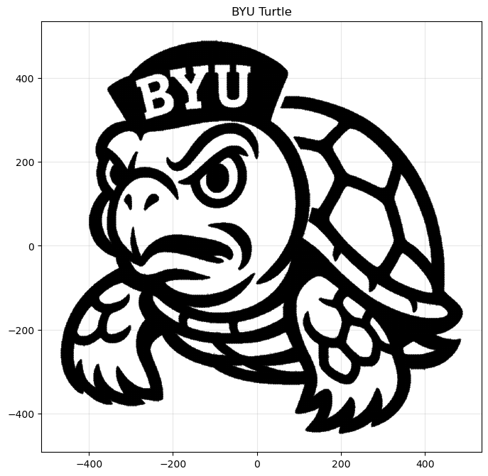
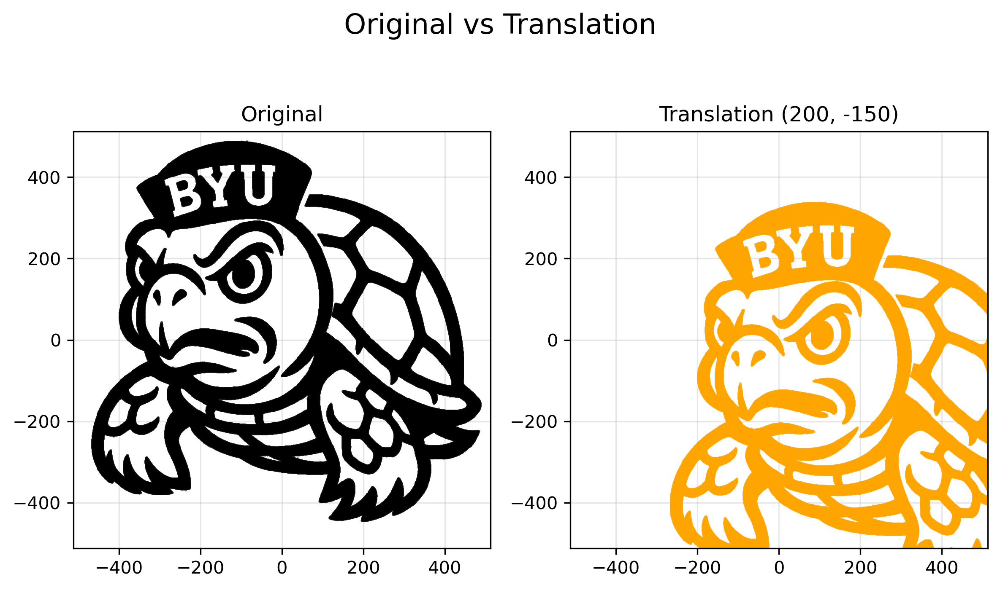
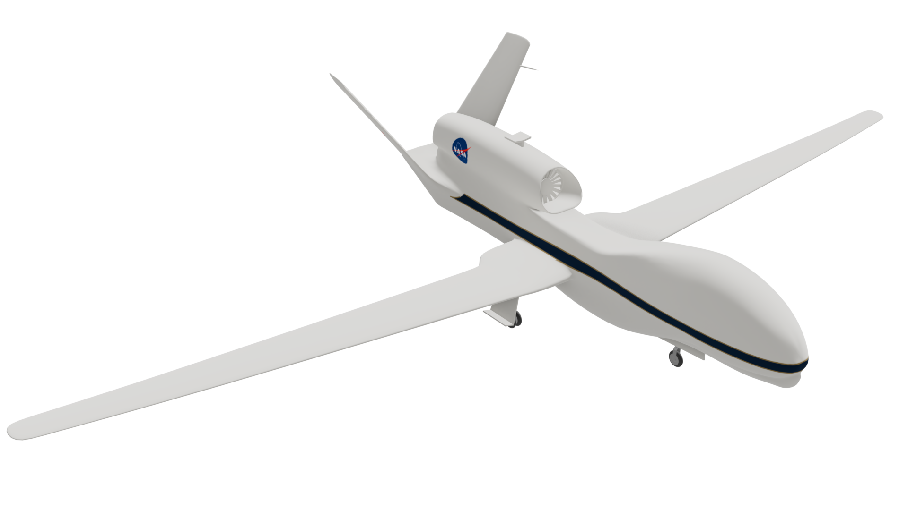
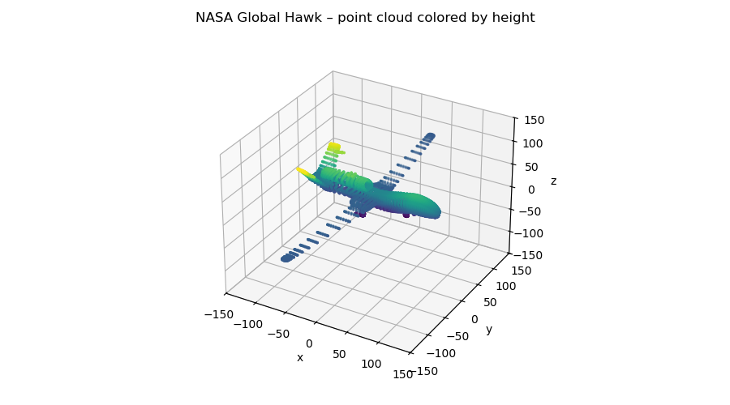
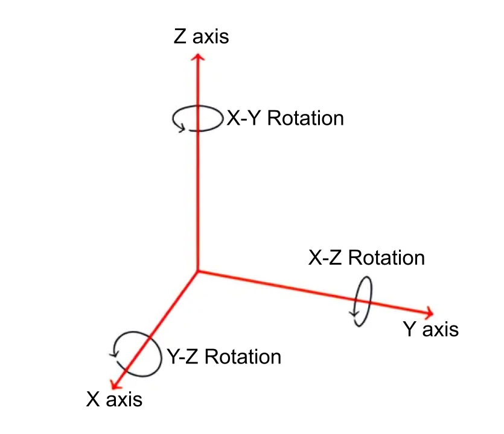
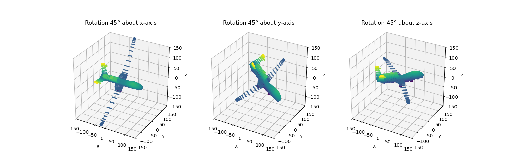

Lab 13: Linear Transformations
==============================

Linear transformations are at the heart of linear algebra and its applications. For example, they define how geometric shapes in :math:`\mathbb{R}^n` stretch, rotate, reflect, and shear. 
In this lab, we explore the geometric power of linear transformations and how matrix multiplication implements them computationally. 

Linear Transformations
----------------------

A *linear transformation* is a mapping between vector spaces that preserves vector addition and scalar multiplication.
More precisely, let :math:`V` and :math:`W` be vector spaces over :math:`\mathbb{R}^n`.
A map :math:`L:V\rightarrow W` is a linear transformation from :math:`V` into :math:`W` if
:math:`L(a \mathbf{x}_1 + b \mathbf{x}_2) = a L \mathbf{x}_1 + b L \mathbf{x}_2` for all vectors :math:`\mathbf{x}_1, \mathbf{x}_2 \in V` and scalars :math:`a, b \in \mathbb{R}`.

Every linear transformation :math:`L` from an :math:`n`-dimensional vector space into an :math:`m`-dimensional vector space can be represented by an :math:`m \times n` matrix :math:`A`, called the *matrix representation* of :math:`L`.
To apply :math:`L` to a vector :math:`\mathbf{x}`, left multiply by its matrix representation.
This results in a new vector :math:`\mathbf{x}'`, where each component is some linear combination of the elements of :math:`\mathbf{x}`.
For linear transformations from :math:`\mathbb{R}^2` to :math:`\mathbb{R}^2`, this process has the form

.. math::

   A \mathbf{x} =
   \left[\begin{array}{cc}
   a & b \\
   c & d \\
   \end{array}\right]
   \left[\begin{array}{c}
   x \\
   y
   \end{array}\right]
   =
   \left[\begin{array}{cc}
   a x + b y \\
   c x + d y
   \end{array}\right]
   =
   \left[\begin{array}{cc}
   x' \\
   y'
   \end{array}\right]
   = \mathbf{x}'.

Linear transformations can be interpreted geometrically.
To demonstrate this, consider an array of points :math:`T` that collectively form the picture of the BYU Turtle above.
The coordinate pairs :math:`\mathbf{x}_i` are organized by column, so the array has two rows: one for :math:`x`-coordinates, and one for :math:`y`-coordinates.
Matrix multiplication on the left transforms each coordinate pair, resulting in another matrix :math:`H'` whose columns are the transformed coordinate pairs:

.. math::

   A T = A \left[\begin{array}{cccc}
   x_1 & x_2 & x_3 & \ldots \\
   y_1 & y_2 & y_3 & \ldots
   \end{array}\right]
   =
   A \left[\begin{array}{c|c|c|c}
    & & & \\
   \mathbf{x}_1 & \mathbf{x}_2 & \mathbf{x}_3 & \ldots \\
    & & & 
   \end{array}\right]
   =
   \left[\begin{array}{c|c|c|c}
    & & & \\
   A \mathbf{x}_1 & A \mathbf{x}_2 & A \mathbf{x}_3 & \ldots \\
    & & &
   \end{array}\right] \\
    =
   \left[\begin{array}{c|c|c|c}
    & & & \\
   \mathbf{x}_1' & \mathbf{x}_2' & \mathbf{x}_3' & \ldots \\
    & & &
   \end{array}\right]
   =
   \left[\begin{array}{cccc}
   x_1' & x_2' & x_3' & \ldots \\
   y_1' & y_2' & y_3' & \ldots
   \end{array}\right]
   = T'.

Types of Linear Transformations
~~~~~~~~~~~~~~~~~~~~~~~~~~~~~~~

Linear transformations from :math:`\mathbb{R}^2` into :math:`\mathbb{R}^2` can be classified in a few ways.

- **Stretch**: Stretches or compresses the vector along each axis.
  The matrix representation is diagonal:
  
  .. math::
  
     \left[\begin{array}{rr}
     a & 0  \\
     0 & b
     \end{array}\right].
  
  If :math:`a=b`, the transformation is called a *dilation*.
- **Shear**: Slants the vector by a scalar factor horizontally or vertically (or both simultaneously).
  The matrix representation is
  
  .. math::
  
     \left[\begin{array}{cc}
     1 & a \\
     b & 1
     \end{array}\right].
  
  Pure horizontal shears (:math:`b = 0`) skew the :math:`x`-coordinate of the vector while pure vertical shears (:math:`a = 0`) skew the :math:`y`-coordinate.
- **Reflection**: Reflects the vector about a line that passes through the origin.
  The reflection about the line spanned by the vector :math:`[a, b]^\mathrm{T}` has the matrix representation
  
  .. math::
  
     \frac{1}{a^2 + b^2}
     \left[\begin{array}{cc}
     a^2 - b^2 & 2 a b \\
     2 a b       & b^2 - a^2
     \end{array}\right].
  
- **Rotation**: Rotates the vector around the origin.
  A counterclockwise rotation of :math:`\theta` radians has the following matrix representation:
  
  .. math::
  
     \left[\begin{array}{rr}
     \cos\theta & -\sin\theta \\
     \sin\theta &  \cos\theta
     \end{array}\right]
  
  A negative value of :math:`\theta` performs a clockwise rotation.
  Choosing :math:`\theta = \frac{\pi}{2}` produces a rotation of 90 degrees counterclockwise.
  Below is an example of each of these linear transformations.

Task 1
------

Write a function for each type of linear transformation.
(``stretch(X, a, b)``, ``shear(X, a, b)``, ``reflection(X, a, b)``, ``rotation(X, theta)``).
Each function should accept an array to transform and the scalars that define the transformation (:math:`a` and :math:`b` for stretch, shear, and reflection, and ``theta`` for rotation).
Construct the matrix representation, multiply it with the input array, and return a transformation of the data.
Make sure to copy the array before transforming it.

Compositions of Linear Transformations
~~~~~~~~~~~~~~~~~~~~~~~~~~~~~~~~~~~~~~

Let :math:`V`, :math:`W`, and :math:`Z` be finite-dimensional vector spaces.
If :math:`L:V\rightarrow W` and :math:`K:W\rightarrow Z` are linear transformations with matrix representations :math:`A` and :math:`B`, respectively, then the *composition* function :math:`K L:V\rightarrow Z` is also a linear transformation, and its matrix representation is the matrix product :math:`B A`.

For example, if :math:`S` is a matrix representing a shear and :math:`R` is a matrix representing a rotation, then :math:`R S` represents a shear followed by a rotation.
In fact, any linear transformation :math:`L:\mathbb{R}^2 \rightarrow\mathbb{R}^2` can be written as a composition of the four transformations.

Affine Transformations
----------------------

All linear transformations map the origin to itself, since for any :math:`\mathbf{x} \not= 0` we have :math:`L(0) = L(0 \mathbf{x}) = 0 L(\mathbf{x}) = 0` for any linear transformation :math:`L`.
An *affine transformation* is a mapping between vector spaces that preserves the relationships between points and lines, but may not preserve the origin.
Every affine transformation :math:`T` can be represented by a matrix :math:`A` and a vector :math:`\mathbf{b}`.
To apply :math:`T` to a vector :math:`\mathbf{x}`, calculate :math:`A \mathbf{x} + \mathbf{b}`.
If :math:`\mathbf{b} = 0` then the transformation is a linear transformation, and if :math:`A = I` but :math:`\mathbf{b} \neq 0` then it is called a *translation**.

For example, if :math:`T` is the translation with :math:`b = [\frac{3}{4}, \frac{1}{2}]^\mathrm{T}`, then applying :math:`T` to an image will shift it right by :math:`\frac{3}{4}` and up by :math:`\frac{1}{2}`.

Affine transformations include all compositions of stretches, shears, rotations, reflections, and translations.
For example, if :math:`S` represents a shear and :math:`R` a rotation, and if :math:`\mathbf{b}` is a vector, then :math:`R S \mathbf{x} + \mathbf{b}` shears, then rotates, then translates :math:`\mathbf{x}`.

Task 2
------

Write a function ``translation(X, b)`` that takes in an array ``X`` and the vector ``b`` for the translation.
The function should return the translation of the data.

Linear Transformations in 3-D
-----------------------------

In the same way that linear transformations from :math:`\mathbb{R}^2` to :math:`\mathbb{R}^2` can be represented by :math:`2 \times 2` matrices, linear transformations from :math:`\mathbb{R}^3` to :math:`\mathbb{R}^3` can be represented by :math:`3 \times 3` matrices.
For this part of the lab we will be using data points from the `Global Hawk aircraft <https://github.com/nasa/NASA-3D-Resources/tree/master/3D%20Models/Global%20Hawk>`_.

This is what the data points look like plotted with 50,000 points in 3-D.

We will simply deal with rotation transformations in :math:`\mathbb{R}^3`.
While in 2-D we could only rotate on the X-Y plane, in 3-D we can rotate on the X-Y plane, the Y-Z plane, and the X-Z plane making 3 different rotations.
With all 3 of these rotations, we can achieve any rotation in 3-D.
Here is what the 3 different rotations look like.

Below are the matrix representations for each of these 3 kinds of rotations in :math:`\mathbb{R}^3`:

- **X-Y plane rotation**:

  .. math::

     \left[\begin{array}{ccc}
     \cos\theta & -\sin\theta & 0 \\
     \sin\theta & \cos\theta & 0 \\
     0 & 0 & 1
     \end{array}\right]

- **Y-Z plane rotation**:

  .. math::

     \left[\begin{array}{ccc}
     1 & 0 & 0 \\
     0 & \cos\theta & -\sin\theta \\
     0 & \sin\theta & \cos\theta
     \end{array}\right]

- **X-Z plane rotation**:
  
  .. math::

     \left[\begin{array}{ccc}
     \cos\theta & 0 & -\sin\theta \\
     0 & 1 & 0 \\
     \sin\theta & 0 & \cos\theta
     \end{array}\right]

Below is an example of each of the 3 rotations.

Task 3
------

Write a function for each 3-D rotation
(``rotate_xy(X, theta)``, ``rotate_yz(X, theta)``, ``rotate_xz(X, theta)``).
Each function should accept an array to transform and the angle :math:`\theta` for the rotation.
Construct the matrix representation, multiply it with the input array, and return a transformation of the data.
Make sure to copy the array before transforming it.

Task 4
------

Take the data points from the Global Hawk aircraft and apply a combination of these 3 rotations so that the plane faces in the direction of the vector :math:`[7, -5, -1]^\mathrm{T}` and save it to the variable ``X_rotated``.
Note that the plane is already facing in the direction of the vector :math:`[1, 0, 0]^\mathrm{T}`.
(The data will be in the file ``plane.csv``.)

.. Modeling Motion with Affine Transformations
.. ~~~~~~~~~~~~~~~~~~~~~~~~~~~~~~~~~~~~~~~~~~~

.. Affine transformations can be used to model particle motion, such as a planet rotating around the sun.
.. Let the sun be the origin, the planet's location at time :math:`t` be given by the vector :math:`p(t)`, and suppose the planet has angular velocity :math:`\omega` (a measure of how fast the planet goes around the sun).
.. To find the planet's position at time :math:`t` given the planet's initial position :math:`p(0)`, rotate the vector :math:`p(0)` around the origin by :math:`t \omega` radians.
.. Thus if :math:`R(\theta)` is the matrix representation of the linear transformation that rotates a vector around the origin by :math:`\theta` radians, then :math:`p(t) = R(t \omega) p(0)`.

.. .. figure::
..    :width: 60%
..    :align: center

..    .. image:: tikz:affine-transform

..    ---

.. Composing the rotation with a translation shifts the center of rotation away from the origin, yielding more complicated motion.

.. .. admonition:: Problem
..    :class: problem
..    :name: prob:solar-system-trajectories

..    The moon orbits the earth while the earth orbits the sun.
..    Assuming circular orbits, we can compute the trajectories of both the earth and the moon using only linear and affine transformations.

..    Assume an orientation where both the earth and moon travel counterclockwise, with the sun at the origin.
..    Let :math:`p_e(t)` and :math:`p_m(t)` be the positions of the earth and the moon at time :math:`t`, respectively, and let :math:`\omega_e` and :math:`\omega_m` be each celestial body's angular velocity.
..    For a particular time :math:`t`, we calculate :math:`p_e(t)` and :math:`p_m(t)` with the following steps.

..    1. Compute :math:`p_e(t)` by rotating the initial vector :math:`p_e(0)` counterclockwise about the origin by :math:`t \omega_e` radians.
..    2. Calculate the position of the moon relative to the earth at time :math:`t` by rotating the vector :math:`p_m(0) - p_e(0)` counterclockwise about the origin by :math:`t \omega_m` radians.
..    3. To compute :math:`p_m(t)`, translate the vector resulting from the previous step by :math:`p_e(t)`.

..    Write a function that accepts a final time :math:`T`, initial positions :math:`x_e` and :math:`x_m`, and the angular momenta :math:`\omega_e` and :math:`\omega_m`.
..    Assuming initial positions :math:`p_e(0) = (x_e, 0)` and :math:`p_m(0) = (x_m, 0)`, plot :math:`p_e(t)` and :math:`p_m(t)` over the time interval :math:`t \in [0, T]`.

..    Setting :math:`T = \frac{3\pi}{2}`, :math:`x_e=10`, :math:`x_m=11`, :math:`\omega_e = 1`, and :math:`\omega_m = 13`, your plot should resemble the following figure (fix the aspect ratio with ``ax.set_aspect('equal')``).
..    Note that a more celestially accurate figure would use :math:`x_e=400`, :math:`x_m=401` (the interested reader should see `this archived article <https://web.archive.org/web/20130116204505/http://www.math.nus.edu.sg/aslaksen/teaching/convex.html>`_).

..    .. figure:: py:solar_system
..       :width: 70%
..       :align: center

.. Timing Matrix Operations
.. ------------------------

.. Linear transformations are easy to perform via matrix multiplication.
.. However, performing matrix multiplication with very large matrices can strain a machine's time and memory constraints.
.. For the remainder of this lab we take an empirical approach in exploring how much time and memory different matrix operations require.

.. Timing Code
.. ~~~~~~~~~~~

.. Recall that the ``time`` module's ``perf_counter()`` function measures a highly precise duration.
.. To measure how long it takes for code to run, record the time just before and just after the code in question, then subtract the first measurement from the second to get the number of seconds that have passed.
.. Additionally, in IPython, the quick command ``%timeit`` uses the ``timeit`` module to quickly time a single line of code.

.. .. code-block:: python
..    :caption: timing_loops

..    # (Your code here)

.. Timing an Algorithm
.. ~~~~~~~~~~~~~~~~~~~

.. Most algorithms have at least one input that dictates the size of the problem to be solved.
.. For example, the following functions take in a single integer :math:`n` and produce a random vector of length :math:`n` as a list or a random :math:`n\times n` matrix as a list of lists.

.. .. code-block:: python
..    :caption: random_vec_mat

..    # (Your code here)

.. Executing ``random_vector(n)`` calls ``random()`` :math:`n` times, so doubling :math:`n` should about double the amount of time ``random_vector(n)`` takes to execute.
.. By contrast, executing ``random_matrix(n)`` calls ``random()`` :math:`n^2` times (:math:`n` times per row with :math:`n` rows).
.. Therefore doubling :math:`n` will likely more than double the amount of time ``random_matrix(n)`` takes to execute, especially if :math:`n` is large.

.. To visualize this phenomenon, we time ``random_matrix()`` for :math:`n = 2^1,\ 2^2,\ \ldots,\ 2^{12}` and plot :math:`n` against the execution time.
.. The result is displayed below on the left.

.. .. code-block:: python
..    :caption: time_plot

..    # (Your code here)

.. .. figure::
..    :align: center
..    :class: side-by-side-2

..    .. figure:: py:time_random_matrix1
..       :align: center

..    .. figure:: py:time_random_matrix2
..       :align: center

..    ---

.. The figure on the left shows that the execution time for ``random_matrix(n)`` increases quadratically in :math:`n`.
.. In fact, the blue dotted line in the figure on the right is the parabola :math:`y = an^2`, which fits nicely over the timed observations. Here :math:`a` is a small constant, but it is much less significant than the exponent on the :math:`n`.
.. To represent this algorithm's growth, we ignore :math:`a` altogether and write ``random_matrix(n)`` :math:`\sim n^2`.

.. .. note::
..    An algorithm like ``random_matrix(n)`` whose execution time increases quadratically with :math:`n` is called :math:`O(n^2)`, notated by ``random_matrix(n)`` :math:`\in O(n^2)`.
..    Big-oh notation is common for indicating both the *temporal complexity* of an algorithm (how the execution time grows with :math:`n`) and the *spatial complexity* (how the memory usage grows with :math:`n`).

.. .. admonition:: Problem
..    :class: problem
..    :name: prob:matrix-multiplication-timing

..    Let :math:`A` be an :math:`m \times n` matrix with entries :math:`a_{ij}`, :math:`x` be an :math:`n \times 1` vector with entries :math:`x_k`, and :math:`B` be an :math:`n \times p` matrix with entries :math:`b_{ij}`.
..    The matrix-vector product :math:`A x = y` is a new :math:`m \times 1` vector and the matrix-matrix product :math:`A B = C` is a new :math:`m \times p` matrix.
..    The entries :math:`y_i` of :math:`y` and :math:`c_{ij}` of :math:`C` are determined by the following formulas:

..    .. math::

..       y_i = \sum_{k=1}^n a_{ik} x_k
..       \qquad\qquad
..       c_{ij} = \sum_{k=1}^n a_{ik} b_{kj}

..    These formulas are implemented below **without** using NumPy arrays or operations.

..    .. code-block:: python
..       :caption: numpy_operations

..       # (Your code here)

..    Time each of these functions with increasingly large inputs.
..    Generate the inputs :math:`A`, :math:`x`, and :math:`B` with ``random_matrix()`` and ``random_vector()`` (so each input will be :math:`n \times n` or :math:`n \times 1`).
..    Only time the multiplication functions, not the generating functions.

..    Report your findings in a single figure with two subplots: one with matrix-vector times, and one with matrix-matrix times.
..    Choose a domain for :math:`n` so that your figure accurately describes the growth, but avoid values of :math:`n` that lead to execution times of more than 1 minute.
..    Your figure should resemble the following plots.

..    .. figure::
..       :align: center
..       :class: side-by-side-2

..       .. figure:: py:mat_vec_mult
..          :align: center

..       .. figure:: py:mat_mat_mult
..          :align: center

..       ---

.. Logarithmic Plots
.. ~~~~~~~~~~~~~~~~~

.. Though the two plots from :ref:`prob:matrix-multiplication-timing` look similar, the scales on the :math:`y`-axes show that the actual execution times differ greatly.
.. To be compared correctly, the results need to be viewed differently.

.. A *logarithmic plot* uses a logarithmic scale---with values that increase exponentially, such as :math:`10^1,\ 10^2,\ 10^3,\ \ldots`---on one or both of its axes.
.. The three kinds of log plots are listed below.

.. - **log-lin**: the :math:`x`-axis uses a logarithmic scale but the :math:`y`-axis uses a linear scale.
..   Use ``plt.semilogx()`` instead of ``plt.plot()``.
.. - **lin-log**: the :math:`x`-axis is uses a linear scale but the :math:`y`-axis uses a log scale.
..   Use ``plt.semilogy()`` instead of ``plt.plot()``.
.. - **log-log**: both the :math:`x` and :math:`y`-axis use a logarithmic scale.
..   Use ``plt.loglog()`` instead of ``plt.plot()``.

.. Since the domain :math:`n = 2^1,\ 2^2,\ \ldots` is a logarithmic scale and the execution times increase quadratically, we visualize the results of the previous problem with a log-log plot.
.. The default base for the logarithmic scales on logarithmic plots in Matplotlib is :math:`10`.
.. To change the base to :math:`2` on each axis, specify the keyword arguments ``base=2``.

.. Suppose the domain of :math:`n` values are stored in ``domain`` and the corresponding execution times for ``matrix_vector_product()`` and ``matrix_matrix_product()`` are stored in ``vector_times`` and ``matrix_times``, respectively.
.. Then the following code produces the **right** subplot in :numref:`fig:loglogdemo`.

.. .. code-block:: python
..    :caption: loglog_plots

..    # (Your code here)

.. .. figure::
..    :name: fig:loglogdemo
..    :class: side-by-side-2
..    :align: center

..    .. figure:: py:bad_loglog
..       :align: center

..    .. figure:: py:good_loglog
..       :align: center

..    ---

.. In the log-log plot, the slope of the ``matrix_matrix_product()`` line is about :math:`3` and the slope of the ``matrix_vector_product()`` line is about :math:`2`.
.. This reflects the fact that matrix-matrix multiplication (which uses 3 loops) is :math:`O(n^3)`, while matrix-vector multiplication (which only has 2 loops) is only :math:`O(n^2)`.

.. .. admonition:: Problem
..    :class: problem
..    :name: prob:numpy-is-awesome

..    NumPy is built specifically for fast numerical computations.
..    Repeat the experiment of :ref:`prob:matrix-multiplication-timing`, timing the following operations:

..    - matrix-vector multiplication with ``matrix_vector_product()``.
..    - matrix-matrix multiplication with ``matrix_matrix_product()``.
..    - matrix-vector multiplication with ``np.dot()`` or ``@``.
..    - matrix-matrix multiplication with ``np.dot()`` or ``@``.

..    Create a single figure with two subplots: one with all four sets of execution times on a regular linear scale, and one with all four sets of execution times on a log-log scale.
..    Your results should resemble :numref:`fig:loglogdemo` except it should have four lines on each subplot. Remember that ``@`` only works on NumPy arrays.
..    For more, see the `NumPy dot documentation <https://numpy.org/doc/stable/reference/generated/numpy.dot.html>`_.

.. .. note::
..    :ref:`prob:numpy-is-awesome` shows that **matrix operations are significantly faster in NumPy than in plain Python**.
..    Matrix-matrix multiplication grows cubically regardless of the implementation; however, with lists the times grows at a rate of :math:`an^3` while with NumPy the times grow at a rate of :math:`bn^3`, where :math:`a` is much larger than :math:`b`.
..    NumPy is more efficient for several reasons:

..    1. Iterating through loops is very expensive.
..       Many of NumPy's operations are implemented in C, which are much faster than Python loops.
..    2. Arrays are designed specifically for matrix operations, while Python lists are general purpose.
..    3. NumPy carefully takes advantage of computer hardware, efficiently using different levels of computer memory.

..    However, in :ref:`prob:numpy-is-awesome`, the execution times for matrix multiplication with NumPy seem to increase somewhat inconsistently.
..    This is because the fastest layer of computer memory can only handle so much information before the computer has to begin using a larger, slower layer of memory.

.. Additional Material
.. -------------------

.. Image Transformation as a Class
.. ~~~~~~~~~~~~~~~~~~~~~~~~~~~~~~~

.. Consider organizing the functions from :ref:`prob:implement-linear-transformations` into a class.
.. The constructor might accept an array or the name of a file containing an array.
.. This structure would makes it easy to do several linear or affine transformations in sequence.

.. .. code-block:: python
..    :caption: class_demo

..    # (Your code here)

.. Animating Function Parameters
.. ~~~~~~~~~~~~~~~~~~~~~~~~~~~~

.. The plot in :ref:`prob:solar-system-trajectories` fails to fully convey the system's evolution over time because time itself is not part of the plot.
.. The following function creates an animation for the earth and moon trajectories.

.. .. code-block:: python
..    :caption: anim_demo

..    # (Your code here)

