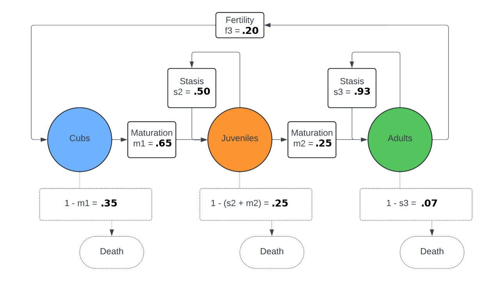

Lab 14: Applications of Eigenvectors
====================================

In this lab you will explore an application of eigenvalues and eigenvectors for population modeling. You will need to import
the following libraries:

>>> import numpy as np
>>> import numpy.linalg as la

Population dynamics is the study of how a population of individuals (like organisms or animals) changes over time. This includes studying growth, decline, and distribution of the population.

It is common to model population dynamics with **matrix population models**. These matrices model populations of organisms and can be used to learn about the different metrics described above.

Transition Matrices
-------------------
We will be looking at a black bear population. This diagram shows the four different groups in the population, *cubs*, *juveniles*, *adults*, and *deceased*.

Population members begin in one stage and transition to other stages. The diagram above models annual transitions from one stage to another. An individual stays in a single class for the entirety of a year but may move to a different class in subsequent years.

The transition values—**stasis**, **maturation**, and **fertility**—represent how much of the population moves from one state to another.

* :math:`s_i`, **stasis**: Probability that an individual in state :math:`i` remains in state :math:`i`
* :math:`m_i`, **maturation**: Probability that an individual in state :math:`i` transitions to state :math:`i+1` (if such next state is possible)
* :math:`f_i`, **fertility**: Probability that an individual in state :math:`i` produces an offspring in state :math:`1`

.. Note::
   No bear can transition out of the deceased state because it acts as an absorbing state. The probability of death can be inferred by the other parameters as :math:`d_i = 1 - s_i - m_i`. 

We can translate the state diagram shown above to a **transition matrix** which shows the rates of transition between different states. Each entry :math:`A_{ij}` corresponds to the average number of individuals that enter into state :math:`i` from a single individual in state :math:`j`:

.. math::
   A = \begin{pmatrix}
      s_1 & f_2 & f_3 \\
      m_1 & s_2 & 0 \\
      0 & m_2 & s_3 \\
   \end{pmatrix}.

The :math:`0` in row 2 indicates that there is no a way for a bear to go from state 3 to state 2 (an adult cannot become a juvenile). The :math:`0` in row 3 indicates that there is no way for a bear to go from state 1 to state 3 (a cub cannot go straight to an adult).

It is important to note that the stasis value for cubs :math:`s_1` will be 0 because cubs cannot remain in the same state for more than a year. The fertility value for juveniles :math:`f_2` will also be 0. So our new matrix is

.. math::
   A = \begin{pmatrix}
      0 & 0 & f_3 \\
      m_1 & s_2 & 0 \\
      0 & m_2 & s_3 \\
   \end{pmatrix}.

Task 1
------

Write a function ``pop_transition_matrix(s2, s3, m1, m2, f3)`` that accepts stasis, maturation, and fertility values and constructs the corresponding transition matrix using a NumPy array. 
Make sure the corresponding transition matrix reflects a valid population dynamics model. Namely, 

* All entries must be non-negative. 
* The stasis and maturation parameters for a given state (i.e., column of :math:`A`) must sum to a value less than or equal to :math:`1`. 

If the matrix is not a valid population dynamics model, raise a ``ValueError``.

Eigenvalues and Eigenvectors
----------------------------

The principal (or largest) eigenvalue and corresponding eigenvector of a transition matrix identify important long-term behavior of the population. The eigenvalue corresponds to the growth or decline of the population and the eigenvector corresponds to the long-term population ratio of the different states.

The `Perron-Frobenius Theorem <https://en.wikipedia.org/wiki/Perron%E2%80%93Frobenius_theorem>`_ states that a real, non-negative, square matrix has a unique largest positive eigenvalue that is real. Additionally, the corresponding eigenvector will be positive once normalized.

Since :math:`A` has non-negative real entries, then by the Perron-Frobenius Theorem

1. There exists a unique dominant, **positive** eigenvalue :math:`\lambda_1 > 0`, with :math:`\lambda_1 > |\lambda_i|` for all :math:`i = 2, \ldots, n`. 
2. The eigenvector :math:`v_1` associated with :math:`\lambda_1` can be scaled to have all positive entries. 

Task 2
------

Write a function ``compute_principal_eig(A)`` that accepts a transition matrix as a NumPy array and returns the principal eigenvalue and its corresponding eigenvector as a list. `See the NumPy function`_ ``numpy.linalg.eig``.

.. _See the NumPy function: https://numpy.org/doc/stable/reference/generated/numpy.linalg.eig.html

The NumPy function ``eig`` will sometimes return numbers of the form ``a+b*j``, where ``j`` is the square root of ``-1``. As this may return complex values of the form ``a+0*j``, use ``np.real`` to convert these values into (real) floats. You may need to use the command ``float()`` to convert the results of this function from ``np.float64`` to the usual ``float`` data type.

Simulating Populations
----------------------

A transition matrix can be combined with a **population value vector** to simulate a transition cycle. A population value vector is a vector containing the number of organisms in each state at the beginning of a cycle.

Task 3
------

Write a function ``simulate(A, p, t)`` that simulates ``t`` steps of the population dynamics model represented by the NumPy array ``A``, with initial population value vector ``p`` given as a list.
Return a list containing the ``t+1`` population vectors. 

.. Note::
   If ``p`` has negative entries, raise a ``ValueError``.

Black Bear Population Demo
--------------------------

Open the `Black Bear Population Demo <https://jhtullis.github.io/test_eigenbears/>`_. This web app computes each of the things that you have written in this lab. On the left hand side of the page you can vary the stasis, maturation, and fertility parameters. 

* The principal eigenvector is displayed as a pie chart reflecting the proportion of the population that each class (or state) makes up.
* The principal eigenvalue is displayed as the title of the plot of the population count. 

Task 4
------

Play around with setting different model parameters :math:`s_2, s_3, m_1, m_2, f_3`. **What happens to the population count when** :math:`\lambda_1 < 1` **? How about when** :math:`\lambda_1 > 1` **?**

Set the parameters to the following: :math:`s_2 = 0.5, s_3 = 0.93, m_1 = 0.65, m_2 = 0.25, f_3 = 0.2`. Now, for each parameter, see how the principal eigenvalue :math:`\lambda_1` changes as a result of changing the parameter by :math:`\pm 0.05`. **Which parameter has the greatest effect on the value of** :math:`\lambda_1` **?**

Task 5
------
Given the following matrix (taken from the diagram shown above), use ``simulate`` with :math:`t = 50` iterations for a few different initial vectors ``p`` (e.g., ``p = np.array([500, 400, 1000])``), then normalize the final population vector. **How does this compare to the principal eigenvector of the transition matrix?**

.. math::
   A = \begin{pmatrix}
      0 & 0 & 0.2 \\
      0.65 & 0.5 & 0 \\
      0 & 0.25 & 0.93 \\
   \end{pmatrix}.

.. note::
   This process is an example of the `Power Method <https://en.wikipedia.org/wiki/Power_iteration>`_, an iterative technique that finds the principal eigenvector of a matrix. For our transition matrix, this means the population distribution (principal eigenvector) will approach a steady state over time. Thus, we can determine the long-term proportions of each group after repeatedly applying the transition matrix.

   You can learn more about this with `Markov Chains <https://en.wikipedia.org/wiki/Markov_chain>`_.