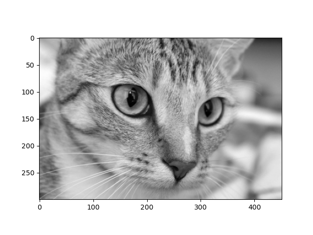
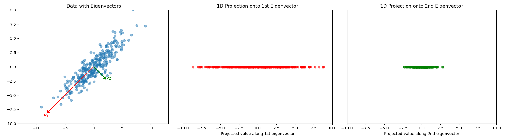

Lab 19: Applications of SVD
==================================

In this lab you will learn about applications of SVD in image compression and in principal component analysis (PCA). 

Image compression
-----------------

For this part of the lab you will perform image compression using singular value decomposition. 
Image compression is the process of reducing the amount of data required to represent an image by removing redundant or less important information.
You will need to import the following:

>>> import numpy as np
>>> import numpy.linalg as la
>>> import matplotlib.pyplot as plt
>>> from skimage import data, color

First, we will do a quick review of SVD decomposition.
Consider an arbitrary matrix of size :math:`m \times n` called :math:`F`.
Recall that the singular value decomposition writes :math:`F` in the form

.. math::

   F = U \Sigma V^T

The matrix :math:`U` is an :math:`m \times m` matrix with orthonormal columns, and :math:`V` is an :math:`n \times n` matrix with orthonormal columns. 
:math:`\Sigma` is a diagonal matrix whose nonzero entries are the singular values of :math:`F`. 
We can use the NumPy function ``la.svd()`` to get these matrices in Python.

>>> U,S,VT = la.svd(F)

Python represents :math:`\Sigma` as ``S``, a list (NumPy array) of the singular values of ``F``. 
The ``np.diag()`` function will turn a list into a diagonal matrix. 
Remember that one of the most useful concepts about SVD decomposition is that when we use the first ``s`` ranks of ``S``, we can obtain a relatively accurate approximation of the matrix :math:`F`\.

>>> F_approx = U[:,:s].dot(np.diag(S[:s])).dot(VT[:s])

This becomes very useful in the context of images.
Most images are stored in matrices of the size ``(height, width, 3)`` where the 3 depths refer to red, blue, green colors represented by a number between 0 and 255.
Because space to store data is finite, performing SVD on every depth, and keeping the first ``s`` ranks of the decomposition can greatly reduce the data taken up while still preserving much of the image quality.
For simplicity we will focus on doing this decomposition on grayscale images which are represented by 2-D matrices with values between 0 and 255.
For this lab we will use a grayscale image of a cat named *Chelsea* from the ``skimage.data`` module, which can be accessed by
this

>>> F = color.rgb2gray(data.chelsea())

To display the image, use the command

>>> plt.imshow(F, cmap='gray')

Now observe what happens when use different values for ``s`` and display the image then. 
This will show what information about the image is preserved in the first few ranks. 
It is impressive how quickly the image can become recognizable with so little data.

.. image:: _static/cats2.png
        :align: center
        :scale: 70%

The command ``F.shape`` shows that the image is stored as a NumPy array of dimensions ``m x n``. 
These dimensions represent the coordinates of a pixel in the image with ``(0,0)`` in the top left corner. 
The first dimension is the vertical dimension and the second is the horizontal dimension.
Each entry is an integer representing how dark a pixel is (``0=black``, ``255=white``).

.. I need to tie this back to SVD somehow

Task 1
------

Write a function ``svd_decomp(F, s)`` which takes in a 2-D grayscale matrix ``F``\, and rank ``s``, and returns an SVD approximation of ``F`` up to rank ``s``.

.. If ``s`` is greater than the length of ``S``, raise a ``ValueError`` and print ``"s cannot be larger than length of S"``.

Task 2
------

How small can you make ``s`` and still have the image recognizable? Don't worry about a little graininess.

Principal Component Analysis
----------------------------

Principal component analysis is a dimensionality reduction technique used to simplify complex datasets while preserving as much information as possible.
In other words, we want to project the data onto a subspace where the most variance exists.
This can be incredibly useful for visualizing patterns in data.
First, we start with and :math:`m \times n` matrix :math:`X` where :math:`m` is the number of data points and :math:`n` is the number of features for each data point.
For example, if you went around interviewing people in the Talmage, :math:`m` would be the number of students and :math:`n` would be their answers to various questions.
The first step is to center the data over each column to obtain :math:`\bar{X}`.
We need to center the data because we care more about how the data is spread about the mean rather than its scale. 

We then need to obtain the sample covariance matrix :math:`C` through :math:`C = \frac{1}{m} \bar{X}^T \bar{X}`\.
In a covariance matrix each entry :math:`(i,j)` gives the covariance between :math:`i` and :math:`j` and the diagonal entries are the variance of each feature. 
What is useful about this matrix is that for each eigenvalue and coresponding eigenvector, the larger the eigenvector, the more variance/information that is preserved in the direction of that eigenvector.
Below is the data points of a :math:`2 \times 100` matrix plotted, along with the assocciated eigenvectors. 
As you can see the first eigenvector preserverse the most variance on the data points.

So all we need to do is find the eigenvectors of the :math:`C` and then project :math:`X` onto the eigenvectors depending on the amount of dimensions we want. 
Each eigenvector will become a basis for the space, allowing the most information to be preserved on the least amount of dimensions.
Becuase :math:`C` is symetric that means it is diagonizable can be written in the form :math:`C = PDP^{-1}` where P is the eigenvectors of :math:`C` and :math:`D` is a diagonal matrix containing the eigenvectors of :math:`C`.
This is where SVD becomes important. 
if we can perfrom SVD on :math:`\bar{X}` to get :math:`\bar{X} = U \Sigma V^T`\, we can then obtain a way to get the eigenvectors of :math:`C`\.

.. math::
        C = \frac{1}{m}\bar{X} ^T \bar{X}
        = \frac{1}{m} V \Sigma^T U^T U \Sigma V^T
        = \frac{1}{m} V \Sigma^T \Sigma V^T
        = V (\frac{1}{m}  \Sigma^T \Sigma) V^T
        = PDP^{-1}

This shows that :math:`V = P` or in other words, :math:`\bar{X}` and :math:`C` have the same eigenvectors.
This means that all you need to do to find the SVD of :math:`X` centered, and then project :math:`X` onto the each eigenvector we want to use as a basis for the space.

Let's do an example with relevant data. 
We will use the NASA Star-Type Dataset which contains 240 stars and 4 features for each star; temperature, luminosity, radius, and absolute magnitude.
So if we center the data over the columns and obtain :math:`\bar{X}` we can then get the SVD and get :math:`V`.
Because we have 4 features :math:`V` will be a :math:`4 \times 4` matrix. 
So if we want to project our data :math:`X` onto a 2-D space, all we have to do is take a truncate it to the first 2 columns and mutliply :math:`X` by it.

.. math::

    \textbf{X} =
    \begin{bmatrix}
        x_{1,1} & x_{1,2} & \cdots & x_{1,4} \\
        x_{2,1} & x_{2,2} & \cdots & x_{2,4} \\
        \vdots  & \vdots  & \ddots & \vdots  \\
        x_{240,1} & x_{240,2} & \cdots & x_{240,4}
    \end{bmatrix}
..     \in \mathbb{R}^{240 \times 4}

.. math::

    \textbf{V}_{\text{trunc}} =
    \begin{bmatrix}
        v_{1,1} & v_{1,2} \\
        v_{2,1} & v_{2,2} \\
        v_{3,1} & v_{3,2} \\
        v_{4,1} & v_{4,2}
    \end{bmatrix}
..     \in \mathbb{R}^{4 \times 2}

.. math::

    \textbf{X}_{\text{proj}} = \textbf{X} \cdot \textbf{V}_{\text{trunc}} =
    \begin{bmatrix}
        p_{1,1} & p_{1,2} \\
        p_{2,1} & p_{2,2} \\
        \vdots  & \vdots  \\
        p_{240,1} & p_{240,2}
    \end{bmatrix}
..     \in \mathbb{R}^{240 \times 2}

Once we plot this data we end up with this graph. 

.. image:: _static/pca.png
        :align: center

As you can see above the PCA works very well because we can see almost distinct groupings for each star type.
Now just so you can understand more of how the variance is preserved through the first two features take a look at the two graphs below. 
On the left we have PCA done with the first 2 columns of :math:`V`, and on the right we have it done with columns 3 and 4.
It is clear to see how so much more variance, and accuracy, is preserved in columns 1 and 2 compared with 3 and 4.

.. image:: _static/pca_vs.png
        :align: center

.. note::
                
        We say principal component in PCA because the axis of these projections hold no metric (they don't mean anything interpretable in context of the features). 
        So while PCA can be really effective to visualize groupings and relations among the data in data sets, it is limited in producing actual conclusions about the features relation to the data.

Task 3
------
Write a function called ``PCA(X, k)`` which takes in a matrix ``X``, and number of principal components ``k`` and returns an ``m x k`` ``numpy.array`` using the PCA algorithm defined above.

Task 4
------

Use your newly defined ``PCA(X, k)`` function to perfrom PCA on the Palmer Penguins Dataset, and then print out which two groups are the most similar according to the analysis. 
