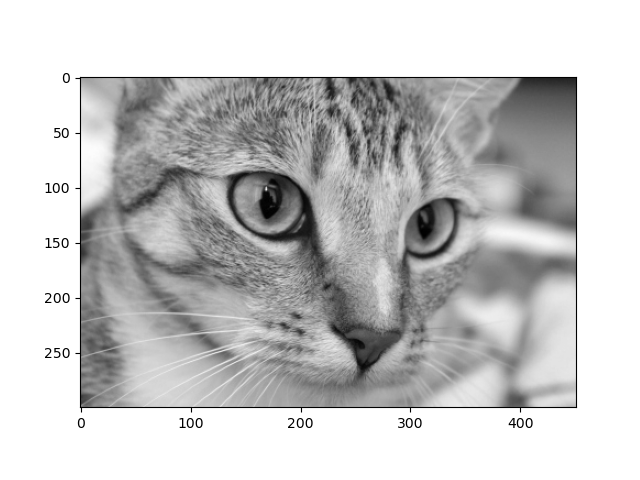
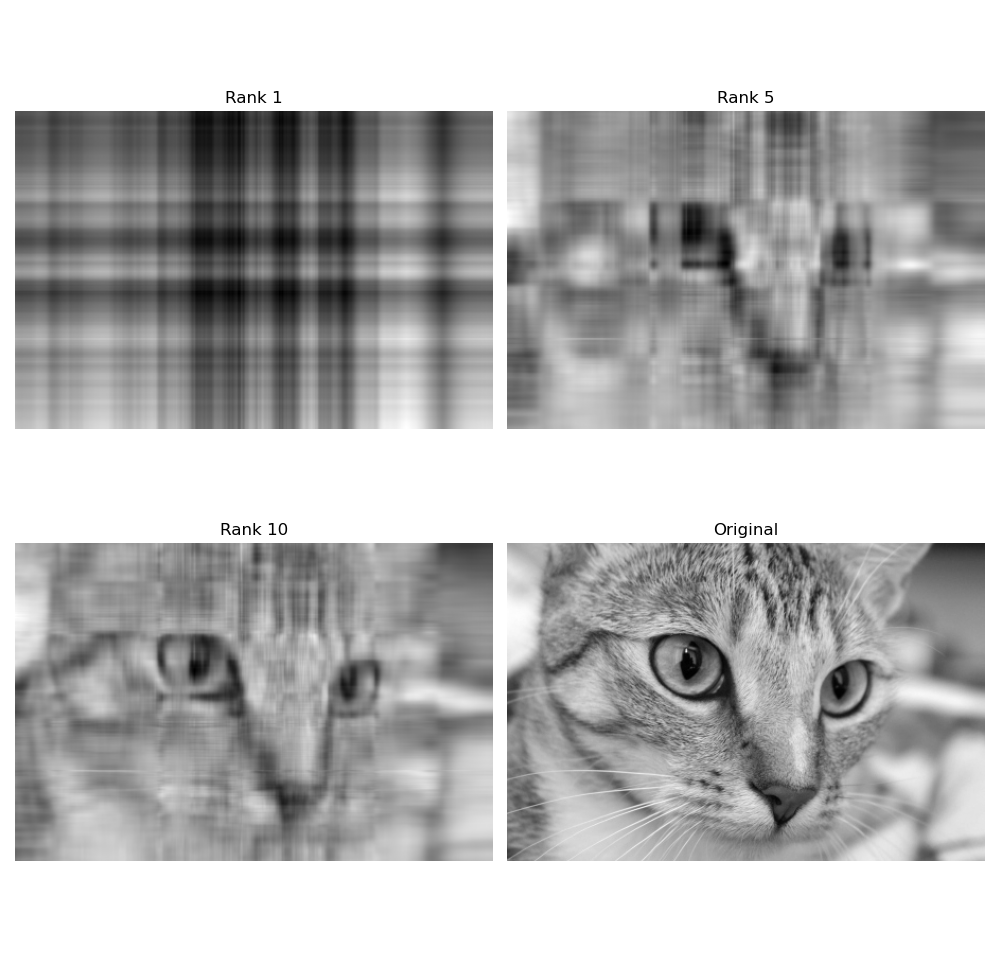
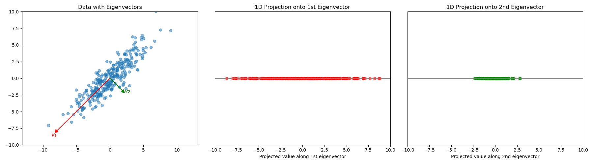
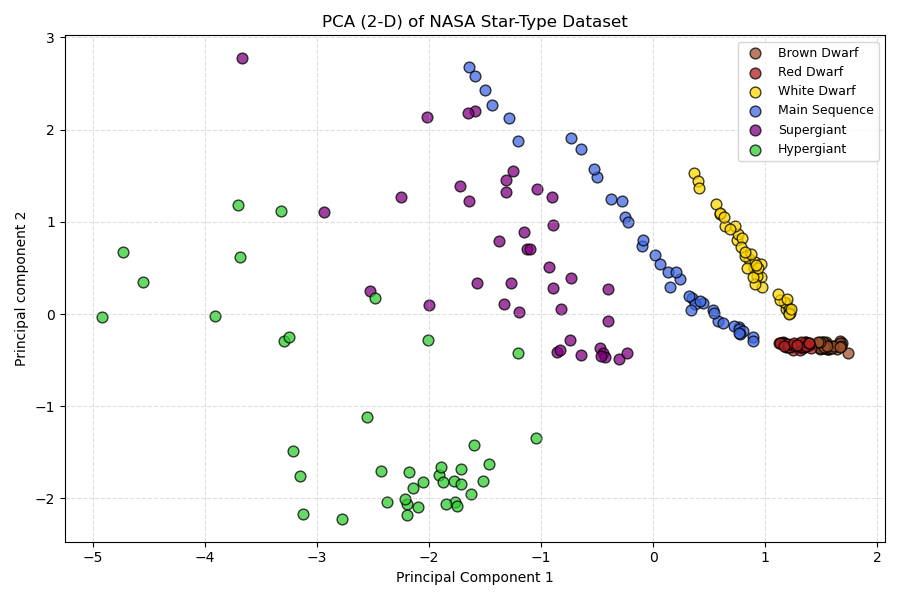
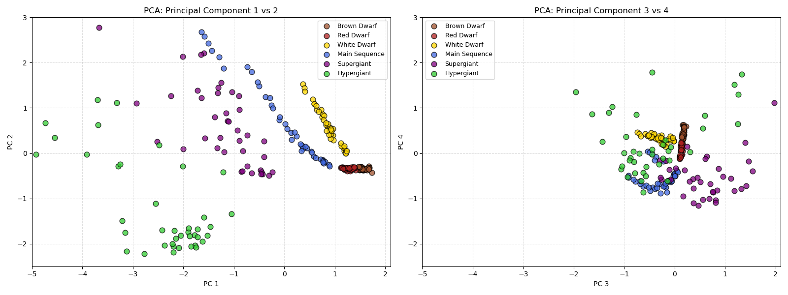

Lab 21: Applications of SVD
==================================

In this lab, you will learn about applications of the singular value decomposition (SVD), like image compression and principal component analysis (PCA). 

Application 1: Image compression
--------------------------------

For this part of the lab, you will perform image compression using singular value decomposition. 
Image compression is the process of reducing the amount of data required to represent an image by removing redundant or less important information.
You will need to import the following:

>>> import numpy as np
>>> import numpy.linalg as la
>>> import matplotlib.pyplot as plt
>>> from skimage import data, color

First, let's do a brief review of the SVD.
Consider an arbitrary matrix of size :math:`m \times n` called :math:`A`.
Recall that the singular value decomposition writes :math:`A` in the form

.. math::

   A = U \Sigma V^T

The matrix :math:`U` is an :math:`m \times m` matrix with orthonormal columns, and :math:`V` is an :math:`n \times n` matrix with orthonormal columns. 
:math:`\Sigma` is a :math:`m \times n` diagonal matrix whose nonzero entries are the singular values of :math:`A`. 
We can use the NumPy function ``la.svd()`` to get these matrices in Python.

>>> U,S,VT = la.svd(A)

Python represents :math:`\Sigma` as ``S``, a 1-D NumPy array of the singular values of ``A``. 
The ``np.diag()`` function will turn a 1-D NumPy array into a diagonal matrix. 
Remember that one of the most useful features of SVD is that when we use the first ``s`` ranks of ``S``, we can obtain a relatively accurate approximation of the matrix :math:`A`\.

>>> A_approx = U[:,:s] @ np.diag(S[:s]) @ VT[:s]

This becomes very useful in the context of images.
Most images are stored in matrices of the size ``(height, width, 3)`` where 3 dimensions refers to the color dimensions, red, blue, and green colors represented by a number between 0 and 255.
Because the space to store an image is finite, performing SVD on every dimension, and keeping the first ``s`` ranks of the decomposition can greatly reduce the storage space while still preserving much of the image quality.
For simplicity we will focus on doing this decomposition on grayscale images which are represented by 2-D matrices with values between 0 and 255 (i.e., ``(height, width)``).

We will use a grayscale image of a cat named *Chelsea* from the ``skimage.data`` module, which can be accessed with
this

>>> A = color.rgb2gray(data.chelsea())

To display the image, use the command

>>> plt.imshow(A, cmap='gray')
>>> plt.show()

Now observe what happens when we display the image for different values of compression level, ``s``. 
This will show what information about the image is preserved in the first few singular vectors. 
It is impressive how quickly the image can become recognizable with so little data (i.e., singular vectors).

.. admonition:: Image Arrays

        The command ``A.shape`` shows that the image is stored as a NumPy array of dimensions ``m x n``. 
        These dimensions represent the coordinates of a pixel in the image with ``(0,0)`` in the top left corner. 
        The first dimension is the vertical dimension and the second is the horizontal dimension. 
        Each entry is an integer representing how dark a pixel is (``0=black``, ``255=white``).

.. I need to tie this back to SVD somehow

Task 1
------

Write a function ``svd_approx(A, s)`` which takes in a 2-D matrix ``A``\, and rank ``s``, and returns an SVD approximation of ``A`` up to rank ``s``.

.. If ``s`` is greater than the length of ``S``, raise a ``ValueError`` and print ``"s cannot be larger than length of S"``.

Task 2
------

How small can you make ``s`` and still have the image recognizable? Don't worry about a little graininess.

Application 2: Principal Component Analysis (PCA)
-------------------------------------------------

Principal component analysis (PCA) is a dimensionality reduction technique used to simplify complex datasets while preserving as much information as possible.
At its most basic level, PCA seeks to project the data onto a subspace where the most variance exists.
This can be incredibly useful for visualizing patterns in and understanding structure about data.

First, we begin with an :math:`m \times n` "data matrix", :math:`X`, where :math:`m` is the number of data points and :math:`n` is the number of features for each data point.
For example, if you went around interviewing people in the Talmage Building, :math:`m` would be the number of students and :math:`n` would be their answers to various questions.
The first step is to center each column of the data to obtain :math:`\bar{X}`.
We need to center the data because we care more about how the data is spread about the mean rather than its scale. 

We then need to obtain the sample covariance matrix :math:`C` given by :math:`C = \frac{1}{m} \bar{X}^T \bar{X}`\.
In a covariance matrix each entry :math:`(i,j)` gives the covariance between feature :math:`i` and feature :math:`j`\.
This implies the diagonal entries are the variance of each feature. 
For each eigenvalue and its corresponding eigenvector of the covariance matrix, the larger the eigenvalue, the more variance is captured along that eigenvector.
Below are the data points of a :math:`100 \times 2` data matrix (i.e., :math:`100` data points each of dimension :math:`2`), plotted along with the associated eigenvectors. 
As you can see, the first eigenvector represents the direction along with that contains the most variance in the data set.

All we need to do is find the eigenvectors of :math:`C` and then project :math:`X` onto the dominant eigenvectors (i.e., eigenvectors corresponding to largest eigenvalues). 
These eigenvectors will form a basis for the space, allowing the most information to be preserved on the least amount of dimensions.
When we perform SVD on :math:`\bar{X}` to get :math:`\bar{X} = U \Sigma V^T`\, we can show that the right singular vectors of :math:`\bar{X}` are the eigenvectors of :math:`C`.
Because :math:`C` is real-valued and symmetric, it is orthogonally diagonalizable and can be written as follows 

.. in the form :math:`C = PDP^{-1}` where :math:`P` contains the eigenvectors of :math:`C`\, and :math:`D` is a diagonal matrix containing the eigenvalues of :math:`C`.

.. math::
        C = \frac{1}{m}\bar{X} ^T \bar{X}
        = \frac{1}{m} V \Sigma^T U^T U \Sigma V^T
        = \frac{1}{m} V \Sigma^T \Sigma V^T
        = V (\frac{1}{m}  \Sigma^T \Sigma) V^T
        = V D V^T,

showing that :math:`V` contains the eigenvectors of :math:`C` and :math:`D` contains the eigenvalues of :math:`C`.
This means we simply need to compute the right singular vectors of the centered matrix :math:`\bar{X}` (which are the eigenvectors of :math:`C`) and then project :math:`\bar{X}` onto the desired number of dominant eigenvectors to capture the most variance in the desired number of dimensions.

Let's do an example with real-world data. 
We will use the NASA Star-Type Dataset which contains 240 stars and 4 features for each star; temperature, luminosity, radius, and absolute magnitude.
If we center each column of the data and obtain :math:`\bar{X}` we can then compute the SVD and get :math:`V`.
Because we have 4 features, :math:`V` will be a :math:`4 \times 4` matrix. 
If we want to project our data :math:`\bar{X}` onto a 2-D space, all we have to do is take :math:`\bar{X}` and multiply it by the first 2 columns of :math:`V`:

.. math::

    \bar{\textbf{X}} =
    \begin{bmatrix}
        x_{1,1} & x_{1,2} & \cdots & x_{1,4} \\
        x_{2,1} & x_{2,2} & \cdots & x_{2,4} \\
        \vdots  & \vdots  & \ddots & \vdots  \\
        x_{240,1} & x_{240,2} & \cdots & x_{240,4}
    \end{bmatrix}
..     \in \mathbb{R}^{240 \times 4}

.. math::

    \textbf{V}_{\text{trunc}} =
    \begin{bmatrix}
        v_{1,1} & v_{1,2} \\
        v_{2,1} & v_{2,2} \\
        v_{3,1} & v_{3,2} \\
        v_{4,1} & v_{4,2}
    \end{bmatrix}
..     \in \mathbb{R}^{4 \times 2}

.. math::

    \bar{\textbf{X}}_{\text{proj}} = \bar{\textbf{X}} \textbf{V}_{\text{trunc}} =
    \begin{bmatrix}
        p_{1,1} & p_{1,2} \\
        p_{2,1} & p_{2,2} \\
        \vdots  & \vdots  \\
        p_{240,1} & p_{240,2}
    \end{bmatrix}
..     \in \mathbb{R}^{240 \times 2}

Once we plot this data, we obtain the following graph.

As you can see above the PCA works very well because we can see almost distinct groupings for each star type.
Now, just so you can understand more of how the variance is preserved through the first two features, take a look at the two graphs below. 
On the left we have PCA done with the first 2 columns of :math:`V`, and on the right we have it done with columns 3 and 4.
It is clear to see how so much more variance, and accuracy, is preserved in columns 1 and 2 compared with 3 and 4.

.. note::
                
        We call them principal components because the axes of these projections carry no physical units (they are not directly interpretable features).
        So while PCA can be really effective to visualize groupings and relations among the data in datasets, it is limited in producing actual conclusions about how individual features relate to the data.

Task 3
------
Write a function called ``PCA(X, k)`` which takes in a matrix ``X``, and number of principal components ``k`` and returns an ``m x k`` ``numpy.ndarray`` using the PCA algorithm defined above.

Task 4
------

Use your newly defined ``PCA(X, k)`` function to perform PCA on the Palmer Penguins dataset, and then print out which two groups are the most similar according to the analysis. 
The dataset will be provided in CodeBuddy. 
