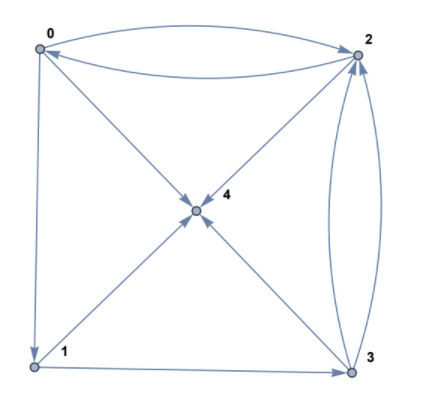

Lab 24601: Networks and Eigenvector Centrality
==============================================

In this lab, you will learn how to model real-world networks as mathematical networks and adjacency matrices. 

A network is a collection of nodes. 
Nodes are objects that are connected by edges. 
You can think about it like houses (nodes) being connected to other houses by roads (edges) in a neighborhood (network).
Networks can model everything from social media friendships to international alliances.
Some networks are directed, meaning each edge has a specific direction.
An example of this could be a supply chain where products are always sent from one firm to another.

Directed networks have become very important in modeling the internet.
We let websites/pages be the nodes, connected by various hyperlinks acting as directed edges.
Networks like this allow search engines such as Google or Microsoft Edge to rank pages based on importance or relevance.
In this lab we will walk you through this process of finding the importance of links.

Adjacency Matrices
------------------

Throughout this lab we will use a directed network to represent the *internet*.
We will start with a matrix of directed edges, where each row contains a starting page and its corresponding ending page.
It will be a :math:`m \times 2` matrix appearing like,

.. math::

    \left[
    \begin{matrix} 
    76 & 109 \\
    76 & 4 \\ 
    76 & 78 \\
    \vdots & \vdots
    \end{matrix}
    \right]

For example, this small snippet shows us that page 76 has hyperlinks to page 109, 4, and 78.
Now, we can take this vector and transform it into a much more useful form of data called an adjacency matrix.
This matrix is :math:`n \times n` with :math:`n` nodes.
In this matrix, each row corresponds to a starting page, and each column corresponds to an ending page.
So every :math:`(i,j)` position of the adjacency matrix will be a directed edge from node :math:`v_i` to node :math:`v_j`

Consider the directed network above. It contains 5 nodes, and can be represented by the following :math:`5 \times 5` adjacency matrix,

.. math:: 
    \left[
    \begin{matrix} 
    0 & 1 & 1 & 0 & 1 \\
    0 & 0 & 0 & 1 & 1 \\
    1 & 0 & 0 & 0 & 1 \\
    0 & 0 & 2 & 0 & 1 \\
    0 & 0 & 0 & 0 & 0 \\ 
    \end{matrix}
    \right]

.. Definitely directly copied this below from the lab haha

Notice the 2 in the 4th row, 3rd column, since there are two edges traveling from node 3 to node 2. 
Also, notice that there are no non-zero entries in the last row, which corresponds to the fact that node 4 does not have any edges which start from it.

Task 1
------
Define a function ``adj_matrix(edge_matrix)``\. 
This function should take a :math:`m \times 2`  ``np.array`` and return the respective :math:`n \times n` adjacency matrix.
Note that because each node is represented by a number between :math:`0` and :math:`n-1` use ``np.max()`` and add 1 to find the size of the adjacency matrix.
If you are confused on how to set up the adjacency matrix, refer to the notes above.

.. There was a part of the original lab where you take 
.. It talks about explaining that you could add up the amount of nodes points to a node to determine its importance but that would be stupid
.. So if they think that adding more of it would be useless them I'm not going to do it, unless we feel it's needed

PageRank Centrality
-------------------

For the next part of the lab, we are going to explore how Google and other companies actually determine the importance of pages through PageRank Centrality.
For the next part of the lab consider the network below.

.. image:: _static/directed_network_gprime.png
        :align: center

The adjacency matrix for this network is defined by

.. math::

   \left[
   \begin{array}{cccccccc}
   0 & 1 & 0 & 0 & 0 & 0 & 0 & 0 \\
   0 & 0 & 1 & 0 & 0 & 0 & 0 & 0 \\
   1 & 0 & 0 & 1 & 0 & 1 & 1 & 0 \\
   0 & 0 & 0 & 0 & 1 & 1 & 0 & 0 \\
   1 & 0 & 1 & 0 & 0 & 0 & 0 & 0 \\
   1 & 0 & 0 & 0 & 0 & 0 & 0 & 0 \\
   0 & 0 & 0 & 0 & 0 & 1 & 0 & 1 \\
   1 & 0 & 0 & 0 & 0 & 0 & 0 & 0
   \end{array}
   \right]

The basis of PageRank Centrality is that the importance of every node, :math:`x_i`\, is determined by the importance of the nodes pointing towards it.
Basically, to measure a node's importance, sum the importance of each node pointing to it, divided by the number of nodes they point to.
Consider node :math:`1`. Only node :math:`0` is pointing towards it, and this node points to only one other node. 
So :math:`x_1 = x_0`, or the importance of node :math:`1` is equal to the importance of node :math:`0`.
Now look at node :math:`7`. Only node :math:`6` is pointing there, but node :math:`6` is pointing to two different nodes. 
Hence :math:`x_7 = \frac{1}{2} x_6`. 
If we continue this for all of the nodes in our network we get the following set of equations.

.. math::
    
    \begin{array}{cc}
    x_0 = \frac{1}{2}x_4  + \frac{1}{4}x_2 + x_5 + x_7 & x_4 = \frac{1}{2} x_3 \\
    x_1 = x_0 & x_5 =  \frac{1}{2}x_6 + \frac{1}{4}x_2 + \frac{1}{2}x_3 \\
    x_2 = x_1 + \frac{1}{2}x_4 & x_6 = \frac{1}{4}x_2 \\
    x_3 = \frac{1}{4}x_2 & x_7 = \frac{1}{2} x_6
    \end{array}

Now we can represent these as a system of equations to solve for the importance of each node.
Doing that we get

.. math::
    \left[
    \begin{array}{c}
    x_0\\ x_1\\ x_2\\ x_3\\ x_4\\ x_5\\ x_6\\ x_7
    \end{array}
    \right]
    =
    \left[
    \begin{array}{cccccccc}
    0 & 0 & \frac{1}{4} & 0 & \frac{1}{2} & 1 & 0 & 1 \\
    1 & 0 & 0 & 0 & 0 & 0 & 0 & 0 \\
    0 & 1 & 0 & 0 & \frac{1}{2} & 0 & 0 & 0 \\
    0 & 0 & \frac{1}{4} & 0 & 0 & 0 & 0 & 0 \\
    0 & 0 & 0 & \frac{1}{2} & 0 & 0 & 0 & 0 \\
    0 & 0 & \frac{1}{4} & \frac{1}{2} & 0 & 0 & \frac{1}{2} & 0 \\
    0 & 0 & \frac{1}{4} & 0 & 0 & 0 & 0 & 0 \\
    0 & 0 & 0 & 0 & 0 & 0 & \frac{1}{2} & 0
    \end{array}
    \right]
    \left[
    \begin{array}{c}
    x_0\\ x_1\\ x_2\\ x_3\\ x_4\\ x_5\\ x_6\\ x_7
    \end{array}
    \right]
    .

Now we have a matrix of the form :math:`x=Px` or :math:`Px=x` where :math:`x` is the importance of each vector. 
As you can begin to see, we are solving for an eigenvector whose corresponding :math:`\lambda` is 1.

If you remember back to Lab 9, we used iterative methods to solve for the solution of systems of equations.
We can use the `Power method <https://en.wikipedia.org/wiki/Power_iteration>`_ here.
This method solves for the dominant eigenvector of a system of equations through following the equation,

.. math::

    x_{k+1} = \frac{Px_k}{||Px_k||}

.. note::
    This matrix is a `stochastic matrix <https://en.wikipedia.org/wiki/Stochastic_matrix>`_. 
    This is because each column of the matrix sums to one.
    By the `Perron-Frobenius theorem <https://en.wikipedia.org/wiki/Perron%E2%80%93Frobenius_theorem>`_ 
    we are guaranteed that if a matrix's columns all sum up to 1 and all entries are non-negative, then 
    there exists an eigenvalue of 1 and associated eigenvector. 
    This is why we can use the Power Method here. 
    

Now consider the vector below whose column adds up to 1.

.. math::
    x_0 = 
    \left[
    \begin{array}{c}
    1/8 \\
    1/8 \\
    1/8 \\
    1/8 \\
    1/8 \\
    1/8 \\
    1/8 \\
    1/8
    \end{array}
    \right].

Because of the way our system of equations is set up, as long as the columns of :math:`x_k` add up to 1, the columns of :math:`x_{k+1}` will add up to 1.
Therefore, we can omit normalization at each iteration.
Thus the rule for the method is :math:`x_{k+1} = Px_k`. 
Therefore, :math:`x_{k} = P^{k}x_0`.
Like all iterative methods, as we increase the amount of iterations, the iterate becomes more and more accurate. 

Task 2
------

Define a function ``stoch_mat(A)`` which will take an adjacency matrix ``A`` and returns the corresponding stochastic matrix. 
You can calculate the stochastic matrix by dividing each row of the matrix by the sum of the row, and then transpose the matrix using ``A.T``.

Task 3
------

Define a function ``stoch_eig(P, k)`` which takes a ``n x n`` stochastic matrix ``P`` and number of iterations ``k`` 
and returns the dominant eigenvector of ``P`` after ``k`` iterations.
You will need to start with ``x_0 = np.array([1/n, 1/n, ... , 1/n]) = np.full(n, 1/n)`` with ``n`` entries.
Remember the equation :math:`x_{k} = P^{k}x_0`.

.. note::
    the numpy function ``np.full(shape, value)`` takes in a shape, ``n`` for one dimensional vectors and ``(m, n)`` for multi-dimensional matrices,
    and fills it in with the fill value.

    >>> np.full(5, 10)
    [10 10 10 10 10]

    >>> np.full((2,3), 4)
    [[4 4 4]
     [4 4 4]]
        

Task 4
------

Define a function ``PageRank_cent(edge_matrix, k)``.
You will need to combine all of your past functions to take ``edge_matrix`` and convert it to an adjacency matrix using the ``adj_matrix`` function.
Then convert the adjacency to a stochastic matrix using the ``stoch_mat`` function.
You will then need to use the ``stoch_eig`` function to return the dominant eigenvector after ``k`` iterations. 

Task 5
------

Use your recently created ``PageRank_cent`` to find the index of the most important node of a 499-node network.
You can use ``np.argmax()`` to find the index of the largest element in an array. The directed edges matrix will be given in code buddy.

Conclusion
----------

Using the Power Method to compute the PageRank scores was the foundation of Google’s search ranking results for many years.
Larry Page and Sergey Brin are the original developers of this algorithm.
The PageRank algorithm is known to converge quite quickly. 
In their original paper, Brin and Page reported that on a network with 322 million edges the algorithm converged to usable values within 52 iterations.

Finally, as a historical note, the patent for the PageRank algorithm is owned by Stanford University (where Brin and Page were students at the time they developed it). 
Stanford granted Google exclusive license rights to use the algorithm, in exchange for 1.8 million shares of Google which Stanford sold in 2005 for $336 million. 
Today those shares would be worth approximately $3.8 billion, all for an algorithm that computes an eigenvector!
