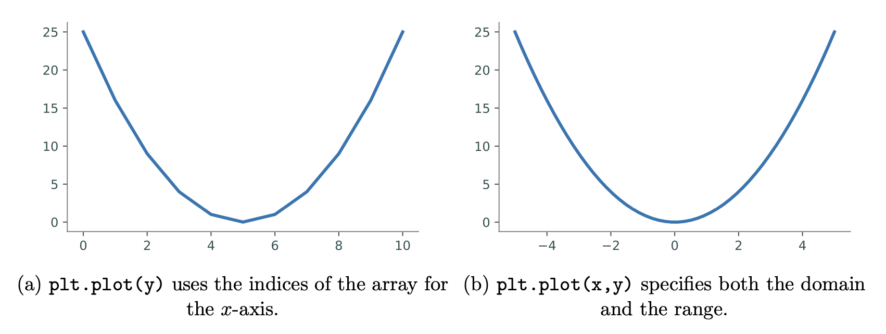
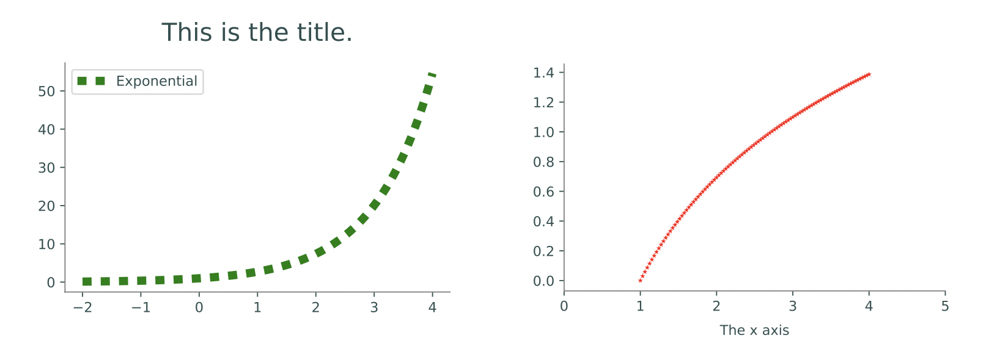
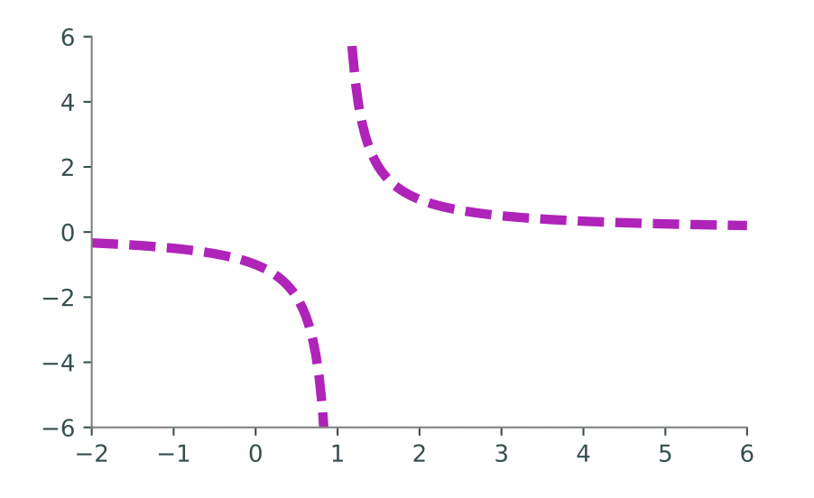

Lab 1: Introduction to Plotting
===============================

.. Find a place to put this information about array masking. 
..
.. Array Masking
.. -------------
.. Array masking is a powerful tool in numpy that allows you to filter data using conditions. When you apply a condition on a NumPy array, it returns a new array of boolean values with ``True`` where the condition is met, and ``False`` otherwise. This is called a **boolean mask**. For example,

.. >>> a = np.array([1, 2, 3, 4])
.. >>> a > 2
.. array([False, False,  True,  True])

.. You can then use this mask to select the elements only where the condition is ``True``.

.. >>> a = np.array([1, 2, 3, 4])
.. >>> b = a > 2
.. >>> a[b]
.. array([3, 4])

This material is adapted from the ACME lab on MatPlotLib.

Raw numerical data is rarely helpful unless it can be visualized. 
Fortunately there is a helpful Python package ``matplotlib`` that can help you create nice visualizations of your data. You have already seen this package in your SVD lab, but in this lab you will learn
more about its capabilities.

We will focus on creating *line plots*. The following code creates an array of outputs of
the function :math:`f(x) = x^2`, then visualizes the array using ``matplotlib``.

.. code-block:: python
	
	import numpy as np
	from matplotlib import pyplot as plt

	y = np.arange(-5,6)**2

	# Visualize the plot.
	plt.plot(y)                     # Draw the line plot.
	plt.show()                      # Reveal the resulting plot.

The result is shown below in (a). Just as ``np`` is a standard alias for ``numpy``, ``plt`` is a standard alias for ``matplotlib.pyplot`` in the Python community.

The call ``plt.plot(y)`` creates a figure and draws straight lines connecting the entries of ``y`` relative to the ``y``-axis. The ``x``-axis is (by default) the index of the array, which in this case is the integers from 0 to 10. Calling ``plt.show()`` then displays the figure.

An obvious problem with plot (a) is that the ``x``-axis does not correspond correctly to the ``y``-axis for the function :math:`f(x) = x^2` that is being drawn. To correct this, define an array ``x`` for the domain, then use it to calculate the image :math:`y = f(x)`. The command ``plt.plot(x,y)`` plots ``x`` against ``y`` by drawing a line between the consecutive points ``(x[i], y[i])``. Note that the arrays must have the same number of elements to be compatible.

Another problem with plot (a) is its poor resolution: the curve is visibly bumpy, especially near the bottom of the curve. ``numpy``'s ``linspace()`` function makes it easy to get a higher-resolution domain by creating an array of evenly-spaced values in a given interval where the **number of elements** is specified.

.. code-block:: python

	# Get 4 evenly-spaced values between 0 and 32 (including endpoints).
	np.linspace(0, 32, 4)

	# Get 50 evenly-spaced values from -5 to 5 (including endpoints).
	x = np.linspace(-5, 5, 50)
	y = x**2                        # Calculate the range of f(x) = x**2.
	plt.plot(x, y)
	plt.show()

The resulting plot is shown in (b). This time, the ``x``-axis correctly matches up with the ``y``-axis. The resolution is also much better because ``x`` and ``y`` have ``50`` entries each instead of only ``10``.

Task 1
------

Write a function that plots the functions ``sin(x)``, ``cos(x)``, and ``arctan(x)`` on the domain ``[-2π, 2π]`` (use ``np.pi`` for π). Call ``plt.xlim(-2*np.pi, 2*np.pi)`` before ``plt.show()`` to stretch the ``x``-axis appropriately. Make sure the domain is refined enough to produce a figure with good resolution.

*Note*: For this lab, the autograder is testing to see if your graphs are a pixel-perfect match for the solution graphs, so follow the instructions closely. Future labs will mostly rely on alternative grading methods.

Plot Customization
------------------

The plots you created in Task 1 are extremely basic. Most plots are greatly improved by the addition of color, legends, axis labels and titles.

``plt.plot()`` receives several keyword arguments for customizing the drawing. For example, the color and style of the line are specified by the following string arguments.

.. list-table:: 
   :widths: 10 50 10 10 200
   :header-rows: 1

   * - Key
     - Color
     - 
     - Key
     - Style
   * - ``"b"``
     - blue
     - 
     - ``"-"``
     - solid line
   * - ``"g"``
     - green
     - 
     - ``"--"``
     - dashed line
   * - ``"r"``
     - red
     - 
     - ``"-."``
     - dash-dot line
   * - ``"c"``
     - cyan
     - 
     - ``":"``
     - dotted line
   * - ``"k"``
     - black
     - 
     - ``"o"``
     - circle marker

Specify one or both of these string codes as the third argument to ``plt.plot()`` to change from the default color and style. Other ``plt`` functions further customize a figure.

.. list-table:: 
   :header-rows: 1

   * - Function
     - Description
   * - ``legend()``
     - Place a legend in the plot
   * - ``title()``
     - Add a title to the plot
   * - ``xlim()`` / ``ylim()``
     - Set the limits of the ``x``- or ``y``-axis
   * - ``xlabel()`` / ``ylabel()``
     - Add a label to the ``x``- or ``y``-axis

.. code-block:: python

	x1 = np.linspace(-2, 4, 100)
	plt.plot(x1, np.exp(x1), 'g:', linewidth=6, label="Exponential")
	plt.title("This is the title.", fontsize=18)
	plt.legend(loc="upper left")    	# plt.legend() uses the 'label' argument of
	plt.show()                      	# plt.plot() to create a legend.

	x2 = np.linspace(1, 4, 100)
	plt.plot(x2, np.log(x2), 'r*', markersize=4)
	plt.xlim(0, 5)                  	# Set the visible limits of the x axis.
	plt.xlabel("The x axis")        	# Give the x axis a label.
	plt.show()

See `the MatPlotLib documentation <https://matplotlib.org/stable/index.html>`_ for more comprehensive lists of colors, line styles, and figure customization routines.

Task 2
------

Write a function to plot the curve :math:`f(x) = \dfrac{1}{x-1}` on the domain [-2, 6].

a. Although :math:`f(x)` has a discontinuity at :math:`x = 1`, a single call to ``plt.plot()`` in the usual way will make the curve look continuous. Split up the domain into :math:`[-2, 1)` and :math:`(1,6]`. Plot the two sides of the curve separately so that the graph looks discontinuous at :math:`x = 1`.

   If we use the two functions ``x1 = np.linspace(-2,1,N)`` and ``x2 = np.linspace(1,6,N)`` to generate our domains, then each domain will contain ``1``, and therefore there will be division by ``0`` if we plug those endpoints into the function. You should remove the last number from the first list, and the first number from the second list, getting rid of the ``1`` s to prevent division by ``0``.

b. Plot both curves with a dashed magenta line. Set the keyword argument ``linewidth`` (or ``lw``) of ``plt.plot()`` to ``4`` to make the line a little thicker than the default setting.

c. Use ``plt.xlim()`` and ``plt.ylim()`` to change the range of the ``x``-axis to :math:`[-2, 6]` and the range of the ``y``-axis to :math:`[-6, 6]`.

The plot should resemble the figure below.

