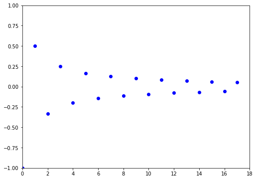
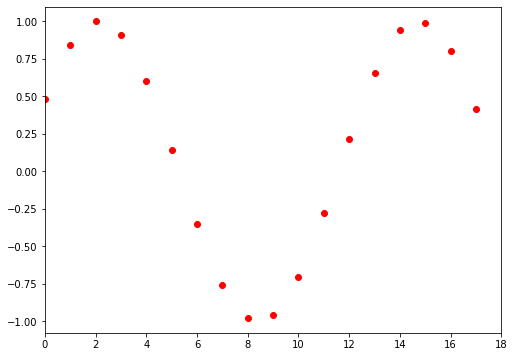

Lab 2: Introduction to Plotting and Sequences 
=============================================

Plotting sequences
------------------

As you have seen in class, a sequence is a countably infinite ordered list of numbers. We are often wondering whether a particular sequence has a limit or not, and one of the most intuitive tools that we have to explore this is plotting. For example, if you saw the two plots below, you would guess that sequence :math:`(a_n)` has a limit (probably :math:`0`) and sequence :math:`(b_n)` does not. While this is not a rigorous proof, it can help build intuition about convergence and divergence of sequences. The goal of this lab is to learn how to create plots like these.

  Sequence :math:`(a_n)` converges to :math:`0`

  Sequence :math:`(b_n)` does not converge

In the previous lab, you saw how to plot functions using the ``matplotlib`` package. When plotting a function on :math:`\mathbb R`, we needed many intermediary values to make the function look smooth. Because of these intermediary values, we used NumPy's ``arange``. However, plotting a sequence is generally much simpler since we no longer need intermediary values. We can instead collect the terms of the sequence into a list. In the example below, we will plot the sequence whose ``n``-th term is given by

.. math::
	a_n = (-1)^n \frac{n}{2n + 1}

.. code-block::

	import matplotlib.pyplot as plt   # importing matplotlib
	                                  # and giving it the name plt

	N = 20      # the number of terms to generate
	a = []      # start with an empty list

	for n in range(0,N):
	    a.append(((-1.0)**n)*n/(2.0*n+1.0))     # populate the list
	plt.plot(a,".")    # the "." tells the program to plot discrete points
	plt.show()         # displays the plot

If you recognize this example, it is because it can be found on page 128 of your Math 341 textbook.
Let's look at what differs from plotting a function in this example. In all our previous examples of using the ``plot`` function, we passed in two lists: a list for the ``x``-coordinates and a list for the ``y``-coordinates. If we instead pass in only one list, that list is assumed to be the list of ``y``-coordinates and the list of ``x``-coordinates is assumed to be a list of indices: a list of integers starting at ``0`` and ending just before the length of the list of ``y``-coordinates. In the example above, the ``y``-coordinates are given by 

.. math::
	a_n = (-1)^n \frac{n}{2n + 1}

for ``0 <= n <= 19`` and the ``x`` coordinates are given by the list ``[0,1,...,19]``.

Task 1
------

Write a function, ``plot_monotonic()``, to plot the sequence

.. math::
	a_n = \frac{n}{\sqrt{n^2 + 1}}

for :math:`n = 0,1,\ldots,19` using the ``sqrt`` function from the ``math`` library. Title the plot :math:`a_n = \frac{n}{\sqrt{n^2 + 1}}`. We can put the raw LaTeX inside a raw string to do this (``r"$a_n = \frac{n}{\sqrt{n^2 + 1}}$"``). Then, label the axes :math:`n` and :math:`a_n` also using raw strings and LaTeX. Then, adjust the x-axis ticks to be the indices of your sequence.

Does the sequence appear to converge? If so, to what limit? Compare with Example 8.2 in the text.

Customizing graphs
------------------

Just as with plotting functions, we may customize our graphs using all the same commands as before. The only difference is that we will prefer to have discrete points to differentiate a sequence from a function on :math:`\mathbb R`. Thus we will use keywords such as ``"."`` or ``"o"`` to get discrete points.
As an example, we can add a title and change the limits of the ``x`` and ``y`` axes in our first example:

.. code-block::

	import matplotlib.pyplot as plt

	N = 20
	a = []

	for n in range(0,N):
	    a.append(((-1.0)**n)*n/(2.0*n+1.0))

	plt.title("A plot of {a_n}")  # titles the plot
	plt.xlim([-1,20])             # sets the x range to between -1 and 20
	plt.ylim([-1,1])              # sets the y range to between -1 and 1
	plt.plot(a,"mo")              # magenta circle markers
	plt.show()

In the above examples, we used a ``for`` loop to construct our ``a`` and ``y`` values. However, we have other options.  We simply need a list. We could have used list comprehension or created a function that makes a list. The code block below shows the first example reworked using list comprehension:

.. code-block::

	import matplotlib.pyplot as plt

	N = 20      # the number of terms to generate
	a = [((-1.0)**n)*n/(2.0*n+1.0) for n in range(0,N)] # generate all of a

	plt.plot(a,".")
	plt.show()

We will create two different plots for the same function rule, one using the natural numbers as the domain and one using an interval of the real line as the domain. 

Task 2
------
Plot the sequence 

.. math::
	a_n = (1-\tfrac{1}{n})^n

for ``1 <= n <= 20``. Use list comprehension to create the sequence. Add a title, change the color and/or style, label the ``x`` and ``y`` axes, and play with the ``x`` and ``y`` limits until you are satisfied with the output. Does it look like this sequence has a limit?

Task 3
------

We will create two different plots for the same function rule, one using the natural numbers as the domain and one using an interval of the real line as the domain.

Write a function, ``plot_function()``, to plot the function

.. math::
	f(x) = (1-\tfrac{1}{x})^x

over ``x`` in ``[1,20]``. Use a NumPy ``arange`` to generate these non-integer ``x`` values with a distance between each point of 0.1. Use list comprehension to generate your ``y`` values. Note that ``y = [f(x) for x in xlist]``. Use ``"-"`` as your marker argument when plotting to emphasize that this is a function plot.

How can you customize this plot and your plot from part (a) to emphasize that one is a plot of a sequence and the other is a plot of a function on ``R``?

The Fibonacci Sequence
~~~~~~~~~~~~~~~~~~~~~~

Consider the Fibonacci sequence defined recursively by 

.. math::
  F_0 = 0, F_1 = 1, \text{ and } F_n = F_{n-1} + F_{n-2} \text{ for all $n \geq 2$}.

    
Task 4
------

Write a function ``fib_list(N)`` that generates a list of the first ``N`` terms of the Fibonacci sequence, starting with :math:`F_0`.

Task 5
------
Let :math:`r_n = \dfrac{F_{n+1}}{F_{n}}` for :math:`n \geq 1`. Write a function ``fib_ratios(N)`` that generates a list of the first ``N`` terms of the sequence of ratios, starting with :math:`r_1`. Plot this sequence of ratios for ``N=20``.

Task 6
------
Make a conjecture about the limit of the sequence :math:`(r_n)`. Plot this limit as a horizontal line. You can plot multiple sequences (or functions) on the same axes by making another call to ``plt.plot(b)`` for some other sequence ``b``. Make the horizontal line look connected (not like discrete points) and a different color than the :math:`(r_n)`.

Task 7
------
Repeat this process with more terms and adjust your ``x`` and ``y`` limits accordingly. Does your horizontal line still appear to be the limit? If not, change it to match your new conjecture. What do you think the limit of the sequence :math:`(r_n)` equals?

