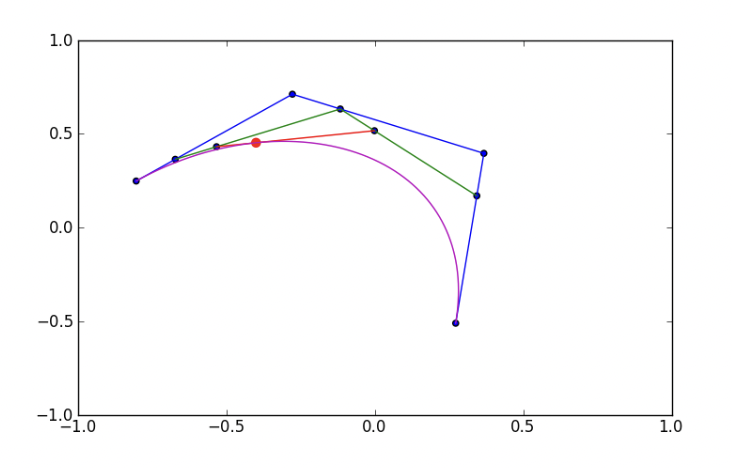
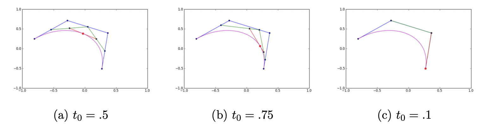

Lab 5: Planes, Trains and Automobiles
=====================================

(Or how what was once "useless math" makes beautifully curved objects). 
Over a century ago Bernstein introduced his now famous set of polynomials defined as

.. math::
	B_j^n(x) = \left(\frac nj \right) x^j (1-x)^{n-j}, \text{ where } \left(\frac nj \right) = \frac{n!}{j!(n-j)!}.

These *Bernstein polynomials* were originally designed to give a constructive proof of the Stone–Weierstrass approximation theorem, which guarantees that any continuous function on a closed interval can be approximated as closely as desired by polynomials -- essentially deep theoretical math with limited application. 
However, in the early 1960s two French engineers, de Casteljau and Bézier, independently used Bernstein polynomials to address a perplexing problem in the automotive design industry, namely how to specify "free-form" shapes consistently.
Their solution was to use Bernstein polynomials to describe parametric curves and surfaces with a finite number of points that control the shape of the curve or surface. This enabled the use of computers to sketch the curves and surfaces. The resulting curves are called *Bézier curves* and are of the form

.. math::
	r(t) = \sum_{j=0}^n {\textbf p}_j B_j^n(t), \quad t\in [0,1],

where ``p_0, ..., p_n`` are the control points and ``B_j^n(t)`` are the Bernstein polynomials.
In this lab we will play with these Bézier curves, and a slick algorithm to create them called the de Casteljau algorithm.

At first glance, the formula for ``r(t)`` looks complicated to calculate. 
De Casteljau gave a geometric algorithm to trace out a Bézier curve for an ordered set of ``n`` control points. 
We will parameterize this curve between the first and last point with respect to ``t``, letting ``t`` go from ``0`` to ``1``.

.. admonition:: De Casteljau’s Algorithm
	
	To evaluate the curve at a given time ``t0`` do the following:

	- Parameterize the lines between each of the points letting ``t`` go from ``0`` to ``1``. For the points ``P_n`` and ``P_(n+1)`` this parameterization is ``P_n(1-t) + P_(n+1)(t)``. (Note, this is the most common way to parametrize a segment between two points.)

	- Evaluate each of these parameterizations at ``t0``. Note that this gives ``n-1`` new points.

	- Repeat this process on the list of points until only one point is left. This is the value of the Bézier curve for these control points at the parameter ``t0``.

Below is an illustration of the de Casteljau algorithm for ``t0 = 0.25``. 
The blue lines are what is called the *control polygon*. The green lines are the first parametrization, the red line is the second, and the red point is the point on the curve when ``t0 = 0.25``.

The next three figures are illustrations of De Casteljau’s Algorithm for 3 points at ``t0 = .5``, ``.75``, and ``1`` respectively.

Task 1
------

Implement De Casteljau’s algorithm by writing a function ``decasteljau(t, p)`` that returns the location of a point on the Bézier curve determined by ``p`` at time ``t``. 
Your function should accept a ``m x 2`` array representing ``m`` control points, and a time ``t0`` at which to evaluate the curve. This looks much more scary then it actually is!

Task 2
------

Modify your code for De Casteljau's Algorithm, ``decasteljau(t, p)``, to handle multiple time values (``t`` as an ``np.ndarray`` input).

Task 3
------

Create a function ``plot_bezier(p)`` to plot a Bézier curve in 2-D. Your function should accept a ``m x 2`` array representing ``m`` control points. 
Use what you learned in :doc:`lab01` (i.e., ``linspace()``, plotting tools) to create a curve that looks smooth.

