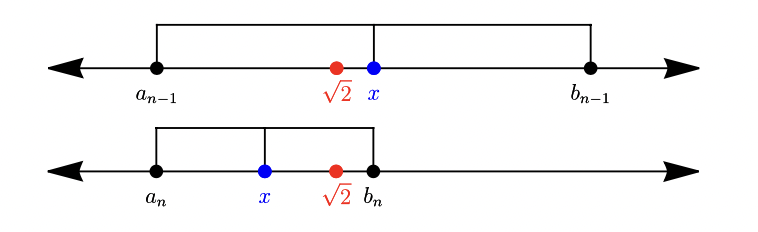

Lab 5: Searching in a Sorted List
=================================

There are several ways to compute (up to machine precision) the value of square roots such as :math:`\sqrt{2}`.
Consider the following approach, which uses the set

.. math::
   A = \{x \in \mathbb{R} : x^2 < 2 \}.

Note that :math:`\sup A = \sqrt{2}`.
To calculate :math:`\sqrt{2}` numerically, we construct two sequences :math:`(a_n)` and :math:`(b_n)` of rational numbers where each :math:`a_n` is in :math:`A` and each :math:`b_n` is an upper bound for :math:`A`.
Let :math:`a_0 = 1.`
Because :math:`1^2 = 1 < 2`, :math:`a_0` is in :math:`A.`
Let :math:`b_0 = 2,` which is an upper bound for :math:`A.`
Proceed inductively using the following iteration:

* Let :math:`x = (a_{n - 1} + b_{n - 1})/2.` Note that :math:`a_{n-1} < x < b_{n - 1}.`
* If :math:`x` is in :math:`A`, set :math:`a_n = x` and :math:`b_n = b_{n-1}.`
* Otherwise, set :math:`a_n = a_{n-1}` and :math:`b_n = x`.

We now have two sequences with the following properties:

* :math:`a_{n - 1} \le a_{n}` and :math:`b_n \le b_{n-1}` for all :math:`n \in \mathbb{N}`.
* :math:`|b_n - a_n| \le \frac{1}{2^{n}}(b_0 - a_0)` for all :math:`n \ge 0` and thus :math:`\lim_{n\to\infty}(b_n - a_n) = 0.`

It can be shown that both sequences converge to the same limit of :math:`\sup A = \sqrt{2}.`

The following code constructs :math:`(a_n)` and :math:`(b_n)` until, up to machine precision, :math:`a_n = b_n \approx \sqrt{2}`.

.. code-block:: python

    # a and b are sequences of rational numbers.
    a = [1.0]
    b = [2.0]

    # Loop a maximum of 1000 times. In practice, <100 iterations are required
    # to exceed the precision of our basic floating point variable.
    for n in range(1, 1000):
        x = (a[n - 1] + b[n - 1]) / 2.0
        if x**2 < 2:  # x is in A.
            # Append x to a and b_{n-1} to b.
            a.append(x)
            b.append(b[n - 1])
        else:  # x is an upper bound for A.
            # Append x to b and a_{n-1} to a.
            a.append(a[n - 1])
            b.append(x)

        # Check that something has changed this iteration. If it hasn't, we've
        # exceeded the precision of our floating point variables.
        if a[n] == a[n - 1] and b[n] == b[n - 1]:
            print("Floating point precision exceeded.")
            break

        # This may never happen, but it would be a stopping point if it did.
        if a[n] == b[n]:
            print("a[n] = b[n]. Limit reached.")
            break

    # Approximation complete, output results.
    print(f"Stopped after {n} iterations.")
    print("Max a[n] =", a[n])
    print("Max b[n] =", b[n])

.. code-block:: text

    Floating point precision exceeded.
    Stopped after 53 iterations.
    Max a[n] = 1.414213562373095
    Max b[n] = 1.4142135623730951

Task 1
------

Adapt the above code to create a function ``cube_root(K)``, which finds the cube root of any natural number :math:`K`, (i.e., :math:`\sqrt[3]{K}`). You should only need to change two lines, one to set an appropriate initial value for the list ``b``, and one to change the number for which the algorithm is searching. *Your code should mimic the outputs of the given program precisely.*

Searching in a Sorted Space
---------------------------

What is this algorithm doing? At step :math:`n`, we consider the number :math:`x` halfway between :math:`a_{n-1}` and :math:`b_{n-1}`, creating two intervals: :math:`[a_{n-1}, x]` and :math:`[x, b_{n-1}]`. Because :math:`\sqrt{2}` is between :math:`a_{n-1}` and :math:`b_{n-1}`, it has to lie in one of these intervals. We compare it to :math:`x` to check which one it is in and then toss out the other interval. This "tossing out" is accomplished by setting either :math:`a_n = x` or :math:`b_n = x` and keeping :math:`b_n = b_{n-1}` or :math:`a_n = a_{n-1}`, respectively. At each step, we are cutting in half the interval in which we are searching. See the figure below.

Why does this algorithm work? First of all, this algorithm only finishes in a finite number of steps because floats actually have limited precision. Combining this fact with an estimate for the upper and lower bound (:math:`a_0` and :math:`b_0`), we are really only searching within a **finite set**.  If we had an arbitrary level of precision, we could obtain better and better approximations to :math:`\sqrt{2}`, but the code would never finish running. Second, our algorithm relies on our ability to compare because we were searching in a **sorted** space. The number system :math:`\mathbb R` is an *ordered field*, so checking something like :math:`x^2 < 2` is possible.

A **sorted list** has both of these qualities. For example, the list ``l = [0,1,2,5,9,22,57]`` is both finite and ordered. How could we find the index of a given number ``n`` in this list? As a first approach, we could start at the beginning and check each number to see if it matches ``n``. This works great if we are searching for ``1``, but not so great if we are searching for ``57``. Imagine if we had a list with millions of entries. Checking every entry would take a long time!

We will use a **binary search**. This algorithm is exactly like the algorithm from Task 1. It is called a binary search because each time we cut our search space in half. Here is the general idea of the algorithm. Suppose we have a sorted list ``l`` (sorted smallest to largest) and we want to find the index of the element ``n`` in this list. We need three other variables. For this example we call them ``min_index``, ``max_index``, and ``curr_index``. These are exactly analogous to :math:`a_{n-1}`, :math:`b_{n-1}`, and :math:`x`.

.. admonition:: Binary Search Algorithm

    1. Set ``min_index`` equal to ``0`` and set ``max_index`` to be ``len(l) - 1``. Then ``curr_index`` is set to be an integer halfway between them.
    2. If ``l[curr_index] = n``, then we have found it!
    3. If ``l[curr_index] < n``, update ``min_index`` to be ``curr_index + 1`` so that we are now searching in the second half of the list.
    4. If ``l[curr_index] > n``, update ``max_index`` to be ``curr_index - 1`` so that we are now searching in the first half of the list.
    5. With our new ``min_index`` and ``max_index``, recalculate ``curr_index`` to be halfway between them and continue recursively by calling the function again with the new values for the variables.
    6. Break the loop and return -1 when ``min_index <= max_index``.

Task 2
------

With the pseudocode given above, write a recursive binary search function called ``binary_search(l,n)`` that takes as input a sorted list of integers ``l`` and an integer ``n`` to search for and returns an index at which that integer  appears. Return ``-1`` if the integer is not in the list. Here are some clarifications:

- Write a function ``binary_search_helper(l,n,min_index,max_index)``. Then, call ``binary_search_helper`` from within ``binary_search`` with the initial values for ``min_index`` and ``max_index``. (It is typically good practice to define helper functions inside the function they are helping)
- You may assume that the list will be sorted from smallest to largest.
- Do not use any built-in functions such as ``index`` or ``find``. Do not iterate over the whole list with a ``for`` loop or use the keyword ``in`` to check if ``n`` is in ``l``.

>>> l = [4, 8, 15, 16, 23, 42]
>>> binary_search(l,15)
2
>>> binary_search(l, 22)
-1

Challenge
~~~~~~~~~

The pseudocode will always return an index at which ``n`` appears, but it may not be the first index. How can you alter your code so that the index returned is always the first index? This would replicate the behavior of Python's built-in ``find`` function.

Timing
------

When we introduced the binary search, we mentioned that checking every element would take a long time. So, does the binary search actually go faster? If so, how much faster? We need two things to test this: 1) a ``linear_search`` function and 2) a big list of numbers. Running both functions on a big list of numbers will let us explore how well they perform.

Task 3
------

Write a function ``linear_search(l,n)`` that takes as input a sorted list of integers ``l`` and an integer ``n`` and returns the index at which the integer ``n`` *first* appears. Return ``-1`` if the integer is not in the list. Use a ``for`` or ``while`` loop to search linearly instead of using a binary search. You may assume that the list is sorted, which may help you know when to return ``-1``. (Note: this problem should be much simpler than problem 2.)

We need an ordered list of integers. Let's use the prime numbers! The ``sympy`` library has a useful ``primerange`` function that will give us all of the prime numbers in a range. It returns a generator object, so we will use the ``list`` function on it to turn it into a list. Try the following code to generate all primes between ``1`` and ``1000``:

.. code-block:: python

    from sympy import primerange

    a = list(primerange(1,1000))

    from time import time

    t = time()                          # saving the current time
    print(binary_search(a, 823))        # running the binary search
    print("Time took: ", time() - t)    # current time - saved time

Compare the output for ``binary_search`` and ``linear_search``.

Task 4
------

Run your code on the following examples:

1. Try ``n = 2``, ``n = 191``, ``n = 713``, ``n = 997``, and ``n = 1000``. Is one algorithm outperforming the other?

2. Increase the length of ``a`` by making ``a`` contain all primes with ``1 <= n <= 10000000``. It may take a few moments to generate. Search for ``n = 2``, ``n = 9999991``, and ``n = 524287`` (the ``7`` th Mersenne prime), and ``n = 1632913``. How are the algorithms comparing? Given an arbitrary ``n``, which algorithm would you expect to be faster? As the size of ``a`` grows, which algorithm would you expect to be faster?

3. With the same ``a`` from (2), search for ``n = 1234567``, ``n = 10000000``, ``n = 1``, and ``n = 512``. Answer the same questions as in (2).
