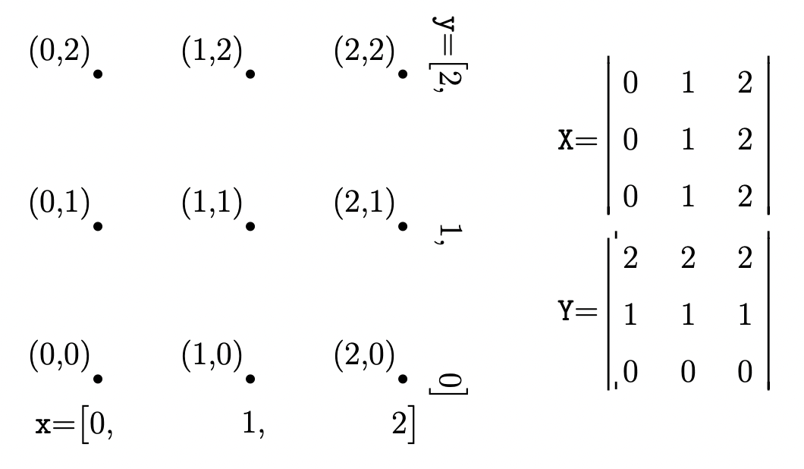
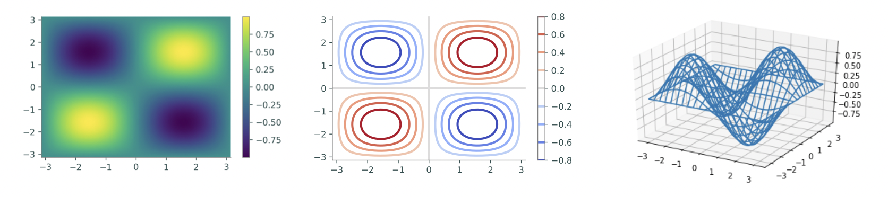

Lab 8: Plotting Surfaces in 3-D
===============================

It has often been said that a picture is worth 1,000 words. 
This is still true in Math 314, however it is often no longer quite as easy to draw the pictures we need since our data is often in 3 dimensions. 
Visualizing a 3-dimensional surface or a function :math:`g : \mathbb R^2 \to \mathbb R` (two inputs, one output) requires a different kind of plot than the line plots we have seen thus far. 
The good news, however, is that the process to create such a plot is similar to creating a line plot but requires slightly more setup: first construct an appropriate domain, then calculate the image of the function on that domain.

NumPy’s ``np.meshgrid()`` function is the standard tool for creating a 2-dimensional domain in the Cartesian plane. Given two 1-dimensional coordinate arrays, ``np.meshgrid()`` creates two corresponding coordinate matrices.

``np.meshgrid(x, y)`` returns the arrays ``X`` and ``Y``. The returned arrays give the ``x`` and ``y``-coordinates of the points in the grid formed by ``x`` and ``y``. Specifically, the arrays ``X`` and ``Y`` satisfy ``(X[i,j], Y[i,j]) = (x[i],y[j])``.

.. code:: python

	x, y = [0, 1, 2], [3, 4, 5]			# A rough domain over [0,2]x[3,5]
	X, Y = np.meshgrid(x, y)			# Combine the 1-D data into 2-D data.
	for xrow, yrow in zip(X,Y):
		print(xrow, yrow, sep='\t')
	
	[0 1 2] [3 3 3] 
	[0 1 2] [4 4 4] 
	[0 1 2] [5 5 5]

With a 2-dimensional domain, a function ``g(x,y)`` is usually visualized with one of four kinds of plots.

- A *heat map* assigns a color to each point in the domain, producing a 2-dimensional colored picture describing a 3-dimensional shape. Darker colors typically correspond to lower values while lighter colors typically correspond to higher values.
  Use ``plt.pcolormesh()`` to create a heat map.

- A *contour map* draws several level curves of ``g`` on the 2-dimensional domain. A level curve corresponding to the constant ``c`` is the collection of points ``{(x, y) | c = g(x, y)}``. Coloring the space between the level curves produces a discretized version of a heat map. Including more and more level curves makes a filled contour plot look more and more like the complete, blended heat map.
  Use ``plt.contour()`` to create a contour plot and ``plt.contourf()`` to create a filled contour plot. Specify either the number of level curves to draw, or a list of constants corresponding to specific level curves.

- A *wireframe map* creates the surface in 3-dimensions using a wire grid. The wireframe allows one to "look through" the plot to see different characteristics of the surface.
  Use ``ax.plot_wireframe()`` to create a wireframe plot.

- A *surface plot* creates the surface in 3-dimensions. Unlike the wireframe above, you cannot "look through" the plot to see parts of the surface. 
  Use ``ax.plot_surface()`` to create a surface plot.

These functions each receive the keyword argument ``cmap`` to specify a color scheme (some of the better schemes are ``"viridis"``, ``"magma"``, and ``"coolwarm"``). `Here is a list of all Matplotlib color schemes <http://matplotlib.org/examples/color/colormaps_reference.html>`_.

Finally, ``plt.colorbar()`` draws the color scale beside the plot to indicate how the colors relate to the values of the function.

 .. code:: python

   # Create a 2-D domain with np.meshgrid().
   x = np.linspace(-np.pi, np.pi, 100)
   y = x.copy()
   X, Y = np.meshgrid(x, y)
   Z = np.sin(X) * np.sin(Y)       # Calculate g(x,y) = sin(x)sin(y).

   # Plot the heat map of f over the 2-D domain.
   plt.subplot(131)
   plt.pcolormesh(X, Y, Z, cmap="viridis")
   plt.colorbar()
   plt.xlim(-np.pi, np.pi)
   plt.ylim(-np.pi, np.pi)

   # Plot a contour map of f with 10 level curves.
   plt.subplot(132)
   plt.contour(X, Y, Z, 10, cmap="coolwarm")
   plt.colorbar()

   #plot a wireframe map, specifying the strides
   fig = plt.figure()
   ax = fig.add_subplot(133, projection='3d')
   # Plot a basic wireframe.
   ax.plot_wireframe(X, Y, Z, rstride=5, cstride=5)
   plt.show()

Task 1
------

Make a heatmap plot to help you visualize the following functions:

.. math::
	&\text{a)} \quad f(x,y) = \frac{x^2-y^2}{x^2+y^2} \\
	&\text{b)} \quad g(x,y) = xy^2-x^3 \qquad \text{(monkey saddle)} \\
	&\text{c)} \quad h(x,y) = \frac{2x^2+3xy+4y^2}{3x^2+5y^2}

Use subplots to put the plots of :math:`f`, :math:`g`, and :math:`h` side-by-side, and restrict the plotting domain to :math:`[-1, 1]^2` for all functions.

Task 2
------

Repeat Task 1, but this time make contour plots of the functions.

Task 3
------

Repeat Task 1, but this time make wireframe plots of the functions.

Task 4
------

Repeat Task 1, but this time make surface plots of the functions.

Task 5
------

Select a function of two variables that you find interesting and create a heatmap, contour, wireframe, and surface plot for the function.

Task 6
------

The following function represents the continuous topography of a mountain range, giving the elevation ``h(x, y)`` at each point ``(x, y)``:

.. math::
	h(x,y) = \left( 5000 - \frac{x^2+y^2+xy}{200} + \frac{25(x+y)}{2} \right) e^{-\left| \dfrac{x^2+y^2}{1000000} - \dfrac{3(x+y)}{2000} + \dfrac{7}{10} \right|}

Here is some Python-friendly code you can copy and paste (you’ll need to modify ``exp`` and ``abs`` depending on how you imported ``numpy``):

>>> ( 5000-0.005*(x**2+y**2+x*y)+12.5*(x+y) ) * exp( -abs(0.000001*(x**2+y**2)-0.0015*(x+y)+0.7) )

Make a wireframe plot and a surface to help you visualize this function. For this whole problem, keep the ``x`` and ``y`` values in the box ``0 <= x,y <= 1600``.

Challenge
---------

(In this problem ``h(x,y)`` refers to the function in Task 6.)
A mosquito wants to fly from the starting point ``A = (200, 200, h(200, 200))`` to the ending point ``B = (1400, 1400, h(1400, 1400))``. It will do this by first flying straight up to the point ``(200,200,H)``, then, maintaining a constant elevation of ``H``, it will fly around any obstacles in its way until it reaches ``(1400,1400,H)``, at which point it will fly straight down to ``B``. What is the minimum value of ``H`` so that this is possible? Keep in mind that the ``x``, ``y`` values of the mosquito’s position must always satisfy the condition ``0 <= x, y <= 1600``. (You may assume that the mosquito takes up no physical space, so it can fit through gaps of arbitrarily small size.)

Hint: what is the maximum value of ``h(0, y)`` (or ``h(x, 0)``)?

