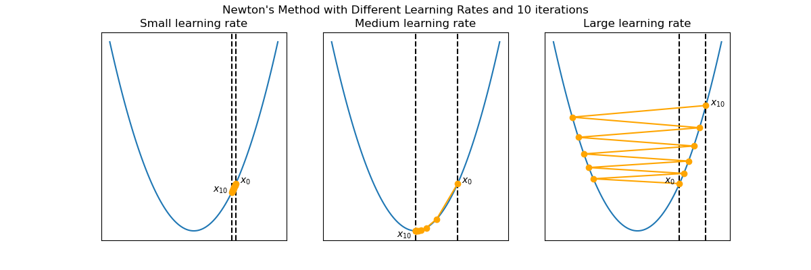
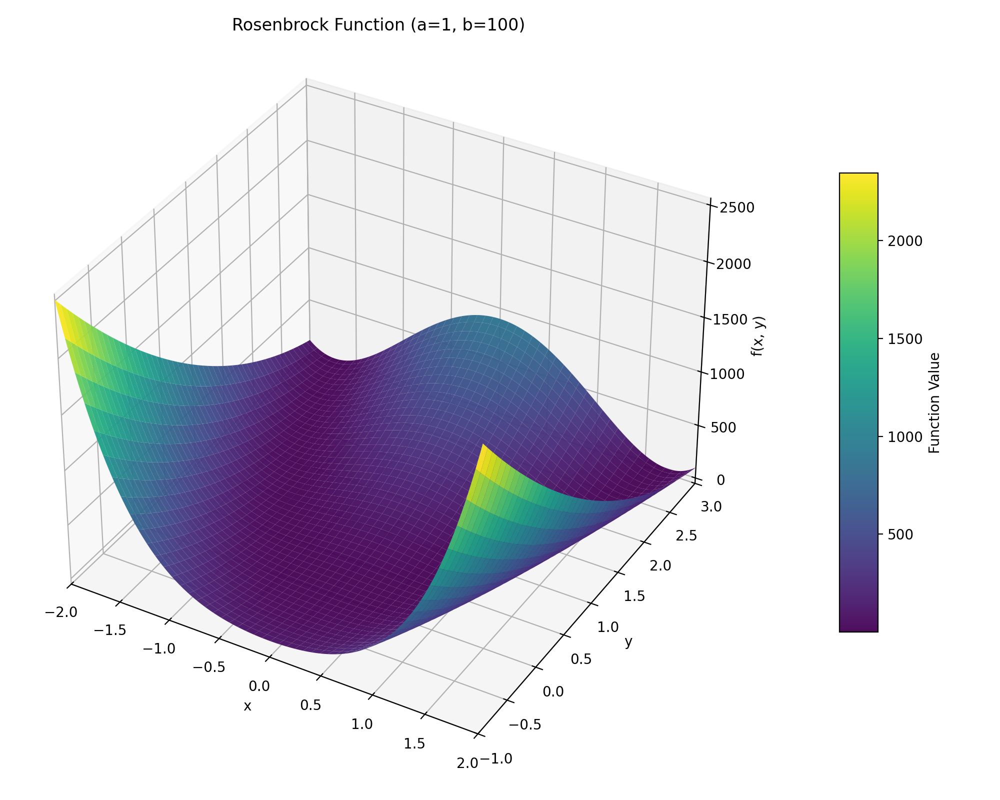
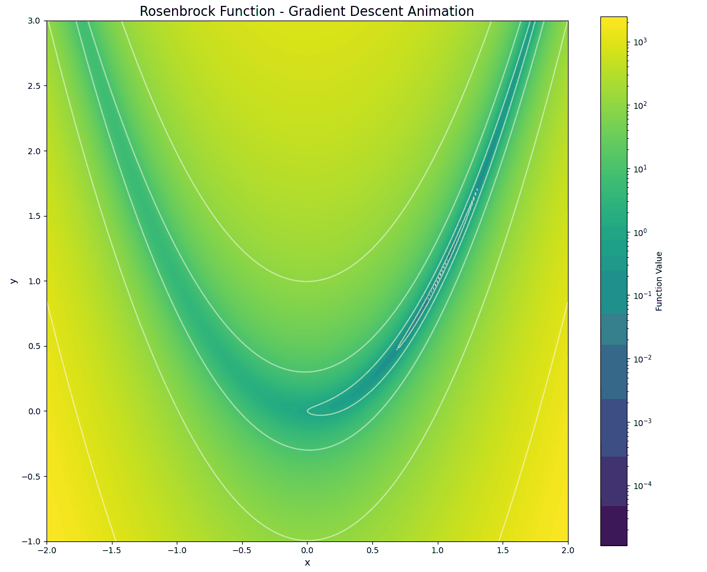

Lab 12: One-dimensional Optimization and Gradient Descent
=========================================================

Most mathematical optimization problems involve estimating the minimizer(s) of a scalar-valued function. Many algorithms for optimizing functions with a high-dimensional domain depend on routines for optimizing functions of a single variable. There are many techniques for optimization in one dimension, each with varying degrees of precision and speed. In your lab for 341, you used Newton's method to find the roots of an equation. We will adapt this method to find optimal points (i.e., maxima and minima) of a one-dimensional equation. After doing this we will consider the problem of gradient descent.

Newton's Method for optimization
--------------------------------

One might not expect that Newton's method can also be used for optimization. Recall that the first-order necessary conditions from elementary calculus state that if :math:`f` is differentiable, then its derivative evaluates to zero at each of its local minima and maxima. Therefore using Newton's method to find the zeros of :math:`f'` is a way to identify potential minima or maxima of :math:`f`. Specifically, starting with an initial guess :math:`x_0`, set

.. math::
	x_{k+1} = x_k - \frac{f'(x_k)}{f''(x_k)}

and iterate until :math:`|x_k - x_{k-1}|` is satisfactorily small. Note that this procedure does not use the actual function :math:`f` at all, but it requires many evaluations of its first and second derivatives. As a result, Newton's method converges in few iterations, but it can be computationally expensive.

Newton's method for optimization works well to locate minima when :math:`f''(x) > 0` on the entire domain. However, it may fail to converge to a minimizer if :math:`f''(x) \leq 0` for some portion of the domain. If :math:`f` is not unimodal, the initial guess :math:`x_0` must be sufficiently close to a local minimizer in order to converge.

Task 1
------

Let :math:`f : \mathbb R \to \mathbb R`. 
Adapt your code for Newton's method from :doc:`lab11` to write a function, ``newton(df, d2f, x0, tol, maxiter)``, that accepts the first and second derivatives of a function, ``df`` and ``d2f``, a starting point, ``x0`` (defaulting to ``0``), a stopping tolerance, ``tol`` (defaulting to ``1e-8``), and a maximum number of iterations, ``maxiter`` (defaulting to ``100``). Implement Newton's method using the formula above to locate a local optimizer. Return the approximate optimizer, whether or not the algorithm converged, and the number of iterations computed.

Task 2
------

Test your function from Task 1 by minimizing ``x ** 2 + sin(5 * x)`` with various initial guesses, tolerances, and iteration constraints. Compare your results to ``opt.newton()``, which implements the root-finding version of Newton's method.

Descent Methods
---------------

Consider now a function :math:`f : \mathbb R^n \to \mathbb R`. *Descent methods*, also called *line search methods*, are optimization algorithms that create a convergent sequence :math:`(x_k)` by the following rule.

.. math::
	{\mathbf x}_{k+1} = {\mathbf x}_k + \alpha_k {\mathbf p}_k

Here :math:`\alpha_k` is called the *step size* and :math:`\mathbf p_k` is called the *search direction*. 
The choice of :math:`\mathbf p_k` is usually what distinguishes an algorithm; in the one-dimensional case :math:`n = 1`, 

.. math::
	p_k = \frac{f'(x_k)}{f''(x_k)}

results in Newton's method.

To be effective, a descent method must also use a good step size :math:`\alpha_k`. If :math:`\alpha_k` is too large, the method may repeatedly overstep the minimum, as shown in the figure below; if :math:`\alpha_k` is too small, the method may converge extremely slowly.

Given a search direction :math:`\mathbf p_k`, the best step size :math:`\alpha_k` minimizes the function

.. math::
	\phi_k(\alpha) = f({\mathbf x}_k + \alpha {\mathbf p}_k)

Since f is scalar-valued, :math:`\phi_k : \mathbb R \to \mathbb R`, so Newton's method (or any other 1-D optimization method) can be used to minimize :math:`\phi_k`.

The Method of Steepest Descent
------------------------------

Let :math:`f:\mathbb R^n\to\mathbb R` with first derivative :math:`Df:\mathbb R^n\to \mathbb R^n`.
The following iterative technique is a common template for methods that aim to compute a local minimizer :math:`\mathbf x^*` of :math:`f`:

.. math:: \mathbf x_{k+1} = \mathbf x_k + \alpha_k \mathbf p_k
	:label: eq:steepest

Here :math:`\mathbf x_k` is the k-th approximation to :math:`\mathbf x^*`, :math:`\alpha_k` is the *step size*, and :math:`\mathbf p_k` is the *search direction*. Newton's method and its relatives follow this pattern, but they require the calculation (or approximation) of the inverse Hessian matrix :math:`Df^2(\mathbf x_k)^{-1}` at each step. The following idea is a simpler and less computationally intensive approach than Newton and quasi-Newton methods.

The derivative :math:`D f(x)^T` (often called the *gradient* of :math:`f` at :math:`x`, sometimes notated :math:`\nabla f(x)`) is a vector that points in the direction of greatest **increase** of :math:`f` at :math:`x`. It follows that the negative derivative :math:`-D f(x)^T` points in the direction of steepest **decrease** at :math:`\mathbf x`. The *method of steepest descent* chooses the search direction :math:`\mathbf p_k = -D f(\mathbf x_k)^T` at each step of :math:numref:`eq:steepest`, resulting in the following algorithm.

.. math:: \mathbf x_{k+1} = \mathbf x_k - \alpha_k D f(\mathbf x_k)^T
	:label: eq:steepest-2

Setting :math:`\alpha_k = 1` for each :math:`k` is often sufficient for Newton and quasi-Newton methods. 
However, a constant choice for the step size in :math:numref:`eq:steepest-2` can result in oscillating approximations or even cause the sequence :math:`(\mathbf x_k)_{k=1}^\infty` to travel away from the minimizer :math:`\mathbf x^*`. 
To avoid this problem, the step size :math:`\alpha_k` can be chosen in a few ways.

- Start with :math:`\alpha_k = 1`, then set :math:`\alpha_k = \frac{1}{2}\alpha_k` until :math:`f(\mathbf x_k - \alpha_k D f(\mathbf x_k)^T) < f(\mathbf x_k)`, terminating the iteration if :math:`\alpha_k` gets too small. This guarantees that the method actually descends at each step and that :math:`\alpha_k` satisfies the Armijo rule, without endangering convergence.

- At each step, solve the following one-dimensional optimization problem.

  .. math:: \alpha_k = \mathrm{argmin}_{\alpha} f(\mathbf x_k - \alpha D f (\mathbf x_k)^T)

  Using this choice is called *exact steepest descent*. This option is more expensive per iteration than the above strategy, but it results in fewer iterations before convergence.

Task 3
------

Write a function, ``grad_descent_const(df, x0, a, tol, maxiter)`` that accepts the derivative of an objective function, ``df``, an initial guess, ``x0``, a constant step size, ``a``, a convergence tolerance, ``tol``, defaulting to ``1e-8``, and a maximum number of iterations, ``maxiter``, defaulting to ``100``, and computes the minimizer via the constant method of steepest descent (gradient descent with constant step size). Return the approximate minimizer, whether or not the algorithm converged, and the number of iterations computed.

Why does satisfying the convergence condition not guarantee that we converged sufficiently close to a minimizer for this version of gradient descent?

Task 4
------

Adapt your code from the previous exercise to write a function, ``grad_descent_exact(f, df, x0, tol, maxiter)``, that takes as input a differentiable function, ``f``, its derivative, ``df``, an initial guess, ``x0``, an allowed error tolerance, ``tol``, and a maximum number of iterations, ``maxiter``, and uses exact gradient descent to find a minimizer for ``f``. Return the minimizer, whether the algorithm converged within the error tolerance, and the number of iterations computed.

Specifically, compute ``a`` for each step of the algorithm by finding the minimizer of ``f(x - a * df(x))`` for a fixed ``x`` instead of accepting it as an argument.

Task 5
------

The Rosenbrock function, ``f = lambda x, y: (a - x) ** 2 + b * (y - x ** 2) ** 2`` is non-convex for all values of ``a``, ``b`` except ``a, b = 0, 0``. 
Classically, we set ``a, b = 1, 100``. 
As such, it takes much longer for gradient descent to converge for this function than most convex functions.
Here is a visualization of the convergence of gradient descent on the Rosenbrock function at multiple starting points.
Note that this is convergence over 5000 iterations, so it does take a long time. 

The convergence of an algorithm is the function, ``L(tol)``, (often simplified to the largest order) that describes how the number of iterations to converge within the error tolerance as that tolerance gets closer to zero. Newton's method for optimization is a quadratic method and exact gradient descent is a linear method. Optimization methods tend to work best when the function we are optimizing on is convex. This is because convex functions have a unique minimizer.

Write a function, ``plot_convergence(a, b)``, that takes as input the constants for the Rosenbrock function, ``a, b``, and performs gradient descent on the corresponding version of the Rosenbrock function for many values of ``tol``, recording the number of iterations needed to converge (making sure that the algorithm converged), using ``x0 = np.zeros(2)``, and then creates a plot of the number of iterations needed to converge, ``n``, as a function of the required error tolerance, ``tol``, with ``tol`` measured on a logarithmic scale (use ``plt.semilogx`` instead of ``plt.plot``). Make sure to label your plot and axes.

Notice that your graph ought to look approximately linear i.e. like a step function that is bounded above by a linear function for the given axes.

Task 6
------

Create a function, ``plot_rosenbrock_gradient_descent(starting_position, learning_rate, tol, maxiter, a, b)`` that takes as input the starting position as a numpy array, ``starting_position``, the learning rate, ``learning_rate``, the tolerance, ``tol``, the maximum number of iterations, ``maxiter``, the value of ``a``, and the value of ``b``, and plots the progress of gradient descent on the Rosenbrock function.

You will need to modify your ``grad_descent_const()`` function to return the path of the gradient descent (make sure to include the starting position in the path).

* Set the figure size to ``(10, 8)`` when creating the figure
* Create a meshgrid with x-range ``[-2, 2]`` and y-range ``[-1, 3]`` using 300 points for each axis (Then apply the Rosenbrock function to the meshgrid)
* Add ``1e-10`` to function values to avoid :math:`\log(0)` issues
* Use ``plt.imshow(Z)`` with arguments ``extent=[-2, 2, -1, 3]``, ``origin='lower'``, ``cmap='viridis'``, and ``norm=LogNorm()`` to display the Rosenbrock function as a heatmap and save it as the variable ``im``
* Then call ``plt.colorbar(im, label='Function Value')`` to add a colorbar
* Use ``plt.contour(X, Y, Z)`` with arguments ``levels=10``, ``norm=LogNorm()``, ``colors='white'``, and ``alpha=0.5`` to show contour lines
* Plot the gradient descent path using ``plt.plot()`` with arguments ``color='orange'``, ``alpha=0.8``, ``linewidth=2``, ``marker='o'``, and ``markersize=4``with the label "Gradient Descent Path"
* Set the title to "Rosenbrock Function Gradient Descent"
* Label the x-axis as "x" and y-axis as "y"
* Set xlim to ``[-2, 2]`` and ylim to ``[-1, 3]``
* Include a legend

