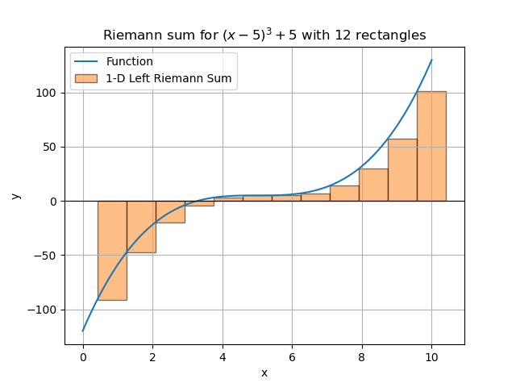
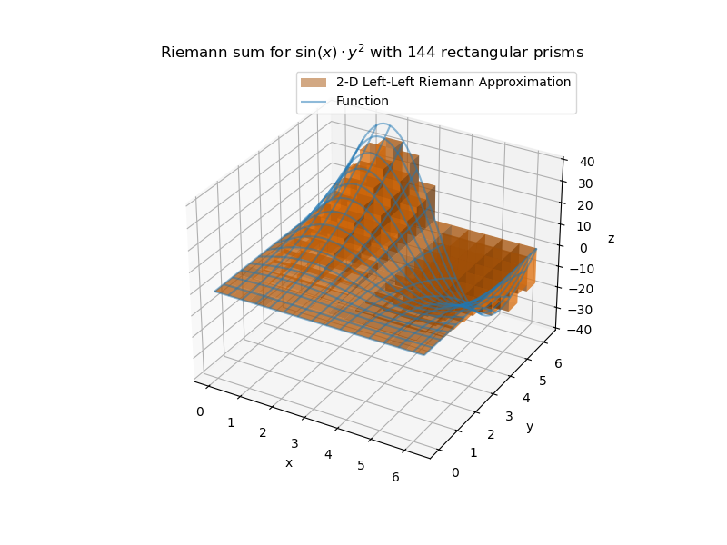

Lab 14: Riemann Sums
====================

In this lab we will study Riemann sums in higher dimensions.

The following is an example of a one dimensional (``x``) Riemann sum, which you are probably familiar with from Calculus 2. One dimensional Riemann sums are used to approximate two dimensional objects (``x``, ``y``).



This can be expanded to two dimensions (``x``, ``y``), to approximate three dimensional objects (``x``, ``y``, ``z``).



Riemann sums of three dimensions ore more are difficult to visualize. Check out `this Wikipedia article <https://en.wikipedia.org/wiki/Tesseract>`_ about Tesseracts if you want to learn more about four dimensional objects.

Task 1
------

Write a function, ``riemann_sum_1D(f, x_min, x_max, N, method)``, that takes as input a function of one variable (``x``), ``f``, a minimum value of ``x``, ``x_min``, a maximum value of ``x``, ``x_max``, a number of sub-intervals to compute, ``N``, and a Riemann method to use, ``method`` (``"left"``, ``"right"``, ``"mid"``), and computes the Riemann approximation of ``f`` on the input space ``[x_min, x_max]``. 

Remember the formula for a one dimensional Riemann sum:

.. math::
	\sum_{i=1}^N f(x_i^*) \Delta x,

where ``Δx = (xMax - xMin)/N``.

Raise a ``ValueError`` if the method is not ``"left"``, ``"right"``, or ``"mid"`` (use the error message ``f"Error: method ({method}) must be \"left\", \"right\", or \"mid\""``).

Task 2
------

Write a function, ``riemann_sum_2D(f, x_min, x_max, y_min, y_max, N, method)``, that takes as input a function of two variables (``x`` and ``y``), ``f``, a minimum value of ``x``, ``x_min``, a maximum value of ``x``, ``x_max``, a minimum value of ``y``,  ``y_min``, a maximum value of ``y``, ``y_max``, a number of sub-intervals to compute, ``N``, and Riemann method to use, ``method`` (``"left"``, ``"right"``, ``mid``).

Remember the formula for a two dimensional Riemann sum:

.. math::
	\sum_{j=1}^N \sum_{i=1}^N f(x_i^*, y_j^*) \Delta x \Delta y,

where ``Δx = (xMax - xMin)/N``, ``Δy = (yMax - yMin)/N``

Raise a ``ValueError`` if the method is not ``"left"``, ``"right"``, or ``"mid"`` (use the error message ``f"Error: method ({method}) must be \"left\", \"right\", or \"mid\""``).

Task 3
------
Using your function from Task 2, use the midpoint method to calculate the Riemann sums for ``N=10`` and ``N=20`` for the following functions and domains:

#. :math:`f(x,y) = x \cdot sin(x \cdot y)` on :math:`[0, pi] \times [0, pi]`
#. :math:`g(x,y) = y^2 \cdot exp(-x-y)` on :math:`[0, 1] \times [0, 1]`
#. :math:`h(x,y) = x^3 \cdot y^2 + x \cdot y` on :math:`[0, 1] \times [1, 2]`

For each option, print the following information:

.. code-block:: console

	f: "function"
	xs: "x domain"
	ys: "y domain"
	N: "number of rectangular prisms"
	Riemann sum: "sum"

Replace everything in ``""`` with the actual value. Use ``f"{number:.5f}"``` to show only the first five decimal places of the sum.

Task 4
------

Consider the integral of :math:`f(x, y) = x \sin(x + y)` on the rectangle :math:`[0, \pi/6] \times [0, \pi/3]`. First calculate the exact value of this integral by hand. Then make a plot that shows the error of the midpoint Riemann integral approximation as :math:`N` ranges from :math:`1` to :math:`100`. Remember to give your graph a title and label your axes.

Task 5
------

Write a function, ``riemann_sum_3D(f, x_min, x_max, y_min, y_max, z_min, z_max, N, method)``, that takes as input a function of three variables (``x``, ``y``, and ``z``), ``f``, a minimum value of ``x``, ``x_min``, a maximum value of ``x``, ``x_max``, a minimum value of ``y``,  ``y_min``, a maximum value of ``y``, ``y_max``, a minimum value of ``z``, ``z_min``, a maximum value of ``z``, ``z_max``, a number of sub-intervals to compute, ``N``, and Riemann method to use, ``method`` (``"left"``, ``"right"``, ``"mid"``).

Remember the formula for a three dimensional Riemann sum:

.. math::
	\sum_{k=1}^N \sum_{j=1}^N \sum_{i=1}^N f(x_i^*, y_j^*, z_k^*) \Delta x \Delta y \Delta z,

where ``Δx = (xMax - xMin)/N``, ``Δy = (yMax - yMin)/N``, ``Δz = (zMax - zMin)/N``.

Raise a ``ValueError`` if the method is not ``"left"``, ``"right"``, or ``"mid"`` (use the error message ``f"Error: method ({method}) must be \"left\", \"right\", or \"mid\""``).

Task 6
------

Using your function from Task 5, use the midpoint method to calculate the Riemann sums for ``N = 10`` and ``N = 20`` for the following function and domain:

.. math::
	f(x,y,z) = xy+z^2 \text{ on the rectangle } [0,2] \times [0,1] \times [0,3].

For each option, print the following information:

.. code-block:: console

	f: "function"
	xs:	"x domain"
	ys: "y domain"
	N: "number of rectangular prisms"
	Riemann sum: "sum"

Replace everything in ``""`` with the actual value. Use ``f"{number:.5f}"``` to show only the first five decimal places of the sum.


Task 7
------

Write a function, ``riemann_sum(f, x_min, x_max, N, method)``, that takes as input a function of an n-dimensional variable (``x``), ``f``, a vector of minimum values of the components of ``x``, ``x_min``, a vector of maximum values of the components of ``x``, ``x_max``, a number of sub-intervals to compute, ``N``, and Riemann method to use, ``method`` (``"left"``, ``"right"``, ``"mid"``).

Raise a ``ValueError`` if the method is not ``"left"``, ``"right"``, or ``"mid"`` (use the error message ``f"Error: method ({method}) must be \"left\", \"right\", or \"mid\""``).