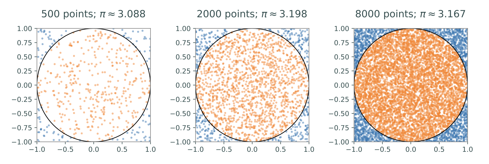

Lab 15: Monte Carlo Integration
===============================

Integration is challenging, even for a computer. 
Although Riemann sums can give fairly accurate answers they do not always work well in higher dimensional settings. In today’s lab we will talk about another technique for numerical integration, called Monte Carlo integration.

Volume Estimation
-----------------

To give you an idea of how Monte Carlo integration works, let’s consider the concrete example of a circle in :math:`\mathbb R^2`.
It is well known that the area of a circle of radius :math:`r` is :math:`A=\pi r^2` -- in fact one way to numerically estimate :math:`\pi` is to compute the area of the unit circle. 
The way that Monte Carlo integration works is to randomly choose points in a domain whose area/volume is easy to calculate that encompasses the object in question. 
For this concrete example we will randomly choose points from the square domain :math:`\Omega = [-1,1] \times [-1,1]`. We can then estimate the area of the circle by determining the percentage of points that lie in the circle and multiplying this percentage by the total area of the sample domain gives an estimate for the area of the circle.

The following code samples 2000 uniformly distributed random points in :math:`\Omega`, determines what percentage of those points are within the unit circle, then multiplies that percentage by :math:`4` (the area of :math:`\Omega`) to get an estimate for :math:`\pi`.

.. code:: python

	>>> import numpy as np
	>>> from scipy import linalg as la

	# Get 2000 random points in the 2-D domain [-1,1]x[-1,1].
	>>> points = np.random.uniform(-1, 1, (2,2000))

	# Determine how many points are within the circle.
	>>> lengths = np.linalg.norm(points, ord=2, axis=0)
	>>> num_within = np.count_nonzero(lengths < 1)

	# Estimate the circle's area.
	>>> 4 * (num_within / 2000)
	3.198

The estimate of the area of the circle 3.198 isn’t perfect, but it only differs from the true area by about :math:`0.0564`. 
On average, increasing the number of sample points decreases the estimate error.

Task 1
------

The :math:`n`-dimensional open unit ball is the set :math:`U_n = \{ x \in \mathbb{R}^n : \sum_{i=1}^n x_i^2 < 1 \}`. Write a function ``unit_ball_vol(n,N)`` that accepts an integer :math:`n` and a keyword argument :math:`N` defaulting to :math:`10^4`. 
Using Monte Carlo Methods, estimate the volume of :math:`U_n` by drawing :math:`N` points uniformly from the surrounding domain :math:`[-1, 1] \times [-1, 1] \times ... \times [-1, 1]`, counting how many fall into :math:`U_n`. Use ``np.random.uniform`` for your sampling and use ``np.linalg.norm`` to determine if the points are within the unit ball.
Hint: the volume of the hypercube :math:`[-1,1]^n` is :math:`2^n`.

When :math:`n = 2`, this is the same experiment outlined above so your function should return an approximation of :math:`\pi`. The volume of :math:`U_3` is :math:`\frac 43\pi \approx 4.18879`, and the volume of :math:`U_4` is :math:`\frac{1}{2}\pi^2 \approx 4.9348`. Try increasing the number of sample points :math:`N` to see if your estimates improve.

Integral Estimation
-------------------

The strategy for estimating the area of a circle can be formulated as an integral problem. Define :math:`f : \mathbb{R}^2 \to \mathbb{R}` by

.. math::
   f(x) =
   \begin{cases}
       1 & \text{if } \sum_{i=1}^n x_i^2 < 1 \text{ ($x$ is within the unit circle),} \\
       0 & \text{otherwise.}
   \end{cases}

Let :math:`\Omega = [-1, 1] \times [-1, 1]` as before. Then

.. math::
   \int_{-1}^1 \int_{-1}^1 f(x, y) \, dx \, dy = \int_{\Omega} f(\mathbf x) \, dV = \pi.

To estimate the integral, we choose :math:`N` random points :math:`\{\mathbf x_i\}_{i=1}^N` in :math:`\Omega`. Since :math:`f` indicates whether or not a point lies within the unit circle, the total number of random points that lie in the circle is the sum of the :math:`f(\mathbf x_i)`.
Then the average of these values, multiplied by the volume :math:`V(\Omega)`, is the desired estimate:

.. math::
	\int_\Omega f(\mathbf x) \, dV \approx V(\Omega) \frac 1N \sum_{i=1}^N f(\mathbf x_i).

This remarkably simple equation can be used to estimate the integral of any integrable function :math:`f: \mathbb R^n \to \mathbb R` over any domain :math:`\Omega \subset \mathbb R^n` and is called the general formula for *Monte Carlo integration*.

The intuition behind the formula above is that :math:`\frac 1N \sum_{i=1}^N f(\mathbf x_i)` approximates the average value of :math:`f` on :math:`\Omega`, and multiplying the approximate average value by the volume of :math:`\Omega` yields the approximate integral of :math:`f` over :math:`\Omega`. This is a little easier to see in one dimension: for a single-variable function :math:`f: \mathbb R\to \mathbb R`, the Average Value Theorem states that the average value of :math:`f` over an interval :math:`[a,b]` is given by

.. math::
	f_{\text{avg}} = \frac{1}{b-a} \int_a^b f(x) \, dx.

Then using the approximation :math:`f_{\text{avg}} \approx \frac 1N \sum_{i=1}^N f(x_i)`, the previous equation becomes

.. math::
	\int_a^b f(x) \, dx = (b-a) f_{\text{avg}} \approx V(\Omega) \frac{1}{N}\sum_{i=1}^N f(x_i),

which is the Monte Carlo formula in one dimension.
In this setting :math:`\Omega = [a,b]` and hence :math:`V(\Omega) = b-a`.

Task 2
------

Write a function ``monte_carlo_one_dim`` that accepts a function :math:`f: \mathbb R\to \mathbb R`, bounds of integration :math:`a` and :math:`b`, and an integer :math:`N` defaulting to :math:`10^4`. Use ``np.random.uniform()`` to sample :math:`N` points over the interval :math:`[a,b]`, then use the Monte Carlo formula to estimate

.. math::
	\int_a^b f(x) \, dx.

Test your function on the following integrals, or on other integrals that you can evaluate by hand.

.. math::
	\int_{-4}^2 x^2 \, dx = 24, \qquad \int_{-2\pi}^{2\pi} \sin(x) \, dx = 0, \qquad \int_1^{10} \frac{dx}{x} = \ln(10) \approx 2.30259

.. admonition:: Warning

	Be careful not to use Monte Carlo integration to estimate integrals that do not converge.
	For example, since :math:`1/x` approaches :math:`\infty` as :math:`x` approaches :math:`0` from the right, the integral

	.. math::
		\int_0^1 \frac{dx}{x}

	does not converge. Even so, attempts at Monte Carlo integration still return a finite value. Use various numbers of sample points to see whether or not the integral estimate is converging.

>>> for N in [5000, 7500, 10000]:
>>> 	print(np.mean(1. / np.random.uniform(0, 1, N)), end='\t')
11.8451683722    25.5814419888    7.64364735049     # No convergence.

Integration in Higher Dimensions
--------------------------------

The implementation of the Monte Carlo formula for a function :math:`f: \mathbb R^n \to \mathbb R` with :math:`n>1` introduces a few tricky details, but the overall procedure is the same as in the case :math:`n=1`. We consider only the case where :math:`\Omega \subset \mathbb R^n` is an :math:`n`-dimensional box :math:`[a_1,b_1] \times [a_2,b_2] \times \cdots \times [a_n,b_n]`.

- If :math:`n=1` then :math:`\Omega` is an interval, so :math:`V(\Omega) = b_1 - a_1`. If :math:`n=2` then :math:`\Omega` is a rectangle, and hence :math:`V(\Omega) = (b_1-a_1)(b_2-a_2)`, the product of the side lengths. The volume of a higher-dimensional box :math:`\Omega` is also the product of the side lengths,

  .. math::
  	V(\Omega) = \prod_{i=1}^n (b_i-a_i)

- It is easy to sample uniformly over an interval :math:`[a,b]` with ``np.random.uniform()``, or even over the :math:`n`-dimensional cube :math:`[a,b]\times [a,b]\times \cdots \times [a,b]`. However, if :math:`a_i \neq a_j` or :math:`b_i \neq b_j` for any :math:`i\neq j`, the samples need to be constructed in a slightly different way. 
  
  The interval :math:`[0,1]` can be transformed to the interval :math:`[a,b]` by scaling it so that it is the same length as :math:`[a,b]`, then shifting it to the appropriate location. 

  .. math::
  	[0,1] \xrightarrow{\text{scale by }b-a} [0,b-a] \xrightarrow{\text{shift by }a} [a,b]

  This suggests a strategy for sampling over :math:`[a_1,b_1] \times [a_2,b_2] \times \cdots \times [a_n,b_n]`: sample uniformly from the :math:`n`-dimensional box :math:`[0,1]\times [0,1]\times \cdots \times [0,1]`, multiply the :math:`i`-th component of each sample by :math:`b_i-a_i`, then add :math:`a_i` to that component.

  .. math::
  	[0,1]\times\cdots\times[0,1] \xrightarrow{\text{scale}} [0,b_1-a_1]\times\cdots\times[0,b_n-a_n] \xrightarrow{\text{shift}} [a_1,b_1]\times\cdots\times[a_n,b_n]

Task 3
------

Write a function ``monte_carlo`` that accepts a function :math:`f: \mathbb R^n\to \mathbb R`, a list of lower bounds :math:`[a_1,\ldots,a_n]`, a list of upper bounds :math:`[b_1,\ldots,b_n]`, and an integer :math:`N` defaulting to :math:`10^4`, and estimates the integral

.. math::
	\int_\Omega f(\mathbf x) \, dV,

where :math:`\Omega = [a_1,b_1]\times\cdots\times[a_n,b_n]`.

Test your function on the following integrals.

.. math::
	\int_0^1 \int_0^1 x^2 + y^2 \, dxdy = \frac 23, &\qquad \int_{-2}^1 \int_1^3 3x-4y+y^2 \, dxdy = 54 \\
	\int_{-4}^4 \int_{-3}^3 \int_{-2}^2 \int_{-1}^1 x+&y-wz^2 \, dxdydzdw = 0

Note carefully how the order of integration defines the domain; in the last example, the :math:`xyzw` domain is :math:`[-1,1] \times [-2,2] \times [-3,3] \times [-4,4]`, so the lower and upper bounds passed to your function should be :math:`[-1,-2,-3,-4]` and :math:`[1,2,3,4]`, respectively.

