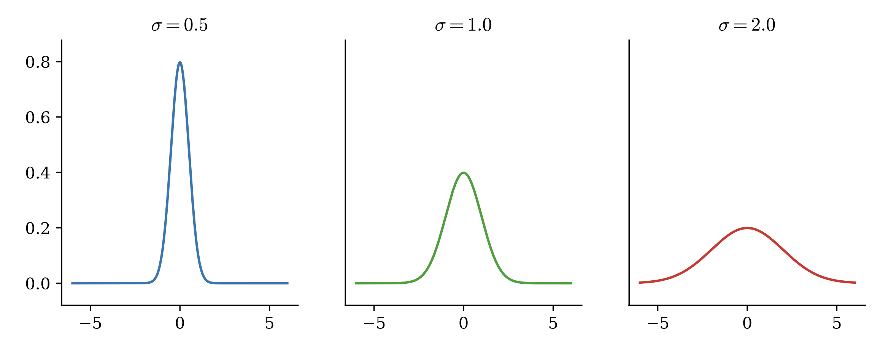

Lab 16: Geometry in Higher Dimensions
=====================================

One of the learning objectives of Math 314 is to expand your mathematical horizons into thinking about things in more than one variable. 
Thus far in Math 314 we have restricted ourselves to thinking about things in either 2-dimensional or 3-dimensional space. 
This is helpful, and natural because we live in a 3-dimensional world, but as dimensionality increases, some of our intuition about what "should" be true falls short. 
In this lab we explore some fun facts about higher dimensional space.

Fact 1
------

**The volume of the unit ball gets smaller as the dimension of the space gets bigger.**

First, a brief notational aside. 
When we measure things in 1-D we usually return a length, in 2-D we return an area, and in 3-D we return a volume. 
The idea of using a different name when measuring for each dimension is unsustainable, so we will use the generic word "volume". 
We also talk about "balls" in :math:`n`-dimensional space. 
Although in 3-D this looks like the ball you are familiar with we usually define a ball as all the points within a certain distance of a central point. 
When we talk about unit balls we are talking about all the points that are distance :math:`1` or less from (typically) the origin.

Our intuition may lead us to believe that as dimensionality increases, the volume of a unit ball should also increase. 
We have good reason for that looking at the following table.

.. list-table:: 
   :widths: 25 50 25
   :header-rows: 1

   * - Dimension
     - Unit Ball
     - Volume
   * - 1
     - :math:`[-1,1]`
     - :math:`2`
   * - 2
     - :math:`\{ (x,y) : x^2+y^2 \leq 1 \}`
     - :math:`\pi`
   * - 3
     - :math:`\{ (x,y,z) : x^2+y^2+z^2 \leq 1 \}`
     - :math:`\frac 43\pi`

Surprisingly this trend does not continue as :math:`n` increases.

Task 1
------

Check to see the volume of the unit ball actually decreases as :math:`n` gets larger by using your code from Task 1 in the Monte Carlo integration lab. 
Write a function, ``plot_ball_volumes()``, that creates a plot with dimension on the ``x``-axis and the volume on the ``y``-axis. Let the dimension of the space vary from ``n = 1`` to ``n = 20``. Remember to label your plot and axes. Make sure to use a large enough number of samples ``N``.
For what value of ``n`` is the volume of the unit sphere the highest?

Fact 2
------

**In higher dimensions most of the volume is concentrated near the boundary.**

You may have noticed when doing the prior problem, that as ``n`` got larger the percentage of points inside the cube that was also inside the sphere decreased. 
As it turns out, in higher dimensions most of the volume is concentrated at the boundary. 
There are a few different exercises one can do to get intuition as to why this is true. 
First, consider an ``n``-dimensional unit cube (i.e., a cube-like shape in ``n``-dimensions where each side has length ``1``). 
Suppose you were asked to draw a cube centered inside that ``n``-dimensional cube that contained half of the volume. 
What would be the length of the side of that cube? For a few values of ``n`` we have the following table.

.. list-table:: 
   :widths: 25 50 25
   :header-rows: 1

   * - Dimension
     - Side Length
     - Approximate Value
   * - 1
     - :math:`1/2`
     - :math:`0.5`
   * - 2
     - :math:`1/\sqrt{2}`
     - :math:`0.7071`
   * - 3
     - :math:`1/\sqrt[3]{2}`
     - :math:`0.7938`
   * - 4
     - :math:`1/\sqrt[4]{2}`
     - :math:`0.8409`
   * - 5
     - :math:`1/\sqrt[5]{2}`
     - :math:`0.8706`

Task 2
------

Write a function, ``plot_side_lengths()`` that plots the following: for :math:`n=1, \ldots, 30` plot the dimension on the :math:`x`-axis and the side length of the :math:`n`-dimensional cube that has exactly half the volume of a unit :math:`n`-dimensional cube.

Fact 3
------

**The volume of the unit ball is concentrated at the equator.**

For the previous fact we considered taking volume out of the center of the cube. 
For this problem we are going to consider what happens if we slice a sphere into thin circles. 
Our next interesting fact is that the volume of a unit ball is concentrated at the equator. 
If you think about this truth in lower dimensions (i.e., 2 or 3 dimensions) it does not seem like it could possibly be true, however if you think about the ideas from Fact 2, a slice from the center of the sphere has the most boundary.

As you may have noticed from Facts 1 and 2, drawing points inside a sphere is hard to do efficiently, so for this fact we will consider points on the surface of a sphere. First, we will write some code that generates points uniformly on a ``n``-dimensional sphere.

.. .. code:: python

.. 	import numpy as np
.. 	#A function to generate n points on a d-dimensional unit sphere
.. 	def generate(n, d):
.. 	   list_of_points = []
.. 	   point = []
.. 	   for i in range(n):
.. 	       point = []
.. 	       for j in range(d):
.. 	           point.append(random.uniform(-1,1))
.. 	       norm = np.sqrt(np.sum([s**2 for s in point]))
.. 	       norm_point = point/norm
.. 	       list_of_points.append(tuple(norm_point))
.. 	   return list_of_points

Task 3a
-------

Write a function, ``generate(n, d)``, that uniformly samples ``n`` points on the surface of a ``d``-dimensional sphere. Do this by first sampling ``n`` points from ``[-1, 1]^d`` then normalizing them with respect to the ``2``-norm (i.e. divide each point by its Euclidean magnitude).

Hints:

1) You can sample ``n`` points from ``[-1,1]^d`` using ``x = np.random.uniform(-1, 1, (d, n))``.

2) You can normalize ``x`` by using ``x /= np.linalg.norm(x, ord=2, axis=0)``.

3) Return ``x.T`` for the proper dimensions, ``(n, d)``.

Task 3b
-------

Write a function, ``equators(d, m, n, tol)``, that uses your generate function to sample ``m`` points from the surface of the ``d``-dimensional unit sphere, then samples ``n`` additional points from the surface of the ``d``-dimensional unit sphere, then computes the equatorial region of width ``tol`` for each of the ``n`` sampled points (where each of the ``n`` points is treated like a pole), and returns both the proportion of the ``m`` sampled points that fall within at least one equatorial band and the proportion of the ``m`` points the fall within all of the equatorial bands. Make sure that your function returns two objects of type ``float`` and not ``np.float32`` or ``np.float64`` (consider wrapping your results with ``float()``).

.. Generate ``500`` points uniformly at random on the surface of a unit ball in ``50`` dimensions. 
.. Then randomly generate five additional points. 
.. For each of the five points, calculate a narrow band of width :math:`2/\sqrt{50}` at the equator, assuming the point was the north pole. 
.. How many of the ``500`` points are in each band corresponding to one of the five equators? 
.. How many of the points are in all five bands?

Fact 4
------

**Vectors drawn from high dimensional Gaussians are almost orthogonal.**

For this final interesting fact, we will take a (very) brief aside into statistics. 
One of the most useful distributions in probability and statistics is the normal distribution, sometimes referred to as the Gaussian distribution, or even the bell curve.
This distribution describes a lot of occurrences in both the physical and social sciences, for example distribution of heights, or distribution of wealth. 
The multidimensional probability distribution function of the normal distribution is given by

.. math::
	f(\mathbf x) = C \exp\left( -\frac 12(\mathbf x - \mu)^T \Sigma(\mathbf x - \mu) \right),

where :math:`\mu` is a vector of the means, :math:`\Sigma` is the covariance matrix and :math:`C` is a constant dependent on :math:`\Sigma` that guarantees the probability distribution function integrates to one.

As one can see from the figure the most probable values are those located close to the mean. 
A natural generalization of this idea is that if we were to independently draw multiple variables, each from a Gaussian distribution the resulting vector would be close to the overall mean and two vectors drawn in this way would be very close to each other. 
In fact, the opposite happens. 
When the number of independent variables are high vectors drawn from a high dimensional Gaussian are nearly orthogonal. 
Let’s see this by coding.

Task 4a
-------

Write a function, ``gaussian_angles(d, n, tol)``, that samples ``n`` vectors from the ``d``-dimensional, standard normal distribution (using ``np.random.normal(size=(n, d))``) then samples an additional vector from the ``d``-dimensional, standard normal distribution, ``x``, and returns an array of angles (in degrees) between each sample and ``x``. Use ``np.linalg.norm`` when computing the angles.

Task 4b
-------

Using your code from the previous exercise, write a function, ``gaussian_orthogonality(d, n, tol)``, that computes the proportion of the angles found by ``gaussian_angles(d, n)`` that fall within a given angle tolerance, ``tol``, of being orthogonal. In other words, find the proportion of angles that satisfy ``|theta - 90| < tol`` where ``theta`` is a given angle.

Task 4c
-------

Use your code from the previous exercises to write a function, ``plot_gaussian_angles(d, n)``, that creates a histogram for the angles generated by ``gaussian_angles(d, n)``. Make sure to label your plot and its axes and selected a proper bin width. Use ``density=True`` for your histogram so your plot resembles a probability distribution.

.. a) Adapt the code above to create a function that draws points from an ``n``-dimensional Gaussian. (Hint: you can do this by removing the normalization step.) Return the vector :math:`\mathbf x`.

.. b) Draw ``200`` points from a zero mean, unit variance Gaussian in ``50`` dimensions. Draw one additional point. Calculate the angle between this new point and the ``200`` points originally drawn. How many of the points are nearly orthogonal? (i.e. the angle is between ``87`` degrees and ``93`` degrees?) Plot the orthogonality using a histogram.

