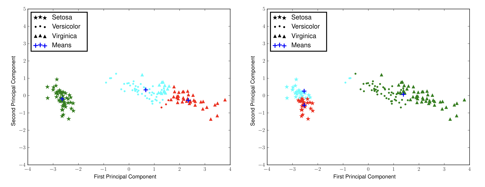
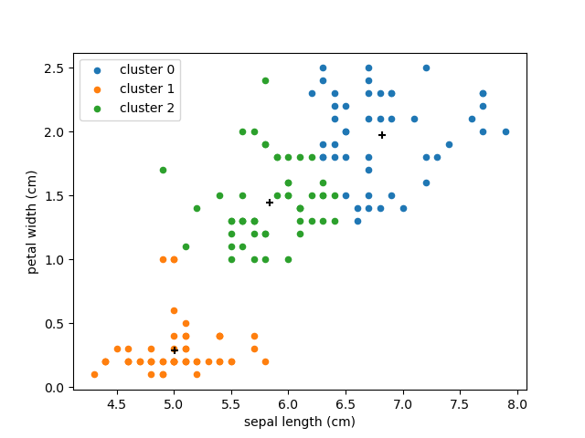
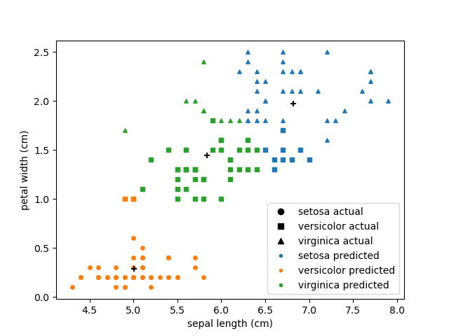

Lab 18: K-Means Clustering
==========================

.. This is the link to the old implementation with some bugs https://colab.research.google.com/drive/1GtrgUCOU4LdT-0arXn1S12uWeGMM2YVX?usp=sharing

A current area of high interest is data science and machine learning. Machine learning can be roughly divided into three  categories, supervised learning, unsupervised learning, and reinforcement learning.

* **Supervised learning**: Uses input data with the labels (think of cat pictures, the data is the picture, and the label is "cat"). Learns how to map from the input data to the label.
* **Unsupervised learning**: Uses algorithms to find patterns or anomalies in existing data.
* **Reinforcement learning**: A type of simulation where an agent learns by interacting with an environment. The agent gets feedback through rewards or penalties.

This lab covers one form of unsupervised learning called clustering. There are many different clustering algorithms, but we will be focusing on one called K-Means.

For this lab, we will be using the Iris dataset, which is a classic machine learning dataset made in the 1930s. It contains 50 samples each of three different species of the Iris flower: Setosa, Virginica, and Versicolor. Each flower has length and width measurements for petals and sepals.

.. image:: _static/figures/iris.png
	:align: center

The objective of clustering is to find a partition of the data such that points in the same subset will be “close” enough. There are many different ways of measuring how close two points are, but we will be using Euclidean distance. Let :math:`p` and :math:`q` be points in a :math:`k` dimensional space with the coordinates :math:`p=(p_1, p_2, \ldots, p_k)` and :math:`q=(q_1, q_2, \ldots, q_k)`. The Euclidean distance for :math:`p` and :math:`q` is:

.. math::
	d(p, q) = \lVert p - q \lVert_2 = \sqrt{(p_1 - q_1)^2 + (p_2 - q_2)^2 + \cdots + (p_k - q_k)^2}.

To determine how we define a cluster, suppose we have a collection of :math:`\mathbb R^k`-valued observations :math:`X = \{x_1,x_2,\ldots,x_n\}`. 
Let :math:`N\in \mathbb N` and let :math:`\mathcal S` be the set of all :math:`N`-partitions of :math:`X`, where an :math:`N`-partition is a partition with exactly :math:`N` nonempty elements.
We can represent a typical partition in :math:`\mathcal S` as :math:`S = \{S_1, S_2, \ldots, S_N\}`, where

.. math::
	X = \bigcup_{i=1}^N S_i

and

.. math::
	|S_i| > 0, \qquad i = 1, 2, \ldots, N.

We seek the :math:`N`-partition :math:`S^*` that minimizes the within-cluster sum of squares, i.e.

.. math::
	S^* = \operatorname{arg min}_{s\in \mathcal S} \sum_{i=1}^N \sum_{x_j \in S_i} \lVert x_j - \mu_i \rVert_2^2,

where :math:`\mu_i` is the mean of the elements in :math:`S_i`, i.e.
	
.. math::
	\mu_i = \frac{1}{|S_i|} \sum_{x_j \in S_i} x_j.

The mean, in this case, represents the center (also called the centroid) of the cluster.

The K-Means Algorithm
---------------------

Finding the global minimizing partition :math:`S^*` is difficult since the set of partitions can be very large, but the *K-Means* algorithm is a heuristic approach that can often provide reasonably accurate results.

We begin by specifying an initial cluster mean :math:`\mu_i^{(1)}` for each :math:`i=1,\ldots,N` (this can be done by random initialization, or according to some heuristic). For each iteration, we adopt the following procedure. Given a current set of cluster means :math:`\mu^{(t)}`, we find a partition :math:`S^{(t)}` of the observations such that each point, :math:`x_j`, is in its closest cluster:

.. math::
	S_i^{(t)} = \{ x_j : \lVert x_j - \mu_i^{(t)} \rVert_2^2 \leq \lVert x_j - \mu_\ell^{(t)} \rVert_2^2, \ell = 1, \ldots, N \}.

We then update our cluster means for each :math:`i=1,\ldots,N`.
We continue to iterate in this manner until the partition ceases to change or we have reached the accuracy we want.

The figure below shows two different clusterings of the iris data produced by the *K-Means* algorithm.
Note that the quality of the clustering can depend heavily on the initial cluster centers. 
We can use the within-cluster sum of squares (a measure of variability) as a measure of the quality of a clustering. A lower sum of squares implies a tighter cluster.
Where possible, it is advisable to run the clustering algorithm several times, each with a different initialization of the means, and keep the best clustering. 

.. note::
    The K-Means clustering algorithm is an iterative method, and will occasionally converge very slowly. 
    Thus, when implementing the algorithm, it is a good idea to terminate after some specified maximum number of iterations. 

	Two different K-Means clusterings for the iris dataset. Notice that the clustering on the left predicts the flower species to a high degree of accuracy, while the clustering on the right is less effective.

The algorithm can be summarized as follows.

1) Choose :math:`k` initial cluster centers.

2) For :math:`i=0, \ldots, \texttt{max_iter}`,
	
   a) Assign each data point to the cluster center that is closest, forming :math:`k` clusters.

   b) Recompute the cluster centers as the means of the new clusters.

   c) If the old cluster centers and the new cluster centers are sufficiently close, terminate early.

.. figure:: _static/figures/kmeans.gif
	:align: center
	:width: 80%
	
	An example of the K-Means algorithm picking/updating centers and assigning points to clusters.

Those students planning on enrolling in the ACME program or who are completing a degree in computer science will likely have the opportunity to code up the K-Means algorithm. 

``sklearn.cluster.KMeans``
--------------------------

The package scikit-learn (``sklearn``) is a popular python package for machine learning applications. It has a K-Means implementation which we will use as an example.

.. code:: python

	from sklearn.cluster import KMeans

We also need access to the Iris dataset, which sklearn has built in.

.. code:: python

    import sklearn.datasets as ds

    iris = ds.load_iris(as_frame=True)      # load the dataset with the data represented in pandas DataFrames
    df = iris["data"]                       # The actual flower measurements
    targets = iris["target"]                # The labeled data: each flower species is assigned a number 0, 1, or 2
    target_names = iris["target_names"]	    # The names associated with the number contained in targets

.. code-block:: python
	
    >>> df
        sepal length (cm)  sepal width (cm)  petal length (cm)  petal width (cm)
    0                  5.1               3.5                1.4               0.2
    1                  4.9               3.0                1.4               0.2
    2                  4.7               3.2                1.3               0.2
    3                  4.6               3.1                1.5               0.2
    4                  5.0               3.6                1.4               0.2
    ..                 ...               ...                ...               ...
    145                6.7               3.0                5.2               2.3
    146                6.3               2.5                5.0               1.9
    147                6.5               3.0                5.2               2.0
    148                6.2               3.4                5.4               2.3
    149                5.9               3.0                5.1               1.8

    [150 rows x 4 columns]
    >>> targets
    0      0
    1      0
    2      0
    3      0
    4      0
          ..
    145    2
    146    2
    147    2
    148    2
    149    2
    Name: target, Length: 150, dtype: int64
    >>> target_names
    array(['setosa', 'versicolor', 'virginica'], dtype='<U10')

.. note::
	A target in machine learning is the variable we are trying to model or predict. We loaded in ``targets`` which is the labeled data of the Iris dataset (which species it is). We are using this for visualization purposes, and not to train the unsupervised model (which doesn't use labels).

Say we want to use our K-Means algorithm to cluster the flowers' sepal length and petal width.

.. code:: python

    import matplotlib.pyplot as plt
    plt.scatter(df["sepal length (cm)"], df["petal width (cm)"])
    plt.xlabel("sepal length (cm)")
    plt.ylabel("petal width (cm)")
    plt.show()

.. image:: /_static/figures/petal_sepal.png
    :align: center

One species of Iris flower is clearly seen in the bottom left, but the other two are not as distinct. To cluster them, we create a ``KMeans`` object. We set the number of clusters, and a random state so the output is deterministic (for testing purposes).

.. code:: python

	kmeans = KMeans(n_clusters=3, random_state=42)

In ``sklearn`` and most other ML libraries, models are trained by calling ``fit(X)`` on the model. Calling this method causes the object to perform all the calculations and in our case, find the clusters for ``X``. Calling ``predict(X)`` on a model will get predictions for the data passed in. In our case, this would be the cluster each data point in ``X`` belongs in.

.. code:: python

    X = df[["sepal length (cm)", "petal width (cm)"]]   # get the two columns
    kmeans.fit(X)                                       # train the kmeans object on X
    cluster_predictions = kmeans.predict(X)             # get the cluster predictions using predict

Now we can plot these predictions by color:

.. code:: python
	
    import matplotlib.pyplot as plt
    import numpy as np

    marker_colors = ['tab:blue', 'tab:orange', 'tab:green']

    # zip iterates through each of the predictions and colors at the same time
    for prediction, color in zip(np.unique(cluster_predictions), marker_colors):
        mask = cluster_predictions == prediction        # keep only the given target label
        plt.scatter(df.loc[mask, "sepal length (cm)"],  # get all the sepal lengths that were classified as the given target
                    df.loc[mask, "petal width (cm)"],
                    color=color,                # color each point with the associated color
                    label=f"cluster {prediction}",      # label each point with the associated target name
                    s=20)                               # point size parameter
        
    # add the cluster centers with a "+" marker
    centers = kmeans.cluster_centers_
    plt.scatter(centers[:, 0], centers[:, 1] , marker="+", color="black", s=40)

    plt.xlabel("sepal length (cm)")
    plt.ylabel("petal width (cm)")
    plt.legend()
	
    plt.show()

We can see our results look fairly reasonable. We can check by using the actual labels contained in  ``targets``.

.. code:: python

    import matplotlib.lines as lines
    markers = ['o', 's', '^']
    marker_colors = ['tab:blue', 'tab:orange', 'tab:green']

    # for each actual target label (use a different marker type, circles, squares, or triangles for different labels)
    for target, marker, in zip(np.unique(targets), markers):                        
        # for each prediction label (use a different color for different labels)
        for prediction, color in zip(np.unique(cluster_predictions), marker_colors):
            mask = (target == targets) & (prediction == cluster_predictions)
            plt.scatter(df.loc[mask, "sepal length (cm)"],
                        df.loc[mask, "petal width (cm)"],
                        marker=marker,
                        color=color,
                        label=f"{target_names[target]}",
                        s=15)

    plt.xlabel("sepal length (cm)")
    plt.ylabel("petal width (cm)")

    # this is just getting the legend right
    handles = [lines.Line2D([0], [0], marker=marker, color="black", linestyle='None', label=f"{label} actual") for marker, label, in zip(markers, target_names)]    # black legend marker for the target values
    handles.extend([lines.Line2D([0], [0], marker='.', color=color, linestyle='None', label=f"{label} predicted") for color, label, in zip(marker_colors, target_names)])   # colored dot for the predicted values
    plt.legend(handles, ["setosa actual", "versicolor actual", "virginica actual", "setosa predicted", "versicolor predicted", "virginica predicted"])

    # show the cluster centers with a "+" marker
    centers = kmeans.cluster_centers_
    plt.scatter(centers[:, 0], centers[:, 1], marker="+", color="black", s=40)

    plt.show()

Our clustering algorithm predicted the correct classification of a species 83% (125/150) of the time.

.. note::
    Unsupervised learning is primarily used for pattern recognition. This means that most times we do not have the targets (or labels) for the data, making determining accuracy ambiguous.

Task 1
------

In the example above, we used K-Means on  ``sepal length (cm)`` and ``petal width (cm)``. Write a function ``generate_predictions(X, n_clusters, random_state)`` that takes in ``X``, the data to cluster, ``n_clusters``, the number of clusters to use, and ``random_state``, the random state. ``generate_predictions`` should return the predictions and also the cluster centers. Use this function to generate predictions and cluster centers for ``petal length (cm)`` and ``petal width (cm)``.

>>> df.columns
Index(['sepal length (cm)', 'sepal width (cm)', 'petal length (cm)', 'petal width (cm)'], dtype='object')

Application: Color Quantization
-------------------------------

Another application of the K-Means algorithm is color quantization, a process that reduces the size of images by reducing the number of unique colors in the image. It does this by taking colors that are close to each other (based on the specified distance algorithm, for us this is Euclidean distance), and merging them into one color.

Images are usually represented on computers as 3-dimensional arrays. 
Each 2-dimensional layer represents the red, green, and blue color values, so each pixel on the image is really a vector in :math:`\mathbb R^3`.

To quantize an image, the K-Means algorithm (or another similar algorithm) first finds clusters which represent groups of pixels are closest in color. It also finds cluster centers which represent the mean color of the cluster. It then takes every pixel in a cluster and recolors it to the cluster center.

Task 2a
-------

Write a function, ``quantize_image(X, k, seed)``, that takes a color image array, ``X`` (shape ``(m, n, 3)``), the number of clusters, ``k``, and a random seed and does the following:

#. Reshape the image array such that each row represents a single pixel (shape ``(m * n, 3)``) using ``np.reshape()``. You can find documentation on how to use ``np.reshape()`` `here <https://numpy.org/doc/stable/reference/generated/numpy.reshape.html>`_.

#. Fit a K-Means classifier to the reshaped data

#. Predict the clusters for the entire flattened image array using the fitted classifier

#. Recolor the pixels in the flattened image array to the color of their corresponding cluster centers

#. Reshape the recolored image to its original shape ``(m, n, 3)``.

#. Return the recolored image

Make sure to set ``random_state=42`` when you create your ``KMeans`` object! Do NOT change the original image during any part of this process (use ``np.copy`` or ``X.copy()`` before performing any of the above steps). You can test your code with the file given in CodeBuddy.

Task 2b
-------

So far, we have been training (or fitting) our K-Means clustering algorithm on the entire set of data we are given. This is not a common practice because of how large some datasets are. Instead, we can take a random sample set of X :math:`x \subset X` to get a representative sample of the data.

Write a function, ``quantize_image_sampled(X, k, n_samples, seed)``, that takes a color image array, ``X`` (shape ``(m, n, 3)``), the number of clusters, ``k``, the number of samples, ``n_samples``, and a random seed. Your function should follow the same process as the function in the last task, but should train (or ``fit()``) the model on a subset of ``X``. Use ``np.random.randint(0, X.shape[0], n_samples)`` to get random integer indices for your random subset. Once you fit the model, get predictions for the entire set of points ``X``, recolor the image and return it.

Application: Detecting Active Earthquake Regions
------------------------------------------------

Suppose we are interested in learning about which locations are prone to frequent earthquake activity. 
We could make a map of all earthquakes over a given period of time and examine it ourselves, but this problem can also be solved using K-Means clustering.

.. figure:: _static/figures/earthquakes.png
	:width: 70%
	:align: center

	Earthquake epicenters over a 6 month period.

The file ``earthquake_coordinates.txt`` contains earthquake data throughout the world from January 2010 through June 2010. 
Each row represents a different earthquake and the columns are scaled longitude and latitude measurements. 
We want to cluster this data into active earthquake regions.

Task 3
------

We will be using the K-Means algorithm to cluster earthquake data, but, this data is recorded in latitudinal and longitudinal coordinates. This is problematic because data points at the longitudinal edges (180˚ and -180˚) are actually right next to each other. This means that the euclidean distance (or other distance algorithm we can use) will be incorrect. As such, we must convert these coordinates to 3-dimensional Euclidean coordinates to preserve the sperical nature of the data before running the K-Means algorithm.

A simple way to accomplish this transformation is to first transform the latitude and longitude values to spherical coordinates, and then to Euclidean coordinates. 
Recall that a spherical coordinate in :math:`\mathbb R^3` has three coordinates :math:`(r,\theta,\varphi)`, where :math:`r` is the distance from the origin, :math:`\theta` is the radial angle in the :math:`xy`-plane from the :math:`x`-axis, and :math:`\varphi` is the angle from the :math:`z`-axis. 
For simplicity we will represent the Earth as a perfect sphere with :math:`r=1`.

Use the following relationships to write ``ll_to_sph(X)`` that transforms a list of longitudinal and latitudinal coordinates, :math:`(\text{longitude}, \text{latitude})`, to spherical coordinates :math:`(r,\theta,\varphi)`.

.. math::
	\theta = \frac{\pi}{180} \times \text{longitude} \qquad \varphi = \frac{\pi}{180}\times (90-\text{latitude})

Then, use the following relationships to write ``sph_to_euc(X)`` that transforms a list of spherical coordinates :math:`(r,\theta,\varphi)` to euclidean coordinates :math:`(x, y, z)`.

.. math::
    x=r\sin\varphi\cos\theta \\
    y=r\sin\varphi\sin\theta \\
    z=r\cos\varphi

Then, combine these functions to create ``ll_to_euc(X)``.

.. note::
    One issue to clustering the data with euclidean coordinates is that because all of the data points represent locations on the surface of the earth, clustering in three dimensions will result in cluster centroids that are inside the surface of the earth. To solve this problem, we have a few options:

    #. If we assume that the earth has a radius of 1, then each data point has a norm of 1. Assuming we want the cluster centroids to also lie on the surface of the earth, we can normalize the centroid vectors after each iteration of the K-Means algorithm so they have a norm of 1. The difficulty of this is that ``sklearn`` doesn't have an option to normalize in between iterations, so we would have to create our own algorithm.

    #. We can plot the clustered data in three dimensions so we can see the data on the surface of the earth, and also the centroids inside the earth. 

    For this lab we will use option two, but it is good to know that there are multiple ways to solve this problem.

Task 4
------

Use your code from the previous tasks to write a function, ``classify_geo(X, k, seed)``, that takes an array of geographical data, ``X``, and does the following:

#. Convert the geographical data, ``X``, to 3-dimensional Euclidean coordinates

#. Fit a K-Means classifier on the Euclidean data with the given ``k``

#. Predict the clusters for the Euclidean data with the fitted classifier

#. Return the predictions and the centroids

.. hint::
    To load in ``earthquake_coordinates.txt`` as a ``np.array``, use ``np.loadtxt()``.

Task 5
------

Once we are able to get the euclidean coordinates and run them through our K-Means clustering algorithm, we want to be able to plot the results. We will plot our euclidean coordinates in three dimensions.

Write a function ``plot_earthquake_3D(X_euclidean, predictions, centroids)`` that creates a 3d plot of each point colored according to its cluster. Use the following plotting parameters:

* Have point sizes be set to 2 (``s=2``)
* Have cluster centroid sizes be set to 40 (``s=40``)
* Use black "+" markers (``color="black"``, ``marker='+'``) for cluster centroids
* Label the axes ``X-axis``, ``Y-axis``, and ``Z-axis`` respectively
* When using ``scatter3D()``, set ``c`` to your predictions, and ``cmap`` to ``'jet'``. This will create a color scheme and assign one color to each different prediction label.

.. admonition:: Visual Studio Code

    If you want to have more functionality in your coding (like being able to see an interactive 3d plot for task 5), consider using VSCode, a free, lightweight code-editor. You can find an introductory tutorial `here <https://code.visualstudio.com/docs/getstarted/getting-started>`_.