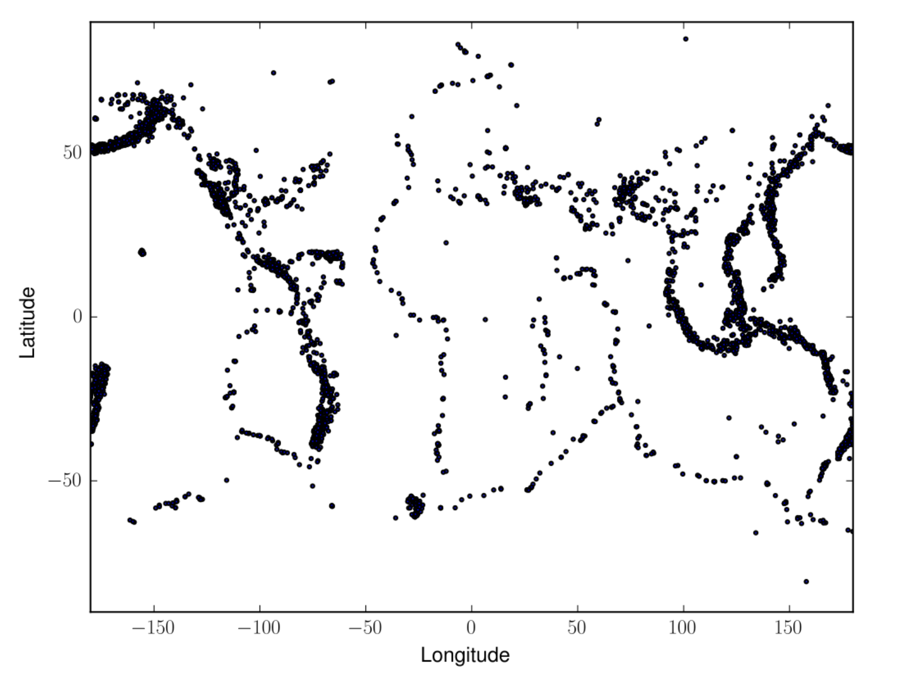

Lab 18: K-Means Clustering
==========================

A current area of high interest is data science and machine learning. Machine learning can be roughly divided into three  categories, supervised learning, unsupervised learning, and reinforcement learning.

* **Supervised learning**: Uses input data with the labels (ie, cat pictures). Learns how to map from the input data to the label.
* **Unsupervised learning**: Uses algorithms to find patterns or anomalies in existing data.
* **Reinforcement learning**: A type of simulation where an agent learns by interacting with an environment. The agent gets feedback through rewards or penalties.

This lab covers one form of unsupervised learning called clustering. There are many different clustering algorithms, but we will be focusing on one called K-Means.

For this lab, we will be using the iris dataset, which is a classic machine learning dataset made in the 1930s. It contains 50 samples each of three different species of Iris, Setosa, Virginica, and Versicolor. Each flower has length and width measurements for petals and sepals.

.. figure:: _static/figures/iris.png
	:align: center

The objective of clustering is to find a partition of the data such that points in the same subset will be “close” enough. There are many different ways of measuring how close two points are, but we will be using Euclidean distance. Let :math:`p` and :math:`q` be points in :math:`K` dimensional space with the coordinates :math:`p=(p_1, p_2, \ldots, p_K)` and :math:`q=(q_1, q_2, \ldots, q_K)`. The Euclidean distance for :math:`p` and :math:`q` is:

.. math::
	d(p, q) = \lVert p - q \lVert_2 = \sqrt{(p_1 - q_1)^2 + (p_2 - q_2)^2 + \cdots + (p_K - q_K)^2}.

To determine how we define a cluster, suppose we have a collection of :math:`\mathbb R^K`-valued observations :math:`X = \{x_1,x_2,\ldots,x_n\}`. 
Let :math:`N\in \mathbb N` and let :math:`\mathcal S` be the set of all :math:`N`-partitions of :math:`X`, where an :math:`N`-partition is a partition with exactly :math:`N` nonempty elements.
We can represent a typical partition in :math:`\mathcal S` as :math:`S = \{S_1, S_2, \ldots, S_N\}`, where

.. math::
	X = \bigcup_{i=1}^N S_i

and

.. math::
	|S_i| > 0, \qquad i = 1, 2, \ldots, N.

We seek the :math:`N`-partition :math:`S^*` that minimizes the within-cluster sum of squares, i.e.

.. math::
	S^* = \operatorname{arg min}_{s\in \mathcal S} \sum_{i=1}^N \sum_{x_j \in S_i} \lVert x_j - \mu_i \rVert_2^2,

where :math:`\mu_i` is the mean of the elements in :math:`S_i`, i.e.
	
.. math::
	\mu_i = \frac{1}{|S_i|} \sum_{x_j \in S_i} x_j.

The mean, in this case, represents the center of the cluster.

The K-Means Algorithm
---------------------

Finding the global minimizing partition :math:`S^*` is difficult since the set of partitions can be very large, but the *k-means* algorithm is a heuristic approach that can often provide reasonably accurate results.

We begin by specifying an initial cluster mean :math:`\mu_i^{(1)}` for each :math:`i=1,\ldots,N` (this can be done by random initialization, or according to some heuristic). For each iteration, we adopt the following procedure. Given a current set of cluster means :math:`\mu^{(t)}`, we find a partition :math:`S^{(t)}` of the observations such that each point, :math:`x_j`, is in its closest cluster:

.. math::
	S_i^{(t)} = \{ x_j : \lVert x_j - \mu_i^{(t)} \rVert_2^2 \leq \lVert x_j - \mu_\ell^{(t)} \rVert_2^2, \ell = 1, \ldots, N \}.

We then update our cluster means for each :math:`i=1,\ldots,N`.
We continue to iterate in this manner until the partition ceases to change or we have reached the accuracy we want.

The figure below shows two different clusterings of the iris data produced by the *k-means* algorithm.
Note that the quality of the clustering can depend heavily on the initial cluster means. 
We can use the within-cluster sum of squares as a measure of the quality of a clustering (a lower sum of squares is better). 
Where possible, it is advisable to run the clustering algorithm several times, each with a different initialization of the means, and keep the best clustering. 
Note also that it is possible to have very slow convergence. 
Thus, when implementing the algorithm, it is a good idea to terminate after some specified maximum number of iterations. 

.. figure:: _static/figures/kmeans-iris.png
	:width: 95 %

	Two different K-Means clusterings for the iris dataset. Notice that the clustering on the left predicts the flower species to a high degree of accuracy, while the clustering on the right is less effective.

The algorithm can be summarized as follows.

1) Choose :math:`k` initial cluster centers.

2) For :math:`i=0, \ldots, \texttt{max_iter}`,
	
   a) Assign each data point to the cluster center that is closest, forming :math:`k` clusters.

   b) Recompute the cluster centers as the means of the new clusters.

   c) If the old cluster centers and the new cluster centers are sufficiently close, terminate early.

.. figure:: _static/figures/kmeans.gif
	:align: center
	
	An example of the K-Means algorithm picking/updating centers and assigning points to clusters.

Those students planning on enrolling in the ACME program or who are completing a degree in computer science will likely have the opportunity to code up the k-means algorithm as part of the program. 

.. For this lab we will use the built in version of k-means clustering that comes with the ``sklearn`` package.

.. go through an example of the code and how it works What does fit and predict mean?

Task 1
------

The K-means clustering algorithm is an unsupervised classification model. `You will find an implementation of this algorithm here <https://colab.research.google.com/drive/1GtrgUCOU4LdT-0arXn1S12uWeGMM2YVX?usp=sharing>`_. Read through this implementation and the usage example to understand how to use this implementation of the K-means clustering algorithm. Be sure to submit the unmodified starter code for this task to receive credit.

Detecting Active Earthquake Regions
-----------------------------------

Suppose we are interested in learning about which regions are prone to experience frequent earthquake activity. 
We could make a map of all earthquakes over a given period of time and examine it ourselves, but this, as an unsupervised learning problem, can be solved using our k-means clustering tool.

	Earthquake epicenters over a 6 month period.

The file ``earthquake_coordinates.npy`` contains earthquake data throughout the world from January 2010 through June 2010. 
Each row represents a different earthquake; the columns are scaled longitude and latitude measurements. 
We want to cluster this data into active earthquake regions. 
For this task, we might think that we can regard any epicenter as a point in :math:`\mathbb R^2` with coordinates being their latitude and longitude. 
This, however, would be incorrect, because the earth is not flat. 
Instead, latitude and longitude should be viewed in spherical coordinates in :math:`\mathbb R^3`, which could then be clustered.

A simple way to accomplish this transformation is to first transform the latitude and longitude values to spherical coordinates, and then to Euclidean coordinates. 
Recall that a spherical coordinate in :math:`\mathbb R^3` has three coordinates :math:`(r,\theta,\varphi)`, where :math:`r` is the distance from the origin, :math:`\theta` is the radial angle in the :math:`xy`-plane from the :math:`x`-axis, and :math:`\varphi` is the angle from the :math:`z`-axis. 
In our earthquake data, once the longitude is converted to radians it is an appropriate :math:`\theta` value; the latitude needs to be offset by :math:`90` degrees, then converted to radians to obtain :math:`\varphi`.
For simplicity we can take :math:`r=1`, since the Earth is roughly a sphere.
We can then transform to Euclidean coordinates using the following relationships.

.. math::
	\theta = \frac{\pi}{180} \times \text{longitude} \qquad \varphi = \frac{\pi}{180}\times (90-\text{latitude})

.. math::
	r &= \sqrt{x^2+y^2+z^2} \qquad &x=r\sin\varphi\cos\theta \\
	\varphi &= \arccos \frac{z}{r} &y= r\sin\varphi\sin\theta \\
	\theta &= \arctan \frac yx  &z=r\cos\varphi

There is one last issue to solve before clustering. 
Each earthquake data point has norm :math:`1` in Euclidean coordinates, since it lies on the surface of a sphere of radius :math:`1`. 
Therefore, the cluster centers should also have norm :math:`1`. 
Otherwise, the means can’t be interpreted as locations on the surface of the earth, and the k-means algorithm will struggle to find good clusters. 
A solution to this problem is to normalize the mean vectors at each iteration, so that they are always unit vectors.

.. Task 1
.. ------

.. Add a keyword argument ``normalize=False`` to your ``KMeans`` constructor.
.. Modify ``fit()`` so that if ``normalize`` is ``True``, the cluster centers are normalized at each iteration.

.. Cluster the earthquake data in three dimensions by converting the data from raw data to spherical coordinates to euclidean coordinates on the sphere.

.. 1) Convert longitude and latitude to radians, then to spherical coordinates. (Hint: ``np.deg2rad()`` may be helpful.)

.. 2) Convert the spherical coordinates to euclidean coordinates in :math:`\mathbb R^3`.

.. 3) Use your ``KMeans`` class with normalization to cluster the Euclidean coordinates.

.. 4) Translate the cluster center coordinates back to spherical coordinates, then to degrees. Transform the cluster means back to latitude and longitude coordinates. (Hint: use ``numpy.arctan2()`` for arctan, so that that correct quadrant is chosen).

.. 5) Plot the data, coloring by cluster. Also mark the cluster centers.

.. With 15 clusters, your plot should resemble this figure.

.. .. figure:: _static/figures/earthquake-color.png
.. 	:width: 95 %

Task 2
------

We will be using the K-means algorithm to classify earthquake data; however, this data is recorded in latitudinal and longitudinal coordinates. This is problematic as applying the 2-norm (Euclidean distance) to this coordinate system fails to yield the measures we expect to see because of distortion. As such, we must convert these coordinates to 3-dimensional Euclidean coordinates before running the K-means algorithm.

Write a function, ``ll_to_euc(X)``, that takes an array of longitudinal and latitudinal (in that order) coordinates, ``X``, and converts them to 3-dimensional Euclidean coordinates. Do this by writing and using two functions: a function, ``ll_to_sph(X)``, that takes an array of longitudinal and latitudinal (in that order) coordinates, ``X``, and converts them into spherical coordinates and a function, ``sph_to_euc(X)``, that takes an array of spherical coordinates, ``X``, and converts them into 3-dimensional Euclidean coordinates.

Task 3
------

We would still like to plot our data in longitudinal and latitudinal coordinates. As such, we need to be able to convert from 3-dimensional coordinates back to longitudinal and latitudinal coordinates.

Write a function, ``euc_to_ll(X)``, that takes an array of 3-dimensional Euclidean coordinates, ``X``, and converts them to longitudinal and latitudinal (in that order) coordinates. Do this by writing and using two functions: a function, ``euc_to_sph(X)``, that takes an array of 3-dimensional Euclidean coordinates, ``X``, and converts them into spherical coordinates and a function, ``sph_to_ll(X)``, that takes an array of spherical (in that order) coordinates, ``X``, and converts them into longitudinal and latitudinal coordinates.

Task 4
------

Use your code from the previous tasks alongside the provided K-means code to write a function, ``classify_geo(X, k, seed)``, that takes an array of geographical data, ``X``, and does the following:

1. Convert the geographical data, ``X``, to 3-dimensional Euclidean coordinates

2. Fit a K-means classifier on the Euclidean data with the given ``k`` and ``seed``

3. Predict the clusters for the Euclidean data with the fitted classifier

4. Convert the ``centers`` from the fitted classifier to longitudinal and latitudinal coordinates

5. Plot the original data, ``X``, colored by its classification labels. 

Make sure to set ``normalize=True`` for your K-means classifier and to use ``seed=42``. Use ``np.load`` to read ``.npy`` files and ``np.loadtxt`` to read ``.txt`` files into a ``np.ndarray``.

Color Quantization
------------------

The k-means algorithm uses the euclidean metric, so it is natural to cluster geographic data. 
However, clustering can be done in any abstract vector space. The following application is one example.

Images are usually represented on computers as 3-dimensional arrays. 
Each 2-dimensional layer represents the red, green, and blue color values, so each pixel on the image is really a vector in :math:`\mathbb R^3`. 
Clustering the pixels in RGB space leads a one kind of image segmentation that facilitate memory reduction. 
(If you would like to read more – go to `<https://en.wikipedia.org/wiki/Color_quantization>`_)

.. Task 2
.. ------

.. Write a function that accepts an image array (of shape ``(m, n, 3)``), an integer number of clusters ``k``, and an integer number of samples ``S``. 
.. Reshape the image so that each row represents a single pixel. 
.. Choose ``S`` pixels to train a k-means model on with ``k`` clusters. 
.. Make a copy of the original picture where each pixel has the same color as its cluster center. 
.. Return the new image. 
.. You may use ``sklearn.cluster.KMeans`` instead of your implementation from the previous problem.

.. Test your code with different values of ``k`` and ``S`` on some of the images from `<https://www.nasa.gov/multimedia/imagegallery/index.html>`_. Include one of your color-quantized pictures in your submitted lab.

Task 5a
-------

Write a function, ``quantize_image(X, n_clusters, n_samples, seed)``, that takes a color image array, ``X`` (shape ``(m, n, 3)``), a number of clusters, ``n_clusters``, and a number of samples, ``n_samples``, and an optional seed for random number generation, ``seed``, and does the following:

1. Flatten the image such that each row represents a single pixel (shape ``(m * n, 3)``)

2. Set the seed for random number generation if given (use ``np.random.seed(seed)``)

3. Randomly sample ``n_samples`` pixels (shape ``(n_samples, 3)``) from the flattened image uniformly (use ``np.random.randint``)

4. Fit a K-means classifier of ``n_clusters`` clusters to the random sample

5. Predict the clusters for the entire flattened image using the fitted classifier

6. Recolor the pixels in the flattened image to the coloration of their corresponding cluster centers

7. Unflatten the recolored image (shape ``(m, n, 3)``)

8. Return the recolored image

Do NOT change the original image during any part of this process (use ``np.copy`` or ``X.copy()`` before performing any of the above steps). Also, you will not need to specify the ``seed`` for your K-means classifier since you will set it manually. Your code will be tested using the file given in CodeBuddy.

Task 5b
-------

Use your code from the previous exercise to perform color quantization on one of the images in CodeBuddy until you generate an image you are satisfied with.

