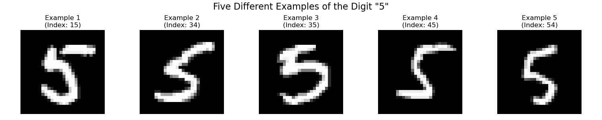

Lab 21: K-Nearest Neighbors Classifier
======================================

KNN Classifier
--------------

In Lab 18, we talked about the K-Means clustering algorithm which is a method for unsupervised learning.
This lab will focus on **supervised learning** where each of the data points has a known label.
We are essentially teaching a computer how to read. 
When we learned to read, we saw hundreds and thousands of different examples of each letter and number.
Through this constant exposure, we eventually learned how to identify them correctly. 
This is the process that we want to replicate for computers: 
Give them different examples of something to classify, and teach them what their labels are so that they can classify new examples correctly.

The KNN classifier is a supervised learning algorithm. 
Given a :math:`n \times d` matrix :math:`X` with :math:`n` data points and :math:`d` features, 
along with known labels for each data point, :math:`y_1,...,y_n`, 
the KNN classifier predicts the label of a new data point :math:`\tilde{x}` 
by finding the :math:`k` closest points in :math:`X` to :math:`\tilde{x}`. 
Then it uses each of those neighbor's labels to vote on the label of :math:`\tilde{x}`.

.. math::

    d(\mathbf{x}, \mathbf{z}) = \sqrt{\sum_{i=1}^d (x_i - z_i)^2}

The most common label among the :math:`k` nearest neighbors becomes the predicted label for :math:`\tilde{x}`.
Scikit-learn makes it really easy to use the KNN classifier. All you need to do is import the model.

.. code:: python

    >>> from sklearn.neighbors import KNeighborsClassifier
    >>> model = KNeighborsClassifier(n_neighbors=3) # n_neighbors is the number of neighbors to consider

Then you can fit the model to the training data.

.. code:: python

    >>> model.fit(X, y) # X is the features and y is the labels

Once you have fit the model, it can be used to predict the labels of new points.
For example, we can use the ``predict`` method to get the predicted labels for a set of inputs ``X_test``.
The output, ``y_pred``, is a vector of predicted labels for each of the inputs in ``X_test``.

.. code:: python

    >>> y_pred = model.predict(X_test)

The MNIST Dataset
-----------------

The MNIST dataset is a collection of 70,000 images of handwritten digits (0-9). 
Each of these grayscale images is 28x28 pixels.
Here is an example of all 10 digits.

.. image:: _static/figures/mnist_10.png
    :align: center
    :width: 80%

What makes this data set interesting is that there is a lot of variation in the handwriting.
As you can see below, here are 5 different examples of the digit "5".
This will make it interesting (and potentially more difficult) for our classifier to correctly identify the digit.

Normally you would be able to load this data set using ``sklearn.datasets.fetch_openml`` or ``tensorflow.keras.datasets.mnist``.
However, because of Codebuddy's lack of internet access, we have provided a csv file containing 5000 samples of the data.
You will load the data into a Pandas ``DataFrame`` with columns ``data`` and ``label``.
The ``data`` column is 28x28 pixels of the image given as a ``numpy.ndarray``.
The ``label`` column is the digit that the image represents.

.. code:: python

    >>> import pandas as pd
    # read_mnist_data() will be a hidden function defined in codebuddy
    >>> data = read_mnist_data('mnist_5k.csv')
    >>> y = data['label']
    >>> X = data['data']

Task 1
------

Create a figure with 3 subplots, and plot the images of the dataset at indexes 13, 3145, and 4321. 

* Set the figure size to ``(12, 4)`` when creating the figure
* For each image, use ``ax[i].imshow(image, cmap='gray')`` to plot the image
* Use ``ax[i].set_title(f"Digit: {label}")`` to display the label of the image
* Use ``ax[i].axis('off')`` to remove the axes for each subplot
* Set the overall title of the figure to ``"MNIST Digits"`` using ``plt.suptitle()``
* Use ``plt.tight_layout()`` to adjust the spacing between the subplots

Image Flattening and Reshaping
------------------------------

You might notice that each MNIST image is a 2D array of 28x28 pixels, so we need to flatten each image into a 1D array.
This is because the KNN classifier expects data in a vector format rather than as 2D images.
Essentially, we compare each pixel position between images to calculate distances.
The ``numpy.reshape()`` function allows us to change the shape of an array without changing its data.

.. code:: python

    >>> import numpy as np
    >>> arr = np.array([[1, 2, 3, 4], [5, 6, 7, 8]])  # shape is (2, 4)
    >>> arr
    [[1 2 3 4]
     [5 6 7 8]]
    >>> reshaped = np.reshape(arr, (4, 2))  # change to shape (4, 2)
    >>> reshaped
    [[1 2]
     [3 4]
     [5 6]
     [7 8]]
    >>> original = np.reshape(reshaped, (2, 4))  # change back to original shape
    >>> original
    [[1 2 3 4]
     [5 6 7 8]]

Task 2
------

Create a function ``flatten_data(X)`` which takes in a Pandas Series and returns a ``numpy.ndarray`` of the flattened data. 
``X`` will be ``data['data']`` from the ``DataFrame`` that you loaded in Task 1. 
Call ``X.values`` to get the ``numpy.ndarray`` from the ``Series`` that you can iterate over.
The returned array should have shape [n, 784] where n is the number of images and 784 = 28x28 pixels.

Train vs Test 
-------------

With supervised learning, we will always have a dataset with known labels. 
When we train a model on a dataset, we want to know how well it performs on new, unseen data.
We can't evaluate the performance of a model on the same data that it was trained on.
It's like testing students on the practice test that we gave them all the answers for. 
This is why we split our data into train and test sets.
We train the model on the train set, and then test it on the test set.
We use the test set to evaluate the performance of the model.

We will be using scikit-learn's functions for splitting the data into train and test sets and verifying accuracy of the model.
Let's pretend that we want to train a fictitious classifier (let's call it ``FictitiousModel``) to predict whether a number is even. 
First we want to split the data into train and test sets.

.. code:: python

    >>> from sklearn.model_selection import train_test_split
    >>> X = [1, 2, 3, 4, 5, 6, 7, 8, 9, 10] # Features
    >>> y = [False, True, False, True, False, True, False, True, False, True] # Labels

    # we split the data into train and test sets
    # test_size is the percentage of the data that we want to use for the test set
    >>> X_train, X_test, y_train, y_test = train_test_split(X, y, test_size=0.2, random_state=42)
    >>> X_train
    [6, 1, 8, 3, 10, 5, 4, 7]
    >>> X_test
    [9, 2]
    >>> y_train
    [True, False, True, False, True, False, True, False]
    >>> y_test
    [False, True]

Once we have split the data, we can train the model on the train set and test it on the test set.

.. code:: python

    >>> from fictitious_classifiers import FictitiousModel 
    >>> model = FictitiousModel()
    >>> model.fit(X_train, y_train)
    >>> y_pred = model.predict(X_test)

Then we can verify the accuracy of the model on the test set.
``accuracy_score`` is a function that calculates the accuracy of the model by dividing the number of correct predictions by the total number of predictions.

.. code:: python

    >>> from sklearn.metrics import accuracy_score
    >>> accuracy = accuracy_score(y_test, y_pred)
    >>> print(f"The accuracy of the model is {accuracy}")
    The accuracy of the model is 0.80

.. note:: 

    We use lowercase `y` for labels because it's a common convention in machine learning - `X` represents features (capitalized because it's typically a matrix), 
    while `y` represents the target variable (lowercase because it's typically represented in a vector form).

Task 3
------

For this task, you will be training a KNN classifier on the MNIST dataset.

* Using your ``flatten_data`` function, create a new array ``X_flat`` with the flattened data.
* Split ``X_flat`` into train and test sets using ``train_test_split``.
* Set the test size to 0.2 and the random state to 42 when splitting the data.
* Fit a KNN classifier with 3 neighbors to the train set, and print the accuracy of the model on the test set.

(Remember that you need to get the features ``X`` and labels ``y`` from the original dataframe.) 

Ablation Study
--------------

An ablation study is a systematic approach to understanding how different components or parameters of a model affect its performance. 
The term "ablation" comes from the medical field, where it means removing or modifying parts to study their effects.
In a machine learning context, we systematically change one parameter at a time while keeping everything else constant to isolate its impact.

For a KNN classifier, the most important parameter to study is k (the number of neighbors), as it changes how the algorithm makes decisions.
Below are some of the common effects of the number of neighbors (k) on the performance of a KNN classifier.

1. **k = 1 (Single Neighbor)** 

   - Makes decisions based on only the closest training example
   - Very sensitive to noise and outliers
   - Can lead to overfitting (memorizing the training data to the point where it performs poorly on new data)
   - Creates complex, irregular decision boundaries

2. **k = 3-5 (Small k)**

   - Balances local patterns with some noise reduction
   - Often provides good performance for many datasets
   - Decision boundaries are still relatively complex

3. **k = 7-15 (Medium k)**

   - More robust to noise
   - Smoother decision boundaries
   - May lose some fine-grained local patterns

4. **k > 15 (Large k)**

   - Very smooth decision boundaries
   - Less sensitive to noise but may miss important local patterns
   - Can lead to underfitting (oversimplifying the problem)

Task 4
------

Create a function ``ablate_k(X, y, k_values, test_size, random_state)`` that will perform an ablation study on the KNN classifier.
It should:

* Split the data into train and test sets according to the parameters ``test_size`` and ``random_state``
* Fit a KNN classifier for each k value
* For each k value, record the accuracy of the model on the test set
* Return a list of the k values and the accuracies of the form ``[(k1, accuracy1), (k2, accuracy2), ...]``

Task 5
------

Using your function from Task 4, plot the effect of the parameter k as a function of the accuracies (plot the k values 1-10 on the x-axis and the accuracies on the y-axis).

* Use a test size of 0.2 and a random seed of 39
* Title the plot ``"KNN Classifier Accuracy vs k Value"``
* Label the x-axis ``"k (Number of Neighbors)"`` and the y-axis ``"Accuracy"``
* For the plotting, pass in the arguments ``['-bo', linewidth=2, markersize=8]``
* Use ``plt.grid(True)`` to add a grid to the plot
* Use ``plt.tight_layout()`` to adjust the spacing between the subplots
* Use ``plt.show()`` to display the plot