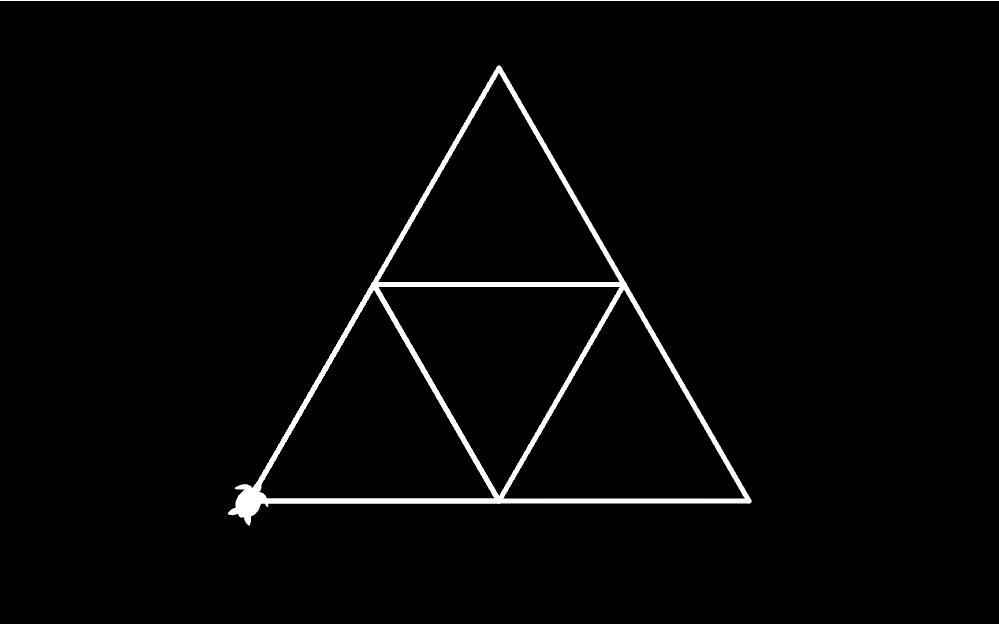
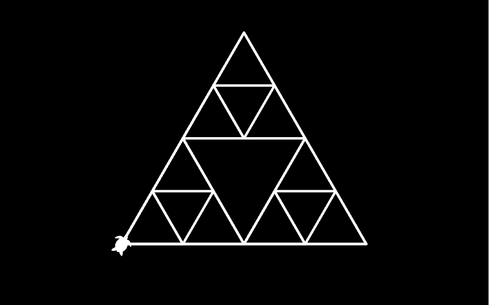

Lab 22: Fractals with Turtle
============================

In this lab we will be using Python's ``Turtle`` library. This library allows us to direct a pen to draw shapes. In your Math 341 class, you were introduced to the Cantor set, an example of a fractal. This fractal is one-dimensional and so is hard to see. In this lab, we will create an example of a two-dimensional fractal, the Sierpiński triangle.

``Turtle`` works slightly differently depending on if you are using Google Colab or not. This lab is split into three sections. If you are using Google Colab, read the section with Google Colab. If you are using a different IDE (for example, `replit.com <https://www.replit.com>`_ also has ``Turtle`` capabilities), choose the section about other IDEs. You are not required to read both of the first two sections, but everyone must read the third section on constructing the Sierpiński triangle.

Google Colab
------------

As with all libraries, we must first import the library. Here is how it is imported in Google Colab. Place the following in a separate cell because you will only need to run it once.

.. code:: console

    !pip3 install ColabTurtle
    from ColabTurtle.Turtle import *

Then, to create a turtle, we need only use the line 

>>> initializeTurtle()

This command will also erase everything the turtle has done so that we can start over.

Now that we have a turtle, we can begin drawing! We draw by directing where the turtle should go. The turtle begins at the center of the screen and faces north. The commands are basic and intuitively named. Here are a list of some of the main commands you'll be using. We highly recommend that you immediately set the turtle speed to maximum  when you are drawing something large.

.. list-table:: Turtle Commands
    :widths: 10 40
    :header-rows: 1

    * - Command
      - Explanation
    * - ``forward(length)``  
      - moves the turtle forward ``length`` pixels 
    * - ``backward(length)``  
      - moves the turtle backwards ``length`` pixels 
    * - ``left(angle)``  
      - turns the turtle left by ``angle`` degrees (not radians!) 
    * - ``right(angle)``  
      - turns the turtle right by ``angle`` degrees 
    * - ``pendown()``  
      - puts the pen down to draw whenever the turtle moves 
    * - ``penup()``  
      - puts the pen up so that the turtle can move without drawing 
    * - ``speed(n)``  
      - sets the turtle speed where ``n`` is in ``[1,13]``, with ``1`` slowest and ``13`` fastest 
    * - ``goto(x,y)``  
      - moves the turtle to a point ``(x,y)``; the coordinates of the turtle's frames are ``(0,0)`` at the top left and ``(800,500)`` at the bottom right, so all ``x`` and ``y`` values are nonnegative.
    * - ``setheading(angle)``  
      - points the turtle toward ``angle`` degrees, where ``0`` degrees is directly right and angles go clockwise

There are also some fun things that you can do to customize your turtle. None of these are required, but are fun to know:

.. list-table:: More Turtle Commands
    :widths: 20 40
    :header-rows: 1

    * - Command 
      - Explanation 
    * - ``shape(sh)`` 
      - changes the turtle's shape, but only ``"circle"`` and ``"turtle"`` are accepted 
    * - ``color(r,g,b)`` or ``color(colorstring)`` 
      - changes the pen color according to RGB values or a color name 
    * - ``bgcolor(r,g,b)`` or ``bgcolor(colorstring)`` 
      - changes the background color 

For a full list of the commands that you can use, check out `<https://github.com/tolgaatam/ColabTurtle>`_.

So that you can get a feel for how to draw things with ``Turtle`` graphics, here is an example of drawing a square. Run this code on your own and check that you understand what is happening.  It may be useful to lower the speed if you cannot see what is happening.

.. code:: python

    initializeTurtle()
    speed(13)

    penup()         # lifts the pen, otherwise goto will draw a line
    goto(350,300)   # moves the turtle so the square is centered
    pendown()       # pen back down

    for i in range(4):
        forward(100)    # one side
        right(90)       # one corner

Now that we have the basic set-up for Python Turtle, skip to the last section of this lab, `The Sierpiński Triangle`_.

Other IDEs
----------

As with all libraries, we must first import the library. Here is how it is imported in most IDEs.

>>> from turtle import *

Now that we have a turtle, we can begin drawing! We draw by directing where the turtle should go. The turtle begins at the center of the screen and faces to the right. (There is a chance that your turtle may begin facing a different direction, so it is worth it to check this.) The commands are basic and intuitively named. Here are a list of some of the main commands you'll be using. We highly recommend that you immediately set the turtle speed to maximum when you are drawing something large.

.. list-table:: Turtle Commands
    :widths: 10 40
    :header-rows: 1

    * - Command
      - Explanation
    * - ``forward(length)``  
      - moves the turtle forward ``length`` pixels 
    * - ``backward(length)``  
      - moves the turtle backwards ``length`` pixels 
    * - ``left(angle)``  
      - turns the turtle left by ``angle`` degrees (not radians!) 
    * - ``right(angle)``  
      - turns the turtle right by ``angle`` degrees 
    * - ``pendown()``  
      - puts the pen down to draw whenever the turtle moves 
    * - ``penup()``  
      - puts the pen up so that the turtle can move without drawing 
    * - ``speed(n)``  
      - sets the turtle speed, where ``n`` is in ``[0, 10]``, with ``1`` slowest, ``n > 1`` getting faster, and ``0`` fastest
    * - ``goto(x,y)``  
      - moves the turtle to a point ``(x,y)``; the coordinates of the turtle's frames are exactly like the ``xy``-plane with ``(0,0)`` at the center and positive and negative ``x`` and ``y`` accepted. There is a chance that your IDE may set ``0`` degrees to be north with angles going counterclockwise. This is worth checking.
    * - ``setheading(angle)``  
      - points the turtle toward ``angle`` degrees, where ``0`` degrees is directly right and angles go counterclockwise

There are also some fun things that you can do to customize your turtle. None of these are required, but are fun to know:

.. list-table:: More Turtle Commands
    :widths: 20 40
    :header-rows: 1

    * - Command 
      - Explanation 
    * - ``shape(sh)`` 
      - changes the turtle's shape, options are ``"arrow”``, ``"turtle”``, ``"circle”``, ``"square”``, ``"triangle”``, ``"classic”``
    * - ``color(r,g,b)`` or ``color(colorstring)`` 
      - changes the pen color according to RGB values or a color name 
    * - ``bgcolor(r,g,b)`` or ``bgcolor(colorstring)`` 
      - changes the background color 

.. \begin{tabular}{c|c}
..     Command & Explanation \\
..     \hline
..     ``shape(sh)`` & changes the turtle's shape; options are ``"arrow”``, \\
..     & ``"turtle”``, ``"circle”``, ``"square”``, \\ 
..     & ``"triangle”``, ``"classic”`` \\
..     ``color(r,g,b)`` or ``color(colorstring)`` & changes the pen color according to RGB \\ 
..     & values or a color name \\
..     ``bgcolor(r,g,b)`` or ``bgcolor(colorstring)`` & changes the background color \\
.. \end{tabular}

`For a full list of the commands that you can use, click here <https://docs.python.org/3/library/turtle.html>`_.

So that you can get a feel for how to draw things with ``Turtle`` graphics, here is an example of drawing a square. Run this code on your own and check that you understand what is happening. It may be useful to lower the speed if you cannot see what is happening.

.. code:: python

    speed(0)

    penup()         # lifts the pen, otherwise goto will draw a line
    goto(-50,-50)   # moves the turtle so the square is centered
    pendown()       # pen back down

    for i in range(4):
        forward(100)    # one side
        left(90)       # one corner

Now that we have the basic set-up for Python ``Turtle``, we can continue on to the last section of this lab.

The Sierpiński Triangle
-----------------------

The instructions given in this section apply to both IDE options. The figures here were made with Google Colab, but the results from other IDEs should be similar.

1. Draw an equilateral triangle using the turtle. Make the side lengths ``100`` pixels. What is the angle that the turtle must turn at each corner? You are encouraged to use a ``for`` loop. It may be helpful to turn the turtle before beginning to draw.

The end goal of this lab is to draw the Sierpiński triangle. Since we will be drawing so many triangles, it makes sense to define a function ``draw_triangle``.

2. Write a function ``draw_triangle(side_length)`` that accepts a float ``side_length`` and will draw a triangle with that side length. For all of your triangles to face the same direction, decide now what angle you want to assume that the turtle is facing whenever this function is called. A reasonable choice is pointed ``30`` degrees to the right of north, but you may choose whatever makes most sense to you.

3. With this function, draw the first image below. You must use your ``draw_triangle`` function whenever you draw a triangle. (This can typically be done with either two or three calls to the function.) Your turtle does not have to end in the same location as depicted, but it will be useful to know how to get the turtle into a position such as this as we continue on. *Hint*: Some of the triangles begin at odd locations and it may be difficult to determine their location in the ``xy``-plane precisely. Note that you do not have to know the the exact coordinates of a point, only how to get to it. Retracing is allowed.

    (The Triforce)

A fractal is an infinite process to create, but we can make approximations by taking a finite number of steps. Drawing a single triangle creates a first approximation, and the figure that you drew in Problem 3 created a better one. We want to be able to continue this process without copying code over and over again. However, each time that we draw more triangles inside another, the side length must decrease for some triangles but not for others, so we cannot simply use a ``for`` loop. We will use a recursive function ``sierpinski(start_length, min_length)`` to draw the fractal.

Let's compare the first picture with the next step to get a good feel for how the recursion should play out. 

    (Triforce Inception)

Comparing the two figures, we can see that each of the three triangles in the corners has the beginnings of another Sierpiński triangle. This makes sense: if we zoom in on part of a fractal, it should look exactly the same. So after we draw each triangle, we should recursively call the ``sierpinski`` function with a start length that is half of the length of the previous step. This can be summarized by the following pseudocode. Recall that all recursive functions *must* have a base case or they will run infinitely many times. If you drew the original shape from problem 3 using only two calls to the ``draw_triangle`` function, you may need to adapt this pseudocode slightly.

.. code:: python

    def sierpinski(start_length, min_length):
        if start_length < min_length:
            return
        else:
            Draw the bottom left triangle
            Recursively call sierpinski with start_length/2
            Draw the top middle triangle
            Recursively call sierpinski with start_length/2
            Draw the bottom right triangle
            Recursively call sierpinski with start_length/2
        

Note that the base case is only reached if ``min_length > 0``. You can program in an exception if an invalid ``min_length`` is passed in, but this is optional.

4. With the above pseudocode and your ``draw_triangle`` function, write a recursive function ``sierpinski(start_length, min_length)`` that will draw the Sierpiński triangle to the accuracy of ``min_length``.

5. Test your function with ``start_length = 200`` and
    * ``min_length = 200``
    * ``min_length = 100``
    * ``min_length = 50``
    * ``min_length = 25`` 
    * ``min_length = 10``

If it is taking too long to do some of the later ones repeatedly, you may skip to the last value. We highly recommend that you set the speed to maximum.

Lastly, to complete your work of art you may find the command ``hideturtle()`` (and the corresponding ``showturtle()``) to be useful, but this is not required.

