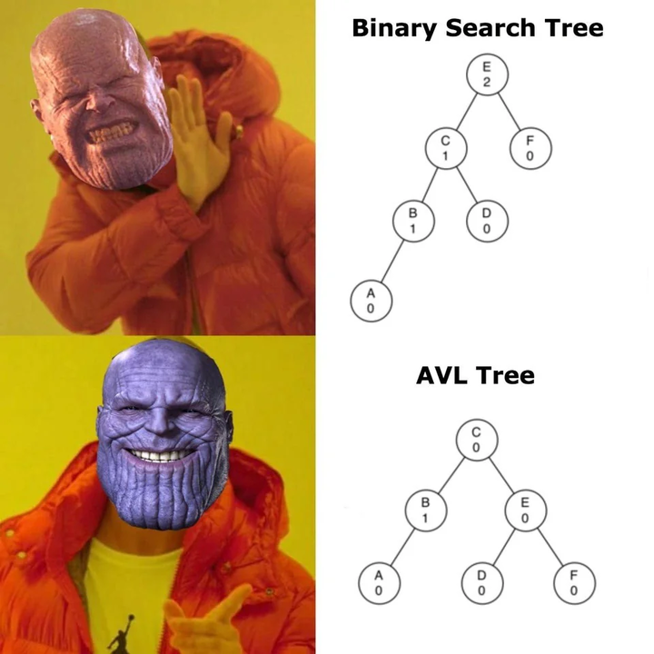

Lab 22: Binary Search Trees
===========================

In the last lab (:doc:`lab06`), we implemented **binary search** on a sorted list.
Each step in binary search "cuts" the search space in half. Binary Search Trees (BSTs)
carry a similar idea into a new structure where the data itself is arranged
so that searching becomes efficient.

As you have learned, lists are very common **data structure** (a way to represent data) in programming. Binary Search Trees are another data structure that work a little differently. BST's are really good when you want to:

- Search quickly (like the binary search algorithm does in a sorted list)
- Keep your data in order while still being able to add/remove items easily
- Avoid having to re-sort after every change

Think of a BST as a *living*, *growing* sorted list where the layout of the data
already encodes where each item belongs.

Before defining a **Binary Search Tree**, let's talk about **trees** in general.

What is a Tree?
---------------

A tree is a set of **nodes** connected in a hierarchy.

.. image:: _static/figures/tree.svg
   :align: center
   :alt: Basic tree diagram

Key terms:

- **Root** - The "top" node of the tree (diagrams are often drawn upside down).
- **Parent** - A node that has one or more children.
- **Child** - A node that descends from another node.
- **Leaf** - A node with no children.
- **Branch** - A path from the root to a leaf.
- **Edges** - The connections between nodes.

.. image:: _static/figures/tree_annotated.svg
   :align: center
   :alt: Basic tree diagram

Trees appear naturally in maany places like: parsing expressions in algebra, decision trees in statistics, factorization trees in number theory, tournament brackets in sports, or even outside in your front lawn.

.. note::
    A node in a tree can have any amount of child nodes. In this lab, we will focus on **Binary Trees** which can have at most two child nodes.

Connecting Nodes
----------------

If we want to make a generic **binary** ``Tree``, all we need is an object that holds 1) a value and 2) references to other ``Tree``\s.

.. code-block:: python

    class Tree:
        def __init__(self, value):
            self.value = value
            self.left = None
            self.right = None

.. note::
    We didn't create a ``Node`` class to go in our ``Tree`` class. This is because each node in a tree can be a tree itself. This is the recursive nature of trees.

To create a simple tree, we just have to create many sub-trees.

.. code-block:: python

    root = Tree(10)
    root.left = Tree(5)
    root.right = Tree(15)
    root.left.left = Tree(2)
    root.left.right = Tree(7)
   
.. image:: _static/figures/bst.svg
    :align: center
    :alt: Tree created from Python code

What Makes a Binary Search Tree?
--------------------------------

A **Binary Search Tree** is a binary tree with an ordering rule:

- The left child contains only values **less than** the parent's value.
- The right child contains only values **greater than** the parent's value.

.. image:: _static/figures/trees.svg
    :align: center
    :alt: Both trees

The above image contains the two examples shared earlier in this lab. Which one follows the rules of a Binary Search Tree?

A Basic Python BST Class
------------------------

Before we look at how searching works, let's examine one way to represent a BST
in Python using a class. This will include the ability to insert new values.

.. code-block:: python

    class BST(Tree):
        def __init__(self, value):
            super().__init__(value)

        def insert(self, value):
            if value < self.value:
                if self.left:   # same thing as saying "if self.right is not None" (if self.right exists)
                    self.left.insert(value)
                else:
                    self.left = BST(value)
            else:
                if self.right:
                    self.right.insert(value)
                else:
                    self.right = BST(value)

>>> root = BST(10)  # The root node
>>> root.insert(5)  # Left of 10
>>> root.insert(15) # Right of 10
>>> root.insert(2)  # Left of 5
>>> root.insert(7)  # Right of 5

Notice how our insert method is recursive. It checks the first node to see if the inserted value is bigger or smaller, and then goes right or left based on that. It continues this process until it encounters a leaf node. For example, inserting 7 in the above example looks like this:

.. image:: _static/figures/bst_insertion.svg
    :align: center
    :alt: BST insertion

This creates the same tree we made earlier by referencing ``left`` and ``right`` attributes, but this one just uses ``insert()``.

.. image:: _static/figures/bst.svg
   :align: center
   :alt: Basic tree diagram

This class-based approach lets each node handle its own insertions.
The tree “grows” downward automatically.

Searching in a BST
------------------

Say we want to write a method in our ``BST`` class that will tell us if a value exists in our tree or not. This is fairly simple because at each node, we instantly know which side to search based on how the value we're looking for compares to the current node's value. This is similar to how the binary search algorithm divides a sorted list in half *by index*, a BST just divides the search space *by value*.

The steps to find a value in a BST are as follows:

#. If the target value is equal to the current node's value, return ``True``.
#. If the target value is less than the current node's value, search the left child if it exists.
#. Otherwise, search the right branch of the node if it exists.

How long would it take to determine if a value exists in a Python ``list``? What about in a ``BST``?

Task 1
------

Write a recursive method in your ``BST`` class called ``search(value)`` that returns ``True`` if the value is in the ``BST``, and ``False`` otherwise. Starter code will be given to you on codebuddy.

Node Characteristics
--------------------

When working with trees, it can be useful to define metrics for talking about where different nodes are in the tree.

- **Depth**: Distance from a node to the root node. It is commonly defined with the root node being at depth 0. Depth is calculated by counting the number of edges in the path between the root and node.

- **Height**: Distance from a node to its deepest descendant leaf. Height is calculated by counting the number of edges in the path between node and its deepest descendant leaf.

.. image:: _static/figures/bst_attributes_annotated.svg
   :align: center
   :alt: Basic tree diagram

Task 2
------

Write a recursive method in your ``BST`` class called ``height()`` that calculates the height of your ``BST``. Starter code will be given to you on codebuddy.

Tree Traversal
--------------

If we visit all the nodes in a ``BST`` from left to right (called *in-order traversal*),
we will see the values in ascending order.

Why this works:
    - Everything in the left subtree is smaller than the root.
    - Everything in the right subtree is larger than the root.
    - Visiting them in this order naturally respects the sorted sequence.

This is a direct example of how a BST encodes order in its shape —
you don't need to sort the list after building it.  
The *shape* of the tree *is* the ordering rule.

Task 3
------

Write a recursive method in your ``BST`` class called ``inorder_traversal()`` that returns a Python ``list`` of all the data in the ``BST`` in order. Starter code will be given to you on codebuddy.

Balanced and Unbalanced Trees
-----------------------------

The main benefit of using a ``BST`` over a Python ``list`` is that it is really easy to search and sort in ``O(log(n))`` time. Consider the following two trees.

.. image:: _static/figures/balanced_v_unbalanced.svg
   :align: center
   :alt: Unbalanced vs Balanced Trees

Both trees contain the same data (``[1, 2, 3, 4, 5, 6]``), but which one will be quicker when searching for a value?

This is the problem of **balanced** and **unbalanced** trees. The first tree essentially acts the same as a Python ``list`` (``O(n)`` search complexity), while the second acts as a true ``BST`` (``O(log(n))`` search complexity. The difference is how we input the data:

>>> # Figure 1
>>> root = BST(3)   # Root
>>> root.insert(1)  # Left of 3
>>> root.insert(2)  # Right of 1
>>> root.insert(5)  # Right of 3
>>> root.insert(4)  # Left of 5
>>> root.insert(6)  # Right of 5

>>> # Figure 2
>>> root = BST(1)   # Root
>>> root.insert(2)  # Right of 1
>>> root.insert(3)  # Right of 2
>>> root.insert(4)  # Right of 3
>>> root.insert(5)  # Right of 4
>>> root.insert(6)  # Right of 5

A tree is **balanced** if, for every node, the heights of its left and right subtrees differ by no more than one.

.. figure:: _static/figures/balanced_v_unbalanced_annotated.svg
    :align: center
    :alt: Unbalanced vs Balanced Trees

    Both trees are created by inserting ``[2, 1, 4, 3, 5]``, but as soon as we add ``6``, the tree becomes unbalanced.

.. admonition:: Tree Balancing Edge Case

    What happens when a node doesn't have any children on the right or left side?

    .. figure:: _static/figures/unbalanced.svg
        :align: center
        :alt: Very unbalanced tree

    This tree is obviously unbalanced at node ``2``, but is not unbalanced at node ``4``. If the balance value is to be greater than 1, what number should we use as the empty node's height?

Conceptual takeaway:
    - The order you insert items determines the *shape* of the tree.
    - This shape affects performance.

Task 4
------

Write a recursive method in your ``BST`` class called ``is_balanced()`` that returns ``True`` if the tree is balanced and ``False`` otherwise. Starter code will be given to you on codebuddy.

Balancing Trees
---------------

Once it is known that a tree is unbalanced, trees are rebalanced with algorithms like AVL (Adelson-Velsky and Landis, the names of its creators), or Red-Black Trees. Both of these algorithms rely on rotating nodes (changing the root of the subtree) to balance the overall tree. If you take CS 235 you will learn how to implement this algorithm.

Summary
-------

- A BST is like a *binary search algorithm* built directly into a tree.
- Trees are naturally recursive.
- An in-order traversal gives you sorted data.
- Balanced trees are faster for search and insertion.

.. Connect to earlier Binary Search (lab 6)
.. In binary search, each iteration would cut the search space in half. That concept is similar to how the Binary Search works.

.. Why even BST's?
.. - if you want to search in a list fast (think Binary Search)
.. - Storing ordered data

.. Before we dive into what a BST is, lets talk about trees and nodes

.. What is a Tree (definitions) (have an image, mention trees are normally shown upside down)
.. - nodes (parent, child, and leaf)
.. - root
.. - branch
.. - head

.. (include the code for a basic python node class)
.. (show how to dynamically build a tree with a linked list like structure)

.. Cool attributes about trees
.. - Naturally recusive algorithms (include an analogy)

.. Useful metrics
.. - depth
.. - heights

.. Explain what makes a BST a BST
.. - left and right children
.. - similar to binary search - each level cuts the search space in half (is there a conceptual analogy we could use with this?)

.. Walk through a height and depth function

.. Task: search function

.. Task: Return a sorted python list

.. Show how to create BSTs
.. - from a list
..     - show how depending on how you input the list, the tree can be balanced or unbalanced, talk about how that affects performance
.. - talk about tree balancing, but don't go super into depth

.. To do:
.. - define objects
.. - construct bst
.. - search function in bst
.. - depth function for bst (show how you get different depths when you put different heights in)
.. - return a Python list

.. Code:
.. - node class
.. - BST class

.. Things to not include
.. - insertion
.. - balancing
.. - removal
.. - AVL

.. Other things
.. include multiple examples becaue it is ok for binary search trees to be organized differently