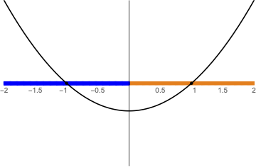
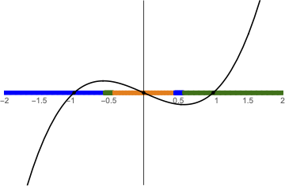
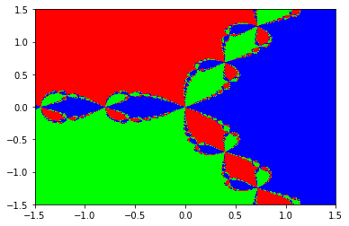
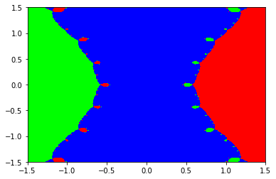

Lab 24: Basins of Attraction
============================

In :doc:`lab11` you were first introduced to Newton's method. 
When there is only one solution to an equation, then for almost every initial condition we will be able to find this solution. 
However, if there is more than one solution, the solution that we find is dependent on our choice of a starting point :math:`x_0`. 
For example, the function :math:`f(x)=x^2-1` has zeros at :math:`-1` and :math:`1`.
If :math:`x_0<0`, then Newton's method converges to :math:`-1`; if :math:`x_0 > 0` then it converges to :math:`1`.

    Basins of attraction for :math:`f(x) = x^2 - 1`

The regions :math:`(-\infty, 0)` and :math:`(0, \infty)` are called the *basins of attraction* of :math:`f`.
Starting in one basin of attraction leads to finding one zero, while starting in another basin yields a different zero. In this lab, we will write code to graph the basins of attraction for a given function. This lab is an ACME lab with more explanation added where necessary.

The basins of attraction for :math:`f(x) = x^2 - 1` are very straightforward, but the basins of attraction for polynomials of degree at least :math:`3` are more interesting. We can see in the figure below that the basis of attraction for the zeros :math:`-1` (in blue) and :math:`1` (in green) are disconnected but share a kind of symmetry.

    Basins of attraction for ``f(x) = x^3 - x``

So far we have performed Newton's method on functions from :math:`\mathbb R` to :math:`\mathbb R`. 
However, the same algorithm also works on functions from :math:`\mathbb C` to :math:`\mathbb C`, and we may similarly find basins of attraction. 
In the complex case, the basins of attraction are now :math:`2` dimensional regions in the complex plane instead of sections on a line, so the graphs of the basins of attraction can be both interesting and beautiful. 
Recall from Lab :doc:`lab21` that every complex number :math:`c` can be written as :math:`c = a + bi` where :math:`a,b` are real numbers. 
We can plot :math:`c` in a plane (the complex plane) by taking the :math:`x`-coordinate to be the real part of :math:`c` (which is :math:`a`) and taking the :math:`y`-coordinate to the be imaginary part of :math:`c` (which is :math:`b`).

To construct a plot of the basins of attraction for a complex function, we are going to use the ``numpy`` library. 
In all the example code given below, we will assume that ``numpy`` was imported as ``np``. 
We can easily construct a real plane with :math:`x`- and :math:`y`-axes with the following code: 

.. code:: python

    x = np.linspace(-1.5, 1.5, 500)
    y = x.copy()
    X, Y = np.meshgrid(x, y)

Generally, we could then create an output list (usually ``Z`` as a function of ``X`` and ``Y``) and plot all three ``X``, ``Y``, ``Z`` as a heatmap, contour plot, or 3D plot. 
However, a complex function is a function of a single complex variable and not two real variables, even though we often think of those as equivalent. 
Thus we will use ``linspace`` and ``meshgrid`` to construct ``X_real`` and ``X_imag`` and combine these to create a grid of complex points. 
In the following example, the imaginary unit :math:`i = \sqrt{-1}` is instead written as ``j`` in Python. 
*Note*: Generally in Python you must always write a multiplication sign ``*`` between any number and variable, but in the case of ``j`` you do not. In fact, you must always have a number attached to ``j`` otherwise it will be assumed to be a variable.

.. code:: python

    x_real = np.linspace(-1.5, 1.5, 500)  # Real parts.
    x_imag = np.linspace(-1.5, 1.5, 500)  # Imaginary parts.
    X_real, X_imag = np.meshgrid(x_real, x_imag)
    X_0 = X_real + 1j*X_imag              # Combine real and imaginary parts.

Now we have one variable ``X_0`` which contains a ``500 x 500`` grid of complex numbers as opposed to two variables  ``X`` and ``Y`` which together make a grid of tuples of real numbers. 
We can calculate using this grid in exactly the same way that we could with the grid of ``X`` and ``Y``. 
If we have some :math:`f: \mathbb C \to \mathbb C`, we may compute an output grid by writing ``Z = f(X_0)``.

.. 1. Recall that Newton's method gives us a sequence :math:`\{x_n\}` that converges to a zero of our function. In Lab :doc:`lab11`, you were asked to find a recursive formula for :math:`x_n` in terms of :math:`x_{n-1}` for a specific function. Given a generic function :math:`f`, write the recursive function for :math:`x_n` in terms of :math:`x_{n-1}`. You may assume that :math:`f` is differentiable. To help with your visualization and intuition, you may consider :math:`f` to be a real function. The solution that you find will work for complex functions as well. It may be useful to review the algorithm of Newton's method.

.. 2. For the function :math:`f(x) = x^3 - 1`, write two functions ``f`` and ``Df`` that both accept a single parameter ``x`` and return ``f(x)`` and ``f'(x)``, respectively. You may use a ``lambda`` function, but you are not required to. You may use SymPy to compute the derivative, but you are also welcome to compute the derivative by hand and hard-code it in.

.. 3. Using ``f`` and ``Df`` and your recursive equation, compute one iteration of Newton's method at every grid point of ``X_0``. Save this in a new grid called ``X_1``. *Hint*: Since we are using NumPy, we can plug entire arrays into simple functions. This is called array broadcasting. For example, running the line ``X_0**2`` will square every element of ``X_0``.

Task 1
------

Write a function, ``comspace(a, b, c, d, n, m, axes)``, that uses ``np.linspace`` and ``np.meshgrid`` to create an array of complex numbers distributed uniformly on ``{x + 1j * y: a <= x <= b, c <= y <= d}`` with ``n`` terms on the real axis and ``m`` terms on the imaginary axis. Also, accept a boolean value ``axes`` that returns the axis grids (the outputs of ``np.meshgrid``) when ``True``.

Task 2a
-------

Write a function, ``newton(f, df, x0, tol, maxiter)``, that implements Newton's method and returns the solution only. If you have completed :doc:`lab11`, you are welcome to reuse that implementation of Newton's Method.

Task 2b
-------

Vectorize your implementation of ``newton(f, df, x0, tol, maxiter)`` by adding ``@np.vectorize(excluded={0, 1, 3, 4, "f", "df", "tol", "maxiter"})`` to the line directly above the function declaration. This allows your function to properly handle vector inputs.

Basins of Attraction
--------------------

If we repeat this, we can create many grids ``X_1``, ``X_2``, ``X_3``, and so on until we have ``k`` iterations. After enough iterations, the ``(i,j)`` th element of ``X_k`` will be very near to one of the zeros of ``f``, which means that using the ``(i,j)`` th element of ``X_0`` as a starting point for Newton's method will converge to that zero. The zeros of :math:`f(x) = x^3 - 1` are :math:`1`, :math:`-\frac{1}{2} + \frac{\sqrt{3}}{2} i`, and :math:`-\frac{1}{2} - \frac{\sqrt{3}}{2} i`, where the last two zeros are complex. Performing Newton's method for this function, ``(i,j)`` th element of ``X_k`` will be close to one of these zeros. We can then assign a value ``0``, ``1``, or ``2`` to each element of ``X_k`` depending on which zero it is closest to and save these values into a new array ``Y``.

We then have an array ``Y`` where all the elements are ``0``, ``1`` or ``2``. Plotting this array with each number corresponding to a different color gives us a plot of the basins of attraction.

    Basins of attraction for :math:`f(x) = x^3 - 1`

    Basins of attraction for :math:`f(x) = x^3 - x`

.. admonition:: Note

    Notice that in some portions of the first figure, whenever red and blue try to come together, a patch of green appears between. This behavior repeats on an infinitely small scale, producing a fractal. Because it arises from Newton's method, this kind of fractal is called a *Newton fractal*.

    Newton fractals show that the long-term behavior of Newton's method is *extremely* sensitive to the initial guess :math:`x_0`. Changing :math:`x_0` by a small amount can change the output of Newton's method in a seemingly random way. This phenomenon is called *chaos* in mathematics.

Task 3
------

Write a function, ``basins(f, df, X, zeros)``, that finds the basins of attraction for ``X`` by running Newton's method on ``X`` for ``f, df`` and finding the indices of the zeros that are closest to the output.

Hint: Consider using ``np.abs`` and ``np.argmin`` (with ``axis=0``) and ``np.expand_dims`` to ensure array broadcasting functions properly.

Task 4a 
-------

Using all the functions you have made so far, write a function, ``plot_basins(f, df, zeros, bounds, res)``, that plots the basins of attraction, using ``plt.pcolormesh`` (with ``cmap="brg"``), of ``f`` applied to the complex region defined by ``bounds`` and ``res`` where ``bounds`` is a tuple containing ``(a, b, c, d)`` and ``res`` is the number of points to generate for each axis.

Task 4b
-------

Use your code from the previous exercise to visualize the basins of attraction for ``f = lambda x: x ** 3 - 1`` on ``{x + yi: -1.5 <= x, y <= 1.5}`` with ``res=500``.

Task 4c
-------

Use your code from the previous exercise to visualize the basins of attraction for ``f = lambda x: x ** 3 - x`` on ``{x + yi: -1.5 <= x, y <= 1.5}`` with ``res=500``.

Task 4d
-------

Use your code to plot the Newton fractal (basins of attraction) for a function of your choice.

If you wish to use functions that are not polynomials, make sure to use NumPy's version of the function instead of the ``math`` library's. For example, use ``np.sin`` instead of ``math.sin`` since the first will work for complex numbers and the second will not. You are welcome to use online calculators to compute the zeros of complex functions. Change the domain variables ``[r_min, r_max, i_min, i_max]`` so that all the zeros of the function ``f`` are within the domain of the plot.

.. 4. Write a function ``basins_of_attraction`` that will plot the basins of attraction for a given function. The function ``basins_of_attraction`` should accept a function ``f``, its derivative ``Df``, a list ``zeros`` of the zeros of ``f`` (which may be real or complex), a list ``[r_min, r_max, i_min, i_max]`` that gives the real and imaginary domains for the plot, and integer ``res`` that determines the resolution of the plot (how many points ``np.linspace`` should use), and a number of iterations ``iters`` to run the iteration. The function ``basins_of_attraction`` should not return anything but should compute and plot the basins of attraction of ``f`` in the complex plane over the specified domain. You may find the following steps and hints useful:

..    #. Construct a ``res x res`` grid ``X_0`` of complex numbers over the domain :math:`\{a + bi: a \in \texttt{[r_min, r_max]}, b \in \texttt{[i_min, i_max]}\}`.
..    #. Run Newton's method on ``X_0`` ``iters`` times, obtaining a ``res x res`` array ``X_k`` (you may call the array anything you want).
..    #. The final grid ``X_k`` cannot be visualized directly because its values are complex. Solve this issue by creating another ``res x res`` array ``Y``. To compute the ``(i,j)`` th entry of ``Y``, determine which zero of ``f`` is closest to the ``(i,j)`` th of ``X_k``. Set ``Y_{i,j}`` to be the index of this zero in the array ``zeros``. If there are ``R`` distinct zeros, each ``Y_{i,j}`` should be one of ``0, 1, ..., R-1``. You may find the following two hints useful:

..       #. The function ``np.argmin`` may be useful. For a list ``my_list`` of numbers, ``np.argmin(list)`` will the index of the smallest element. For example, ``np.argmin([1, 2, .25, .251])`` will return ``2``. Try out some different inputs until you have a good feel for this function.
..       #. The function ``abs`` will return the absolute value of a number, and it also works for complex numbers. The absolute value of a complex number is its distance from ``0``, which is always a nonnegative number. For example, :math:`3+4i` has a distance of :math:`\sqrt{3^2 + 4^2} = 5` from :math:`0`, so :math:`|3+4i| = 5`. Test this yourself by running the code ``abs(3 + 4j)``. Thus, we can determine how close two numbers :math:`z` and :math:`w` are to each other in the complex plane by computing :math:`|z - w|`.

..    #. Use ``plt.pcolormesh()`` to visualize the basins. Recall that this function accepts three array arguments: the ``x``-coordinates (in this case, the real components ``X_real`` of the initial grid), the ``y``-coordinates (the imaginary components ``X_imag`` of the grid), and an array indicating color values (in this case, ``Y``). Set ``cmap="brg"`` to get the same color scheme as in the figures above.

.. 5. Test your function using ``f(x) = x^3 - 1`` and ``f(x) = x^3 - x``. Your plots should resemble the figures above, perhaps with colors permuted.

.. 6. Test your function ``basins_of_attraction`` using many different functions ``f``. Two suggestions are ``f(x) = x^4 - 1`` and ``f(x) = x^4 - x``, but you are encouraged to come up with your own! If you wish to use functions that are not polynomials, make sure to use NumPy's version of the function instead of the ``math`` library's. For example, use ``np.sin`` instead of ``math.sin`` since the first will work for complex numbers and the second will not. You are welcome to use online calculators to compute the zeros of complex functions. Change the domain variables ``[r_min, r_max, i_min, i_max]`` so that all the zeros of the function ``f`` are within the domain of the plot.

