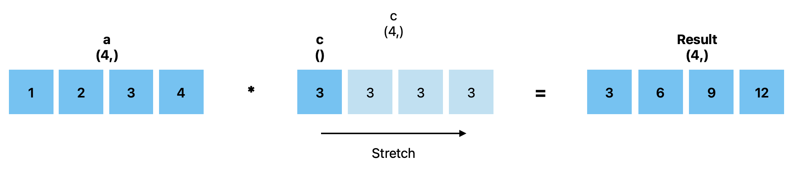

Lab 8675309: Introduction to Python, Revisited
==============================================
.. topics to cover lambda functions, array broadcasting, vectorization, plotting, try except, type declarations/docstrings in functions, f-strings (and .join, and \ with ""), dictionaries, modules
.. possibly move List comprehension here, but probably not....
.. map, filter, or sorted?

This lab covers additional topics in Python and NumPy that can help your coding to be more efficient.

Lambda Functions
----------------

Lambda functions are essentially one-time use functions. The syntax is:

.. code:: python

    lambda arguments: expression

So a simple lambda function that computes a power would look like:

.. code:: python

    lambda a, n: a ** n

Lambda functions are frequently used as parameters in other functions. For example, the ``map(func, a)`` function in Python exectues ``func`` on every element in ``a``. ``a`` can be anything you can iterate over (like a list or a string).

This will capitalize every word in a list

>>> x = map(lambda letter: letter.upper(), ["hello", "world"])
>>> x = x.list()    # convert it to a list for readability
>>> print(x)
['HELLO', 'WORLD']

This will capitalize every letter and return a list

>>> x = map(lambda letter: letter.upper(), "helloworld])
>>> x = x.list()    # convert it to a list for readability
>>> print(x)
['H', 'E', 'L', 'L', 'O', 'W', 'O', 'R', 'L', 'D']

Our lambda function ``lambda letter: lett.upper()`` just capitalizes a letter.

.. Note::
    The downside to lambda functions is that they reduce readability. Only use them for very small functions where the functionality is clear.

Task 1: ``filter``
------------------
``filter(fx, a)`` is similar to ``map``. It filters list ``a`` by a function. Filter the list ``a = np.linspace(0, 6, 13)`` so that only solutions to the equation :math:`\sin(2\pi\cdot t \cdot (1+0.5\sin(3t)) = -1)` remain.

.. t = np.linspace(0, 2*np.pi, 1000)
.. # A sine wave with frequency modulation
.. mod_sine = np.sin(2 * np.pi * t * (1 + 0.5 * np.sin(3 * t)))

.. Hint::
    The result from ``filter`` is a ``filter`` object. You can use ``list()`` to convert it to a list.

More Operators
--------------
You are familiar with simple operators like ``+``, ``-``, and ``*``. It is common to take a variable and set it to itself added, subtracted, or multiplied with another number. Python has a syntax for this:

>>> var = 120
>>> var -= 100
>>> var
20

Remember this is the same as ``var = var - 100``. This same syntax works for ``+``, ``*``, ``/``, ``**``, ``%``, and others as well.

Try/Except
------------------
.. arrays of different sizes
The try/except block is used for catching errors in code blocks without breaking the entire program.

.. code:: python

    def divide():
        try:    # without the try/except block, we would just get a ZeroDivisionError
            1/0
        except:
            print("An error occurred")
            
>>> divide()
An error occurred

You can also catch specific errors and chain them together

.. code:: python

    def divide_element(i):
        """Gets the the element at index i from my_list and divides it by 0."""
        my_list = [1, 2, 3]
        try:
            my_list[i]/0
        except IndexError:
            print("Got an Index Error")
        except ZeroDivisionError:
            print("Got a Zero Division Error")

>>> divide_element(10)
Got an Index Error
>>> divide_element(1)
Got a Zero Division Error

There is also an ``else`` block which gets run if no errors are raised in the try block. The ``finally`` block is run at the very end.

.. code:: python

    def divide_element(i, n):
        """Gets the the element at index i from my_list and divides it by n. If there is an error, it returns 0, if not, it returns the the quotient + 10."""
        my_list = [1, 2, 3]
        try:
            val = my_list[i]/n
        except IndexError:
            print("Got an Index Error")
            val = 0
        except ZeroDivisionError:
            print("Got a Zero Division Error")
            val = 0
        else:
            print("Successful")
            val += 10
        finally:
            return val
        
>>> print(divide_element(2, 1))
Successful
13.0
>>> print(divide_element(10, 1))
Got an Index Error
0
>>> print(divide_element(2, 0))
Got a Zero Division Error
0

Task 2: Lists
---------------
Write a function that takes in two Python lists
.. arrays of different sizes.
.. correlation.

Type Declarations in Functions
------------------------------

We have talked about functions and docstrings before, but python has an additional way to document the types that functions take in.

.. code:: python

    def add(a: int, b: float) -> float:
        """Adds an int and a float together."""
        return a + b

This simply says that ``a`` should be an ``int``, ``b`` should be a ``float``, and the return value should be a ``float``.

.. Warning::
    Python doesn't actually enforce type declarations in functions. It is purely for documentation purposes.

Additionally, you can have default parameters for functions. This way, the user doesn't need to pass in a parameter.

.. code:: python

    def calculate_force(mass: float, acceleration: float = 9.8) -> float:
        """Returns the force from a given mass an acceleration. The default value for acceleration is 9.8 m/s^2 from gravity."""
        return mass * acceleration

>>> calculate_force(10)
98.0
>>> calculate_force(10, 7)
70

f-strings
---------

.. possibly include r-strings

Python f-strings are an efficient and simple way of formatting strings. They are generally faster more readable than other methods of string fomratting (including concatenation with ``+``).

An f-string is just a string with an ``f`` in front of it. ``{}`` can be used inside f-strings to get the string value of python code.

>>> a = 10
>>> b = 37
>>> print(f"The value of a is: '{a}'")
>>> print(f"The value of a * b is: '{a * b}'")

.. Note::
    In the example above we used single quotes ``''`` inside double quotes ``""``. This is ok because they are different types of quotes.

f-strings also make it possible for fancier formatting. You can learn more about that on the `Python documentation <https://docs.python.org/3/tutorial/inputoutput.html#fancier-output-formatting>`_.

Dictionaries
------------

.. make a dictionary, print it or something like that. Find the lowest grade.

A dictionary is another Python type. It is similar to a list, but it can use any datatype to retrieve another (rather than just an integer index).

Dictionaries contain key-value pairs ie., given a key, we can retrieve a value (but not the other way around).
We access dictionaries using the ``[]`` notation.

>>> my_dict = {"apple": "red", "orange": 12, "blueberry": True}
>>> my_dict["apple"]
'red'
>>> my_dict["orange"]
12
>>> my_dict["blueberry"]
True

To insert or change a value in a dictionary, we use the same notation
>>> my_dict["strawberry"] = "red"
>>> my_dict
{"apple": "red", "orange": 12, "blueberry": True, "strawberry": "red"}
>>> my_dict["apple"] = "green"
>>> my_dict
{"apple": "green", "orange": 12, "blueberry": True}

Here are some useful functions for dictionaries:
- ``len(my_dict)`` the length of the dictionary
- ``my_dict.keys()`` gets all the keys in the dictionary
- ``my_dict.values()`` gets all the values from the dictionary
- ``my_dict.items()`` gets a list of tuples containing the all the keys and values

Task 3: 
-------------

Importing
---------
At this point, you are familiar with how to import a module in python using

.. code:: python
    import package
    import package as pk

Here are a few other ways to import a module:

* ``from package import function`` will import a specific function or class from a module so you can call it directly (without ``package.function``)
* ``from package import *`` will import all of the functions or classes from a module so you can call them directly. This method is not very common, though.
* ``from package import function as func`` will import a function or class from a module with a nickname so you can call the nickname directly

So far in this class we have been using Google Colab for our projects. Google Colab is convenient because it allows us to write Python code in our browser, it is free to do large computation, and it has lots of Python libraries pre-installed.

When working on a large project it is better to run Python locally on your computer. This is commonly done with an Integrated Development Environment (IDE) like VS Code, PyCharm, or even a simple text editor and the command line. We won't get into this now, but it is important to know that Google Colab is just an intro.

Array Masking
-------------
Array masking is a powerful tool in numpy that allows you to filter data using conditions. When you apply a condition on a NumPy array, it returns a new array of boolean values with ``True`` where the condition is met, and ``False`` otherwise. This is called a **boolean mask**. For example,

>>> a = np.array([1, 2, 3, 4])
>>> a > 2
array([False, False,  True,  True])

You can then use this mask to select the elements only where the condition is ``True``.

>>> a = np.array([1, 2, 3, 4])
>>> b = a > 2
>>> a[b]
array([3, 4])

Task 4: Image
-------------
The given NumPy array conatins an image.
.. green screen (detect green function) or distortion?

.. import numpy as np
.. from PIL import Image

.. a = np.random.randint(0, 256, (100, 100, 3), dtype=np.uint8)

.. # Convert `a` to a PIL Image
.. img = Image.fromarray(a)
.. img.show()

Array Broadcasting
------------------

This section is taken from the `Broadcasting <https://numpy.org/doc/stable/user/basics.broadcasting.html>`_ NumPy documentation.

Broadcasting in NumPy is what enables us to do things like multiply element-wise in a vector and also do scalar multiplication.

>>> a = np.array([1, 2, 3, 4])
>>> b = np.array([4, 5, 6, 7])
>>> a * b
array([ 4, 10, 18, 28])
>>> c = 3
>>> a * c
array([ 3,  6,  9, 12])

The main idea of array broadcasting is that operations can be performed on ``numpy.array``s with different shapes. NumPy handles this by 'stretching' certain dimensions so the arrays are compatible for the operation. In the example above, ``a`` has shape ``(4,)`` and ``b`` has shape ``(4,)`` so numpy does the multiplication operation element wise. When ``a`` is multiplied by ``c`` with shape ``()``, ``c`` is stretched to the shape ``(4,)``.

.. Note::
    NumPy doesn't actually create this temporary array ``c`` with shape ``(4,)``. This is just a good way to think about it.

Array broadcasting does not work on any shape of array. NumPy determines compatibility by comparing the shapes of the arrays starting with the rightmost dimension. Dimensions are compatible when they are equal, or one of the dimensions is one. A ``ValueError: operands could not be broadcast together`` is raised when arrays are not compatible (`General Broadcasting Rules <https://numpy.org/doc/stable/user/basics.broadcasting.html#general-broadcasting-rules>`_).

The result array of an operation will have the same number of dimensions as the array with the greatest number of dimensions in the operation. The size of each dimension in the result array will be the largest corresponding dimension in the input arrays. Any missing dimensions are treated as having dimension 1.

.. real world example

Say ``a`` has shape ``(3, 1)``, ``b`` has shape ``(1, 4)``, ``c`` has shape ``(4,)`` and ``d`` is a scalar. All of these arrays are broadcastible with one another.

Task 5: Normalization
---------------------
Normalization is a basic statistical method to scale data so all of the points lie between 0 and 1. Here is the formula:

.. math::
    x_{\text{norm}} = \frac{x - x_{min}}{x_{max} - x_{min}}

You are given data on recent college graduates and their median earnings based on major.
Use array broadcasting to create a normalized set of median earnings. The data is given in CodeBuddy.

.. np.random.rand(10)
.. https://github.com/fivethirtyeight/data/blob/master/college-majors/recent-grads.csv use median for money

.. np.append/concatenate joins along existing axis
.. np.stack joins along new axis

Vectorization
-------------
NumPy has another convenient tool for working element-wise with arrays. ``np.vectorize()`` takes in a python function (which takes in a NumPy array) and makes it work element-wise on the array. For example,

.. code::python

    def square_add(a):
        return a**2 + 1

>>> a = np.array([1, 2, 3])
>>> square_add_vec = np.vectorize(square_add)
>>> square_add_vec(a)
array([ 2,  5, 10])

This use case isn't very helpful for use because we could have just done:

>>> a**2 + 1

to get the same result. Vectorization is particularly useful when working with strings, conditionals, objects, or anything else that numpy doesn't inherently handle. If we wanted an array with a string value describing the actual element in an array, we could do:

.. code::python

    def format_value(x):
        return f"High" if x > 100 else "Low"

>>> arr = np.array([50, 200, 120])
>>> vec_format = np.vectorize(format_value)
>>> vec_format(arr)
array(['Low', 'High', 'High'], dtype='<U4')

Task 6: Time
------------
You are given an array of times where the first three columns are the hours, minutes, and seconds of a start time, and the second three columns are the hours, minutes, and seconds of an end time. Using NumPy vectorization, write a function ``print_times`` that will create an array of strings where each string matches the pattern: ``Start: hh:mm:ss, End: hh:mm:ss``.

Plotting
--------
