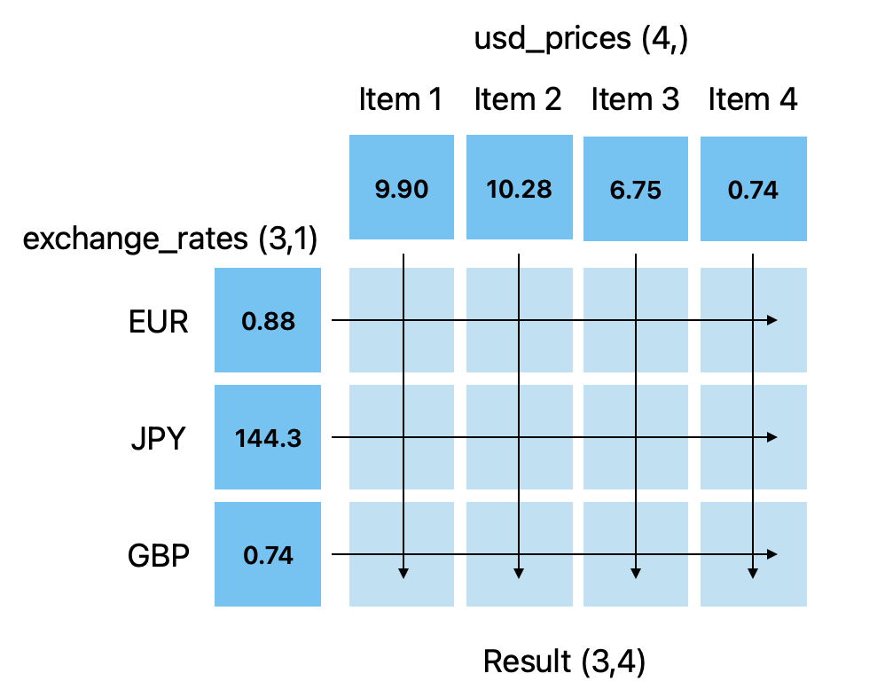

Lab 8675309: Introduction to Python, Revisited
==============================================

This lab covers additional topics in Python and NumPy that will expand your coding knowledge.

Lambda Functions
----------------

Lambda functions are a shorthand way of defining functions. They are excellent for creating simple functions. The syntax is:

.. code:: python

    lambda arguments: expression

A simple lambda function that computes a power would look like:

.. code:: python

    lambda a, n: a ** n

This is the same as writing:

.. code:: python

    def power(a, n):
        return a**n

.. Note::
    The downside to lambda functions is that they reduce readability. Only use them for very small functions where the functionality is clear.

A slightly more complicated lambda function would look like:

.. code:: python

    # checks if a number is even
    lambda x: x % 2 == 0

This is the same as:

.. code:: python
    
    def is_even(x):
        return x % 2 == 0

Sometimes, it is necessary to use a lambda function in multiple places. In this case, we can assign it to a variable.

>>> is_even = lambda x: x % 2 == 0

We can treat the variable as if it were a normal function defined with ``def``.

>>> is_even(14)
True
>>> is_even(27)
False

.. Note::
    Lambda functions are frequently used as parameters in other functions. For example, the ``map(func, a)`` function in Python exectues ``func`` on every element in ``a``. ``a`` can be anything you can iterate over (like a list or a string).

    This will capitalize every word in a list

    >>> x = map(lambda letter: letter.upper(), ["hello", "world"])
    >>> x = x.list()    # convert it to a list for readability
    >>> print(x)
    ['HELLO', 'WORLD']

Task 1: Basic Functions
-----------------------
Write each function as a lambda function. Assign each to the variables ``mean``, ``sigmoid``, and ``prime_count_approx``.

.. math::
    :label: eq:(1)

    \mu = \frac{\sum_{i=1}^{n}x_i}{n}

.. math::
    :label: eq:(2)

    \sigma(\text{x}) = \frac{1}{1 + e^{-x}}

.. math::
    :label: eq:(3)

    f(x) = \frac{x}{\log(x)}

Task 2: Sort
------------
``sorted(a, key)`` is a built-in python function that sorts an iterable (something you can iterate over like a list, string, etc.). ``a`` is the iterable, and ``key`` is a function that specifies how the iterable should be sorted.

Here is an example of sorting a list of tuples by the second element.

>>> pairs = [(1, 3), (2, 2), (4, 1)]
>>> sorted_pairs = sorted(pairs, key=lambda pair: pair[1])
>>> print(sorted_pairs)
[(4, 1), (2, 2), (1, 3)]

.. note::
    ``sorted()`` only works with 1d ``numpy.ndarrays`` which is why we are using Python lists in this task.

Write a function ``sort_list(a)`` that takes in ``a`` which is a ``(n,m)`` Python ``list`` of lists and returns the list sorted by the mean of each row. Make sure to assign your ``lambda`` function to the ``key`` paramater!

.. hint::
    It may be easiest to convert each row to a ``numpy.ndarray`` so you can use the built in ``.mean()`` method. 

.. def sort_list(a):
..     return sorted(a, key=lambda row: np.array(row).mean())

More Operators
--------------
You are familiar with simple operators like ``+``, ``-``, and ``*``. It is common to take a variable and set it to itself added, subtracted, or multiplied with another number. Python has a syntax for this:

>>> var = 120
>>> var += 32
>>> var
152

Remember this is the same as ``var = var + 32``. This same syntax works for ``-``, ``*``, ``/``, ``%``, ``**``, and others as well. Here are some more examples

>>> var = 20
>>> var *= 2
>>> var
40
>>> var -= 30
>>> var
10
>>> var /= 2
>>> var
5.0
>>> var %= 2
>>> var
1.0

Try/Except
------------------

The try/except block is used for catching errors in code blocks without breaking the entire program.

.. code:: python

    def divide(denominator):
        try:    # without the try/except block, we would just get a ZeroDivisionError
            1/denominator
        except:
            print("An error occurred")
            
>>> divide(0)
An error occurred

.. note:: Bonus: more error catching

    ``try`` and ``except`` are the basics of error catching in python. Other elements like ``else`` and ``finally`` along with error-specific catching can be very useful when working with large programs. Here is an example with all of them together.

    .. code:: python

        def divide_element(i, n):
            """Gets the the element at index i from my_list and divides it by n. Then adds 10 to the result.
            
            If there is an error, it returns 0.
            """

            my_list = [1, 2, 3]
            try:
                val = my_list[i]/n
            except IndexError:                  # catches only IndexErrors
                print("Got an Index Error")
                val = 0
            except ZeroDivisionError:           # catches only ZeroDivisionErrors
                print("Got a Zero Division Error")
                val = 0
            else:                               # if it didn't catch any errors
                print("Successful")
                val += 10
            finally:                            # always run this no matter what happens
                return val
            
    >>> print(divide_element(2, 1))
    Successful
    13.0
    >>> print(divide_element(10, 1))
    Got an Index Error
    0
    >>> print(divide_element(2, 0))
    Got a Zero Division Error
    0

Task 3: Matrix Multiplication
-----------------------------
Write a function ``matmul(a, b)`` that takes in ``numpy.ndarray``\s ``a`` and ``b`` and performs matrix multiplication on them. ``matmul`` should print ``Error: matrix a with shape (n,m) is not compatible with matrix b with shape (n,m)`` when the matrices are of incompatible shapes.

.. hint::
    Use ``np.matmul()`` to do the calculation and use ``try`` and ``except`` to handle any errors that may occur from ``np.matmul()``.

Type Declarations in Functions
------------------------------

We have talked about functions and docstrings before, but python has an additional way to document the types that functions take in.

.. code:: python

    def add(a: int, b: float) -> float:
        """Adds an int and a float together."""
        return a + b

This says that ``a`` should be an ``int``, ``b`` should be a ``float``, and the return value should be a ``float``.

.. Warning::
    Python doesn't enforce type declarations in functions, it is purely for documentation purposes.

Additionally, you can have default parameters for functions. This way, the user doesn't need to pass in a parameter.

.. code:: python

    def calculate_force(mass: float, acceleration: float = 9.8) -> float:
        """Returns the force from a given mass and acceleration.
        
        The default value for acceleration is 9.8 m/s^2 from gravity."""
        return mass * acceleration

>>> calculate_force(10)
98.0
>>> calculate_force(10, acceleration=3.73)  # mars
70

f-strings
---------

Python f-strings are an efficient and simple way of formatting strings. They are generally faster and more readable than other methods of string formatting (including string concatenation with ``+``).

An f-string is declared by placing an ``f`` in front of the string. ``{}`` can be used inside f-strings to get the ``str`` value of python code.

>>> a = 10
>>> b = 37
>>> print(f"The value of a is: '{a}'")
The value of a is: '10'
>>> print(f'The value of a * b is: {a * b}')
The value of a * b is: 370

.. Note::
    In the example above we used single quotes ``''`` inside double quotes ``""``. This is necessary if we want to include single quotes in our string. If you want to have both single and double quotes inside the f-string, just create the f-string ``"""`` or ``'''``.

    >>> print(f"""'This' is too many "quotes".""")

f-strings also make it possible for fancier formatting. Check out the `Python documentation <https://docs.python.org/3/tutorial/inputoutput.html#fancier-output-formatting>`_ to learn more.

Dictionaries
------------

A dictionary is another Python type. It is similar to a list, but while a list uses an integer index to retrieve another type, a dictionary can use any type to retrieve another type. This is called "mapping".

Dictionaries contain key-value pairs i.e., given a key, we can retrieve a value (but not the other way around).
We access dictionaries using the ``[]`` notation.

>>> my_dict = {"apple": "red", "orange": 12, "blueberry": True}
>>> my_dict["apple"]
'red'
>>> my_dict["orange"]
12
>>> my_dict["blueberry"]
True

To insert or change a value in a dictionary, we use the same notation

>>> my_dict["strawberry"] = "red"
>>> my_dict
{"apple": "red", "orange": 12, "blueberry": True, "strawberry": "red"}
>>> my_dict["apple"] = "green"
>>> my_dict
{"apple": "green", "orange": 12, "blueberry": True}

It is often helpful to iterate over the entries in a dictionary. We can do this with the ``.items()`` method which returns a tuple of each key and value in the dictionary.

>>> my_dict.items()
dict_items([('apple', 'red'), ('orange', 12), ('blueberry', True), ('strawberry', 'red')])
>>> for key, value in my_dict.items():
>>>     print(f"my_dict key: {key}, my_dict value: {value}")
my_dict key: apple, my_dict value: green
my_dict key: orange, my_dict value: 12
my_dict key: blueberry, my_dict value: True

Here are some other useful functions and methods for dictionaries:

- ``len(my_dict)`` the length of the dictionary (how many entries there are)
- ``my_dict.keys()`` gets all the keys in the dictionary
- ``my_dict.values()`` gets all the values from the dictionary
- ``my_dict.items()`` gets a list of tuples containing the all the keys and values (used in the example above)

Task 4: Sorting a Dictionary
----------------------------
Write a function ``sort_dict(d)`` that takes in ``d`` which is a dictionary that maps from a students name (``str``) to their percentage in the class (``float``). ``sort_dict(d)`` should sort the student's scores from highest to lowest and return a list of tuples of the student's name and their grade i.e., ``[("peter", 97.5), ("james", 96.1), ("john", 94.8)]``.

.. hint::
    Use ``sorted(a, key)`` from Task 2.

.. def sort_dict(d):
..     return sorted(d.items(), key=lambda item: item[1])

Importing
---------
At this point, you are familiar with how to import a module or package in python using

.. code:: python

    import package

and

.. code:: python

    import package as pk

Here are a few other ways to import a module:

.. code:: python

    # import a specific function or class from a module to call it directly (without package.function)
    from package import function    

    # import all of the functions or classes from a module so you can call them directly. This method is not very common.
    from package import *   

    # import a function or class from a module with an alias so you can call the function directly
    from package import function as func    

So far in this class we have been using Google Colab for our projects. Google Colab is convenient because it allows us to write Python code in our browser, it is free, and it has lots of Python libraries pre-installed.

When working on a large project it is better to run Python locally on your computer. This is commonly done with an Integrated Development Environment (IDE) like VS Code, PyCharm, or even a simple text editor and the command line. We won't get into this now, but it is important to know that Google Colab is just an intro.

NumPy Stacking
--------------

NumPy has different functions to merge and concatenate NumPy arrays. It is important to know that these functions exist, but you don't need to know all the details.

``numpy.column_stack`` 
~~~~~~~~~~~~~~~~~~~~~~
Takes 1d arrays and stacks them as the columns of a 2d array.

>>> a = np.array([1, 2, 3, 4])
>>> b = np.array([4, 5, 6, 7])
>>> np.column_stack((a, b))

``numpy.vstack``
~~~~~~~~~~~~~~~~
Takes a set of arrays and stacks them vertically (along the first axis)

>>> a = np.array([1, 2, 3, 4])
>>> b = np.array([4, 5, 6, 7])
>>> np.vstack((a, b))
array([[1, 2, 3, 4],
       [4, 5, 6, 7]])

>>> c = np.array([[1, 2], [3, 4], [5, 6]])
>>> d = np.array([[6, 7], [8, 9], [10, 11]])
>>> np.vstack((c, d))
array([[ 1,  2],
       [ 3,  4],
       [ 5,  6],
       [ 6,  7],
       [ 8,  9],
       [10, 11]])
       
``numpy.hstack``
~~~~~~~~~~~~~~~~
Takes a set of arrays and stacks them horizontally (along the second axis)

>>> a = np.array([1, 2, 3, 4])
>>> b = np.array([4, 5, 6, 7])
>>> np.hstack((a, b))
array([1, 2, 3, 4, 4, 5, 6, 7])

>>> c = np.array([[1, 2], [3, 4], [5, 6]])
>>> d = np.array([[6, 7], [8, 9], [10, 11]])
>>> np.hstack((c, d))
array([[ 1,  2,  6,  7],
       [ 3,  4,  8,  9],
       [ 5,  6, 10, 11]])

``numpy.dstack``
~~~~~~~~~~~~~~~~
Takes a set of arrays and stacks them according to 'depth' (along the third axis)

>>> a = np.array([1, 2, 3, 4])
>>> b = np.array([4, 5, 6, 7])
>>> np.dstack((a, b))
array([[[1, 4],
        [2, 5],
        [3, 6],
        [4, 7]]])

>>> c = np.array([[1, 2], [3, 4], [5, 6]])
>>> d = np.array([[6, 7], [8, 9], [10, 11]])
>>> np.dstack((c, d))
array([[[ 1,  6],
        [ 2,  7]],

       [[ 3,  8],
        [ 4,  9]],

       [[ 5, 10],
        [ 6, 11]]])

>>> e = np.array([[[1, 2], [3, 4]], [[5, 6], [7, 8]]])
>>> f = np.array([[[2, 3], [4, 5]], [[6, 7], [8, 9]]])
>>> np.dstack((e, f))
array([[[1, 2, 2, 3],
        [3, 4, 4, 5]],

       [[5, 6, 6, 7],
        [7, 8, 8, 9]]])

``numpy.stack``
~~~~~~~~~~~~~~~
Joins a set of arrays along a *new* axis. When ``axis=-1``, it will join along the last axis

>>> a = np.array([1, 2, 3, 4])
>>> b = np.array([4, 5, 6, 7])
>>> np.stack((a, b), axis=0)
array([[1, 2, 3, 4],
       [4, 5, 6, 7]])
>>> np.stack((a, b), axis=1)
array([[1, 4],
       [2, 5],
       [3, 6],
       [4, 7]])

>>> c = np.array([[1, 2], [3, 4], [5, 6]])
>>> d = np.array([[6, 7], [8, 9], [10, 11]])
>>> np.stack((c, d), axis=0)
array([[[ 1,  2],
        [ 3,  4],
        [ 5,  6]],

       [[ 6,  7],
        [ 8,  9],
        [10, 11]]])
>>> np.stack((c, d), axis=1)
array([[[ 1,  2],
        [ 6,  7]],

       [[ 3,  4],
        [ 8,  9]],

       [[ 5,  6],
        [10, 11]]])
>>> np.stack((c, d), axis=2)
array([[[ 1,  6],
        [ 2,  7]],

       [[ 3,  8],
        [ 4,  9]],

       [[ 5, 10],
        [ 6, 11]]])

Array Broadcasting
------------------

This section is taken from the `Broadcasting <https://numpy.org/doc/stable/user/basics.broadcasting.html>`_ NumPy documentation.

Broadcasting in NumPy is what enables us to do things like multiply element-wise in a vector and also do scalar multiplication.

>>> a = np.array([1, 2, 3, 4])
>>> b = np.array([4, 5, 6, 7])
>>> a * b
array([ 4, 10, 18, 28])
>>> c = 3
>>> a * c
array([ 3,  6,  9, 12])

The main idea of array broadcasting is that operations can be performed on ``numpy.array``\s with different shapes. NumPy handles this by 'stretching' certain dimensions so the arrays are compatible for the operation. In the example above, ``a`` has shape ``(4,)`` and ``b`` has shape ``(4,)`` so numpy does the multiplication operation element wise. When ``a`` is multiplied by ``c`` with shape ``()``, ``c`` is stretched to the shape ``(4,)``.

.. image:: ./_static/broadcasting_stretch.png

.. Note::
    NumPy doesn't actually create this temporary array ``c`` with shape ``(4,)``. This is just a good way to think about it.

Array broadcasting does not work on any shape of array. NumPy determines compatibility by comparing the shapes of the arrays starting with the rightmost dimension. Dimensions are compatible when they are equal, or one of the dimensions is one. A ``ValueError: operands could not be broadcast together`` is raised when arrays are not compatible (`General Broadcasting Rules <https://numpy.org/doc/stable/user/basics.broadcasting.html#general-broadcasting-rules>`_).

The result array of an operation will have the same number of dimensions as the array with the greatest number of dimensions in the operation. The size of each dimension in the result array will be the largest corresponding dimension in the input arrays. Any missing dimensions are treated as having dimension 1.

Consider the following arrays

* ``a = np.array([[a1], [a2], [a3]])`` with shape ``(3, 1)``
* ``b = np.array([[b1, b2, b3, b4]])`` with shape ``(1, 4)``
* ``c = np.array([c1, c2, c3, c4])`` with shape ``(4,)``
* ``d`` is a scalar

All of these arrays are broadcastable with one another because all can be expanded into a ``numpy.ndarray`` of shape ``(3, 4)``.

On the other hand, array ``e`` with shape ``(5, 2)`` could not be broadcast into shape ``(3, 4)`` because none of the corresponding dimensions are the same and none of them are 1.

But, array ``f`` with shape ``(5, 1, 1)`` is compatible with arrays ``a``, ``b``, ``c``, and ``d`` because the dimensions corresponding to ``a``, ``b``, ``c``, and ``d`` are all 1. In this case, each ``a``, ``b``, ``c``, and ``d`` would be stretched to match dimension ``5`` in ``f``.

Consider this example. You are given a list of prices of products in USD and you want to convert that list of prices into different currencies like EUR, JPY, and GBP.

>>> usd_prices = np.array([9.90, 10.28, 6.75, 3.09])
>>> exchange_rates = np.array([0.88, 144.3, 0.74])  # [EUR, JPY, GBP]

We could loop over each of these and find the converted prices that way, or we can use array broadcasting. Right now, ``usd_prices`` has a shape of ``(4,)`` and ``exchange_rates`` has shape ``(3,)``. If we redefine ``exchange_rates`` to have shape ``(3,1)`` then we can use array broadcasting to get an array where each row represents the currency, and each column represents the price.

>>> usd_prices = np.array([9.90, 10.28, 6.75, 3.09])
>>> exchange_rates = np.array([[0.88], [144.3], [0.74]])    # shape (3,1)
>>> np.round(exchange_rates * usd_prices, decimals=2)   # shape: (4,3)
array([[   8.71,    9.05,    5.94,    2.72],
       [1428.57, 1483.4 ,  974.03,  445.89],
       [   7.33,    7.61,    5.  ,    2.29]])

Task 5: Normalization
---------------------
Normalization is a basic statistical method to scale data so all of the points lie between 0 and 1. Here is the formula:

.. math::
    x_{\text{norm}} = \frac{x - x_{min}}{x_{max} - x_{min}}

You are given data on recent college graduates and their median earnings based on major.
Use array broadcasting to create a normalized set of median earnings. The data is given in CodeBuddy.